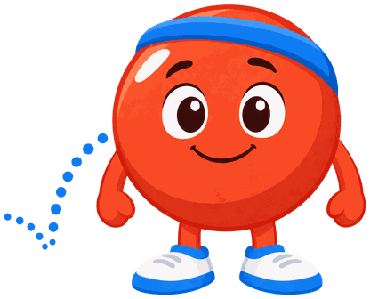

# Charts, Plots and Tables

## Summary

Covers Chart.js, Plotly and HTML tables for showing quantitative data, comparisons and mathematical functions in interactive form.

Students learn chart configuration and datasets, the common chart types, slider-driven plots and clickable comparison tables, along with color and source-citation practice. After it, they can pick and build the right chart for a data objective.

## Concepts Covered

This chapter covers the following 20 concepts from the learning graph:

| Concept | Concept Impact Score |
|---------|-----------------------|
| Chart.js Library | 16 |
| Chart Configuration | 6 |
| Chart Dataset | 9 |
| Bar Chart | 1 |
| Line Chart | 1 |
| Pie Chart | 1 |
| Scatter Plot | 3 |
| Bubble Chart | 2 |
| Priority Matrix | 1 |
| Chart Tooltip | 1 |
| Plotly Library | 3 |
| Function Plot | 2 |
| Slider-Driven Plot | 1 |
| Data Table | 4 |
| Comparison Table | 2 |
| Star Rating Table | 1 |
| Clickable Table Detail Panel | 1 |
| Chart Color Palette | 1 |
| Data Source Citation | 1 |
| Infographic | 1 |

## Prerequisites

This chapter builds on concepts from:

- [Chapter 1: What Is a MicroSim](../01-what-is-a-microsim/index.md)
- [Chapter 4: Choosing a MicroSim Type](../04-choosing-a-microsim-type/index.md)
- [Chapter 6: p5.js MicroSims](../06-p5js-microsims/index.md)

---

## Welcome

!!! mascot-welcome "Numbers That Move"
    { class="mascot-admonition-img" }
    Most learners meet data as a frozen picture, but in this chapter you will build charts, plots and tables they can poke, hover over and slide. By the end you will be able to pick the right chart for a data objective and specify it well enough for an AI skill to build it. Let's bounce it around!

Chapter 4 taught you to route a learning objective to a MicroSim type and a library. Chapter 6 covered the most flexible library, p5.js, where you draw every pixel yourself. This chapter covers the types that you choose when the objective is about *quantitative data*: how much, how many, how fast, how two things compare. Three families do this work. **Chart.js** draws standard chart types from a data description. **Plotly** draws mathematical function plots with built-in hovering and zooming. **HTML tables** present exact values and comparisons, with a little JavaScript to make cells respond to clicks.

The three families share one design idea that we will keep returning to: separate the *data* from the *presentation*. When the numbers live in a plain data structure and the chart is generated from it, an author can change one without touching the other, and an AI skill can fill in a template instead of writing drawing code from scratch.

## Chart.js: Configuration and Datasets

The **Chart.js Library** is an open-source JavaScript library that draws charts on an HTML canvas element from a declarative description of the chart. "Declarative" means you state what the chart should contain and how it should look, and the library decides how to draw it. The MicroSim generator's guide names the supported types as line, bar, pie, doughnut, radar, polar area, bubble and scatter. It recommends loading the library from a CDN (a content delivery network, a public server that hosts shared library files) at version 4.4.0, using the address `https://cdn.jsdelivr.net/npm/chart.js@4.4.0/dist/chart.umd.min.js`. Chart.js is a *JavaScript library* in the sense of Chapter 1, so a MicroSim needs no installation step beyond that one script tag.

Every Chart.js chart is created from a single JavaScript object, the **chart configuration**. This **Chart Configuration** object has three top-level parts that you should be able to name from memory:

- `type` is a string naming the kind of chart, such as `'bar'` or `'line'`.
- `data` holds the labels and datasets, which is the content to draw.
- `options` holds settings for behavior and appearance, such as scales, legend position and responsiveness.

The guide's bar chart example shows all three parts together. Read the comments first, since they explain the properties that matter most for MicroSims.

```javascript
{
    type: 'bar',
    data: {
        labels: ['Category A', 'Category B'],        // one label per bar
        datasets: [{
            label: 'Dataset 1',                       // name shown in the legend
            data: [65, 59],                           // one value per label
            backgroundColor: 'rgba(54, 162, 235, 0.8)',
            borderColor: 'rgb(54, 162, 235)',
            borderWidth: 1
        }]
    },
    options: {
        responsive: true,                             // resize with the container
        scales: { y: { beginAtZero: true } }          // y axis starts at zero
    }
}
```

The `responsive: true` setting matters for this book because every MicroSim must fit the width of its container, a requirement Chapter 12 develops fully. The guide also lists `maintainAspectRatio` and `aspectRatio` as the options for keeping the chart a sensible shape as the width changes.

A **chart dataset** is one series of values plus the styling that goes with it. In Chart.js terms, the **Chart Dataset** is one object inside the `datasets` array, carrying its own `label`, its `data` array and its colors. A chart can hold several datasets: a multi-line chart, for example, is a line chart whose `datasets` array contains one object per line. The shape of the `data` array depends on the chart type. Bar, line and pie charts take a plain list of numbers matched to `labels`. Scatter charts take objects of the form `{ x, y }`, and bubble charts take `{ x, y, r }`, where `r` is the bubble radius. The table below summarizes this pairing, which you have just read about in prose.

| Chart type | What each `data` entry looks like | Uses `labels` |
|---|---|---|
| bar, line, pie | a number | yes |
| scatter | `{ x: -10, y: 0 }` | no |
| bubble | `{ x: 20, y: 30, r: 15 }` | no |

The template that ships with the generator skill applies the data-versus-presentation idea directly. Its script keeps a single `chartData` object holding `labels`, `values`, `colors`, axis labels and a unit string, then builds a pie chart and a bar chart from that one object, plus a table view. Change the numbers in `chartData` and every view updates together. Chart.js does not redraw when you change a dataset in place, however, so a slider or button that modifies data must call `chart.update()` afterward, as the guide's troubleshooting section shows.

!!! mascot-thinking "One Object, Three Jobs"
    { class="mascot-admonition-img" }
    Think of a chart configuration as a recipe card: `type` names the dish, `data` lists the ingredients and `options` sets the oven. When a chart looks wrong, ask which of the three parts holds the mistake before you touch anything else.

Before the next specification, note the terms it uses. A *panel* is a labeled region of a page. A *live JSON editor* is a text box holding the configuration that the chart re-reads whenever you edit it.

#### Diagram: Chart Configuration Anatomy Explorer

<details markdown="1">
<summary>Chart Configuration Anatomy Explorer</summary>
Type: microsim
**sim-id:** chart-configuration-anatomy-explorer<br/>
**Library:** Chart.js<br/>
**Status:** Specified

Learning objective (Bloom level: Understand; verb: explain): The learner will explain which part of a chart configuration (type, data or options) controls each visible feature of a chart, by editing values and observing the result.

Layout: two panels side by side. The left panel is a text region showing the chart configuration as color-coded blocks, one color each for `type`, `data` and `options`. The right panel is a canvas showing the chart. On narrow screens the panels stack.

Controls:

- Dropdown "Chart type" with bar, line and pie. Changing it rewrites the `type` block only
- Editable number fields for each value in the first dataset, which rewrite the `data` block
- Checkbox "Responsive" and dropdown "Legend position" (top, bottom, left, right), which rewrite the `options` block
- Button "Add dataset", which appends a second dataset object with its own label and colors

Interactions: hovering a color-coded block highlights the chart features it controls. Hovering any chart element shows a tooltip naming the configuration path that produced it, for example `data.datasets[0].data[1]`. A "Break it" button removes one label and shows the resulting mismatch between labels and values.

Responsive design: the canvas width follows the container width on window resize, and the two panels stack vertically below 600 pixels.

Implementation: Chart.js 4.4.0 from a CDN, with the chart rebuilt from the configuration object and `chart.update()` called after each edit.
</details>

## The Common Chart Types

Choosing a chart type is a decision about the relationship you want the learner to see. Chart.js supports the types listed earlier, and this chapter's concepts cover five of them. Each definition below gives the data relationship it fits, following the selection guide in the generator skill.

A **bar chart** compares values across discrete categories by drawing one bar per category. The **Bar Chart** is the default choice for questions such as "which of these is largest?" It is not suited to trends or continuous data. A horizontal variant, produced by setting `indexAxis: 'y'`, helps when category labels are long, and stacked bars come from setting `stacked: true` on both axes.

A **line chart** connects values in order, so it shows change over a continuous quantity such as time. The **Line Chart** takes one dataset per line, and the `tension` property controls how curved the connecting segments are. It is a poor choice for unordered categories, because the line implies a continuous path between them that does not exist.

A **pie chart** shows how a whole divides into parts. The **Pie Chart** works only when the parts sum to a meaningful total and there are few of them; the guide advises no more than six slices and warns that pie charts are unsuited to precise comparisons or many categories. Setting `type: 'doughnut'` gives the same information with a hole in the middle.

A worked example shows how the choice follows the question. Suppose you have the share of each library used across a set of MicroSims. If the question is "how is the whole divided?", use a pie chart with a handful of slices. If the question is "which library is used most, and by how much more than the next?", use a bar chart, because the eye compares bar lengths more precisely than slice angles. The same numbers support both charts, but each answers a different question.

!!! mascot-warning "The Seven-Slice Pie"
    { class="mascot-admonition-img" }
    A common trap is putting eight categories into a pie because the data happen to have eight rows, which makes the thin slices impossible to compare. If a pie needs more than about six slices, switch to a bar chart and sort the bars.

#### Diagram: Chart Type Chooser

<details markdown="1">
<summary>Chart Type Chooser</summary>
Type: microsim
**sim-id:** chart-type-chooser<br/>
**Library:** Chart.js<br/>
**Status:** Specified

Learning objective (Bloom level: Apply; verb: select): The learner will select the chart type that best fits a stated data question, then check the choice against the same data drawn in two alternative types.

Data: three small built-in datasets. The first is category shares that sum to 100 percent, the second is a value measured at six ordered time points, and the third is eight categories with unrelated values.

Controls:

- Dropdown "Dataset" to choose one of the three datasets
- Radio buttons "Chart type" for bar, line and pie
- Button "Check my choice", which shows a green or amber message explaining why the choice fits or does not fit

Interactions: the chart redraws when the type changes. After "Check my choice", a side note quotes the fit rule (for example, "pie: parts of a whole, six slices or fewer"). Hovering any bar, point or slice shows a tooltip with its label and value.

Responsive design: the canvas fills the container width, the controls wrap onto a second row below 500 pixels, and the height is fixed.

Implementation: Chart.js 4.4.0 with one chart object destroyed and rebuilt when the type changes.
</details>

## Scatter Plots, Bubble Charts and Priority Matrices

The chart types so far take a list of values matched to labels. Two further types plot *pairs* or *triples* of numbers. A **scatter plot** places one point for each observation at its (x, y) position, so it shows whether and how two numeric variables are related. The **Scatter Plot** dataset is a list of `{ x, y }` objects, and the guide's example gives the x scale `type: 'linear'`, meaning the axis is a continuous number line. Scatter plots suit correlations and distributions but not categorical data.

A **bubble chart** adds a third variable by drawing each point as a circle whose size encodes a third number. The **Bubble Chart** dataset uses `{ x, y, r }`, where `r` is the bubble radius in pixels. Because pixel radius is not proportional to the underlying quantity, the bubble guide includes a scaling function that maps a count linearly between a minimum and maximum radius, with 8 and 30 pixels as its example bounds. The guide also recommends extending the scale limits slightly, for example `min: -0.5, max: 10.5`, so that bubbles near an edge are not clipped.

A **priority matrix** is a bubble chart whose axes are decision criteria and whose plane is divided into four quadrants. The **Priority Matrix** in the bubble guide plots items by impact against effort, with a third quantity such as frequency as bubble size, so that high-impact, low-effort items stand out in one corner. Other pairings the guide names are risk against value and cost against benefit. Quadrants are drawn by a custom Chart.js plugin, a function that hooks into the drawing cycle to paint shaded backgrounds and labels, and the guide suggests background opacity of only 0.05 to 0.1 so the bubbles stay readable.

A worked example makes the idea concrete. Suppose a team is deciding which MicroSim types to build first. Each candidate type gets an impact score from 0 to 10, an effort score from 0 to 10, and a count of how many planned MicroSims use it. The data structure below follows the shape used in the bubble guide.

```javascript
const data = [
    { type: 'bar-charts',   count: 12, impact: 7, effort: 2 },
    { type: 'function-plots', count: 5, impact: 8, effort: 4 },
    { type: 'network-maps', count: 3, impact: 6, effort: 8 }
];
// Bubble radius grows with count; x is effort, y is impact.
const points = data.map(d => ({ x: d.effort, y: d.impact, r: 8 + d.count }));
```

The items and scores are invented for illustration. Under the impact-against-effort layout, the bar-chart item lands in the high-impact, low-effort quadrant and would be built first, while the network item, with high effort and only moderate impact, would wait. The value of the chart is that the decision is visible at a glance and that the learner can move an item and see it change quadrant.

!!! mascot-warning "Radius Is Not Area"
    { class="mascot-admonition-img" }
    Readers judge a bubble by its area, but Chart.js draws the radius you give it, so doubling `r` quadruples the area and exaggerates the difference. Scale the radius with a function and state in the caption that bubble size shows the count.

The terms in the next specification are now defined: *impact* and *effort* are the two axes, *bubble size* is the third variable, and a *quadrant* is one of the four regions the axes' midpoints create.

#### Diagram: Priority Matrix Bubble Explorer

<details markdown="1">
<summary>Priority Matrix Bubble Explorer</summary>
Type: microsim
**sim-id:** priority-matrix-bubble-explorer<br/>
**Library:** Chart.js<br/>
**Status:** Specified

Learning objective (Bloom level: Analyze; verb: compare): The learner will compare candidate items by impact, effort and frequency, and identify which quadrant each item occupies and why.

Data: eight invented items, each with a name, an impact score, an effort score and a count, plus a status category used for color.

Layout: a bubble chart with x axis "Effort" and y axis "Impact", both from -0.5 to 10.5 so that no bubble is clipped. Four quadrant backgrounds shaded at low opacity and labeled, drawn by a plugin in the `afterDatasetsDraw` hook. A list below the chart names the items in each quadrant.

Controls:

- Slider "Effort" and slider "Impact" that move the currently selected item, with the selection made by clicking a bubble
- Slider "Bubble scale" from 1 to 3 that changes the minimum and maximum radius
- Checkbox "Show quadrant labels"

Interactions: hovering a bubble shows a tooltip with the item name, effort, impact and count. Moving an item across a midpoint updates the quadrant list immediately. A "Reset" button restores the original data.

Responsive design: the chart follows the container width with a fixed aspect ratio, and the quadrant list moves below the chart at all widths under 700 pixels.

Implementation: Chart.js 4.4.0 bubble chart with a custom plugin for quadrant shading, and `chart.update()` called after each slider change.
</details>

## Tooltips and the Chart Palette

A **chart tooltip** is a small box that appears when the learner hovers over or touches a chart element, showing details about that element. The **Chart Tooltip** is the simplest form of interactivity in Chart.js, and the generator's guide requires it: "Tooltips should always be used." By default a tooltip shows the label and value, but the `plugins.tooltip.callbacks.label` function lets you return any text. The guide's example returns `'Custom: ' + context.parsed.y`, where `context` is an object describing the hovered element and `parsed.y` is its y value.

Tooltips matter twice in this book. Pedagogically, a tooltip can carry an explanation instead of a raw number, such as "12 MicroSims use this type". For evidence, a hover is an event that an instrumented MicroSim could report, a topic Chapters 16 and 17 develop. We have not measured what tooltip hovers reveal about mastery, and Chapter 18 treats that link as a hypothesis to test.

!!! mascot-tip "Write the Tooltip Last"
    { class="mascot-admonition-img" }
    Before you accept a chart, hover over three elements and ask whether each tooltip tells the learner something the axes do not. If it only repeats the number, rewrite the label callback to add a unit or a one-line meaning.

The second half of this section concerns color. A **chart color palette** is the ordered set of colors assigned to the categories or series of a chart. The **Chart Color Palette** in the generator's Chart.js template is four semi-transparent colors in the `rgba(red, green, blue, alpha)` format, a blue, a green, an amber and a red, each drawn at 0.85 alpha with a matching fully opaque border color. Pairing a translucent fill with an opaque border keeps neighboring shapes distinguishable. The guide's design rules add three constraints: use distinguishable colors with good contrast, prefer intuitive meanings such as green for good and red for caution, and make sure the array of colors matches the length of the data, since a short array leaves elements uncolored.

!!! mascot-warning "Color Alone Is Not a Message"
    { class="mascot-admonition-img" }
    A learner with color-vision deficiency may not tell the green slice from the red one, so a chart that relies on hue alone hides its message from them. Add a second cue, such as direct labels, a legend the learner can click, or a table view of the same numbers, and check the contrast of every text color.

## Plotly Function Plots

Chart.js excels at charts of measured or categorical data. Mathematical functions call for something different: a smooth curve computed from a formula, with axes that behave like a graph in a mathematics text. The **Plotly Library** (Plotly.js) is a JavaScript charting library with built-in hover tooltips and an export option that the generator skill uses for exactly this job. Its template loads `https://cdn.plot.ly/plotly-2.27.0.min.js` and builds the plot from *traces*. A trace is one drawn series, described by an object with `x` and `y` arrays, a `type` and a `mode`, and a `layout` object holds axes, margins and legend settings.

A **function plot** is a graph of the values of a mathematical function \( f(x) \) over a chosen domain, drawn as a curve. The **Function Plot** MicroSim in the guide works by *sampling*: it evaluates \( f \) at many evenly spaced x values and joins the results with a line. The guide recommends 500 points for a smooth curve and keeping the total under 2000 for performance. The author edits a JavaScript function `f(x)` and a `config` object, and the guide gives a conversion table from mathematical notation to code, for example \( \sin(x) \) as `Math.sin(x)` and \( e^x \) as `Math.exp(x)`.

The template's configuration object shows the parameters an author sets. Its default domain is about \( -2\pi \) to \( 2\pi \), written as -6.28 to 6.28, with a y range of -1.5 to 1.5 and `numPoints` of 500.

```javascript
const config = {
    xMin: -6.28, xMax: 6.28,      // domain: left and right edges of the plot
    yMin: -1.5,  yMax: 1.5,       // range: bottom and top edges
    numPoints: 500,               // samples used to draw the curve
    initialX: 0                   // starting position of the movable point
};
function f(x) { return Math.sin(x); }   // replace with the function to plot
```

To choose a domain, the guide advises showing one to three complete periods of a trigonometric function, all real roots of a polynomial where possible, and a meaningful span of change for an exponential. For the range, it says to add 10 percent padding above and below the extreme values so the curve does not touch the frame.

A **slider-driven plot** adds a control that moves a marker along the curve. In the **Slider-Driven Plot** pattern, an HTML range input sets the x position, the script computes \( f(x) \) at that position, and a second trace, a single red marker, is redrawn there. The tooltip should teach rather than merely report. The guide's own example contrasts "At x = \( \pi/2 \) (1.571), sin(x) reaches its maximum value of 1" with the bare pair "1.571, 1.000", and recommends slider activities such as finding where \( f(x) = 0 \) or locating the maximum. Because the slider is a standard range input, it is keyboard accessible with no extra work.

A worked example shows why the slider changes what a learner can do. Ask a learner, "At what x does \( \sin(x) = 0.5 \)?" With a static plot they estimate by eye. With the slider they move the marker until the readout shows 0.5, notice that this happens at two x values within each period, and can then predict the pattern in the next period. The interaction turns a lookup into an investigation, which is the property that defined an interactive simulation in Chapter 1.

!!! mascot-tip "Bounded Sampling Beats Guessing"
    { class="mascot-admonition-img" }
    If you are unsure whether a curve looks right, sample it at the domain edges and at one or two points where you know the answer, such as \( \sin(0) = 0 \). If those points are off, the formula is wrong long before the styling matters.

Before the specification, recall the terms it uses: the *domain* is the set of x values plotted, the *marker* is the movable point, and the *readout* is the text that reports the current x and \( f(x) \).

#### Diagram: Function Plot Slider Lab

<details markdown="1">
<summary>Function Plot Slider Lab</summary>
Type: microsim
**sim-id:** function-plot-slider-lab<br/>
**Library:** Plotly<br/>
**Status:** Specified

Learning objective (Bloom level: Apply; verb: locate): The learner will locate the x values where a chosen function reaches a given output, by moving a marker along the curve and reading the tooltip.

Data and layout: a Plotly plot with one line trace of 500 samples over the domain -6.28 to 6.28 and one red marker trace. The y range is padded by 10 percent beyond the function's extreme values. A readout line above the plot shows x and \( f(x) \).

Controls:

- Dropdown "Function" with sin(x), cos(x), \( x^2 \) and \( e^{-x^2} \)
- Slider "x" spanning the full domain in steps of 0.01, keyboard accessible
- Number field "Target y" and button "Show matches", which marks every x where the curve crosses the target within the domain

Interactions: hovering the curve shows a tooltip in the form "x = 1.571, f(x) = 1.000 (maximum of sin)". The marker follows the slider. Changing the function keeps the slider position and redraws the curve.

Responsive design: the plot height is 400 pixels on desktop and 300 on narrow screens, the body has no margin, and the plot fills the container width.

Implementation: Plotly.js 2.27.0 from a CDN, with the plot redrawn by a `createPlot(pointX)` function called from the slider's input event.
</details>

## Data Tables and Comparison Tables

Not every quantitative message is best drawn. A **data table** arranges values in rows and columns so that a reader can look up an exact figure. The **Data Table** has a role even in chart MicroSims: the Chart.js template includes a Table tab beside its pie and bar tabs, built from the same `chartData` object, so a learner who needs the exact number, or who cannot interpret the graphic, still has access to it. A table view also supplies a text alternative to the drawing, which is one small contribution to the accessibility practices of Chapter 24.

A **comparison table** goes further by placing several items side by side against shared criteria so that a reader can choose among them. The **Comparison Table** generator in the skill library builds tables of 3 to 8 items, with 1 to 4 rating columns, an optional category column with Easy, Medium and Hard badges, a description column, and hover tooltips that carry a one or two sentence description of each item. The guide sets tooltips under 200 characters and estimates an iframe height of about 60 pixels per row plus 150 pixels for the header and legend.

A **star rating table** is the comparison table's most recognizable form: each rating criterion is shown as one to five filled stars. The guide's **Star Rating Table** uses a five-color scale, with 5 stars in green, 4 in yellow-green, 3 in orange, 2 in red-orange and 1 in red, applied through classes such as `stars-4`. Each rating is written as filled stars followed by an empty one, as in the guide's pattern for four out of five: four filled stars in a `stars stars-4` span and one in a `stars-empty` span. Star ratings are easy to scan but they compress judgment into a number. A trustworthy table therefore states what each criterion means, which the guide handles by requiring "rating explanations" on the documentation page.

A worked example shows the design choices. Suppose you compare three chart libraries for a course. The rows are the libraries, the rating columns are "Ease of use" and "Interactivity", the category column marks the difficulty of learning each, and the tooltip describes what each library is best for. The table below sketches the row structure of that design. It summarizes the pieces just described, and the ratings shown are illustrative only, not a measured evaluation.

| Item | Ease of use | Interactivity | Difficulty badge | Tooltip on hover |
|---|---|---|---|---|
| Library A | 4 stars | 3 stars | Easy | One-sentence description |
| Library B | 3 stars | 5 stars | Medium | One-sentence description |
| Library C | 2 stars | 4 stars | Hard | One-sentence description |

!!! mascot-neutral "Where Tables Fit"
    { class="mascot-admonition-img" }
    The comparison-table and HTML-table generators are separate skills from the chart generators, so Chapter 4's routing decides which one runs. Chapter 14 shows how a specification can request many of them in one batch.


#### Diagram: Star Rating Comparison Table

<details markdown="1">
<summary>Star Rating Comparison Table</summary>
Type: table
**sim-id:** star-rating-comparison-table<br/>
**Library:** HTML and CSS<br/>
**Status:** Specified

Learning objective (Bloom level: Evaluate; verb: judge): The learner will judge which of several items best fits a stated need, by comparing star ratings, badges and tooltip descriptions across weighted criteria.

Data: five items, each with a name, two rating criteria on a 1 to 5 scale, a difficulty badge, a description tooltip of at most 200 characters, and a "Best for" text cell. All ratings are invented illustrations.

Layout: a table with one row per item. Star cells use the five-color scale (5 green, 4 yellow-green, 3 orange, 2 red-orange, 1 red), and a legend below explains the badges. A source line sits under the legend.

Controls:

- Two sliders "Weight: Ease of use" and "Weight: Interactivity", each from 0 to 5
- Button "Sort by weighted score" and button "Reset order"
- Checkbox "Show numeric ratings", which adds the digit next to each star group for readers who cannot rely on color

Interactions: hovering a row shows its tooltip, and the first row's tooltip appears below the row so the header does not hide it. Changing a weight recomputes the weighted score and, when sorting is on, reorders the rows.

Responsive design: the table scrolls horizontally inside its container below 600 pixels while the item column stays fixed, and the iframe height is set to about 60 pixels per row plus 150 pixels.

Implementation: plain HTML, CSS star classes such as `stars-4`, and a short JavaScript sort function.
</details>

## Clickable Tables with Detail Panels

A comparison table has one weakness: a cell can hold only a short value. When each cell needs a paragraph of explanation, as in a comparison of learning theories across several dimensions, a plain table either becomes unreadable or drops the reasoning. The **clickable table detail panel** is a pattern that keeps cells short and moves the explanation into a side panel that slides open when the learner clicks. In the **Clickable Table Detail Panel** pattern from the HTML-table generator, rows are the items, columns are the dimensions, and each cell holds a short summary value plus a description and an example that appear in the panel.

The pattern separates concerns into files. A `data.json` file holds all the content, a `style.css` file holds the light theme, a `script.js` file generates the table and handles clicks, and a small `main.html` provides the empty structure. Each cell in the JSON carries four fields: a short `value`, an `emphasis` label chosen from high, medium, low, balanced and unique that controls the cell tint, a `description` and an `example`. The script reads the JSON with `fetch`, builds the table rows, and attaches a click handler to every cell. The handler fills the panel with the row name, column name, description and example, and opens it. A short excerpt from the guide shows the whole mechanism.

```javascript
data.columns.forEach(col => {
    const cell = document.createElement('td');
    const cellData = row.cells[col.key];
    cell.className = `cell emphasis-${cellData.emphasis}`;  // tint by emphasis
    cell.textContent = cellData.value;                       // short summary only
    cell.addEventListener('click', () => showDetail(row, col.key, col.name));
    tr.appendChild(cell);
});
```

Because the summary and the explanation live in the same JSON record, an author edits one place, and a reviewer can read the reasoning behind every cell without opening the page. The guide contrasts this pattern with the star-rating table: use the clickable table when cells need explanations, and the star-rating table for simple rated comparisons.

!!! mascot-encourage "Three Files, One Table"
    { class="mascot-admonition-img" }
    Splitting a table across JSON, CSS and JavaScript can feel like too many moving parts at first, and that reaction is normal. Start by editing only `data.json` in an existing example and watch the table change, then touch the script once you trust the data flow.

#### Diagram: Clickable Detail Matrix

<details markdown="1">
<summary>Clickable Detail Matrix</summary>
Type: table
**sim-id:** clickable-detail-matrix<br/>
**Library:** HTML and JavaScript<br/>
**Status:** Specified

Learning objective (Bloom level: Analyze; verb: differentiate): The learner will differentiate several items across several dimensions by reading each cell's summary and then opening its explanation and example.

Data: a `data.json` file with four rows (invented learning-theory names) and four columns (invented dimensions), each cell holding `value`, `emphasis`, `description` and `example`.

Layout: a table with aliceblue background and cells tinted by emphasis. A detail panel slides in from the right and a semi-transparent overlay covers the table while the panel is open.

Controls:

- Click a cell to open the panel, and a close button or a click on the overlay to close it
- Toggle "Show emphasis colors", which removes the tints so the learner can test whether the summaries alone are clear
- Button "Random cell" that opens a randomly chosen cell and asks the learner to predict its emphasis first

Interactions: hovering a cell raises it slightly. The panel shows row name, column name, description and example. The Escape key closes the panel, and focus returns to the clicked cell.

Responsive design: the panel becomes a bottom sheet below 600 pixels, and the table scrolls horizontally inside its wrapper.

Implementation: the table is generated from `data.json` with `fetch`, and each cell has a click listener that calls `showDetail`.
</details>

## Citing Sources and Choosing Infographics

Every chart makes a claim about the world, and a claim needs a source. **Data source citation** is the practice of stating where a chart's data came from, so that a reader can check it. The **Data Source Citation** appears in the skill's templates as a `<p class="source">` line under the chart in the Chart.js template and under the comparison table, filled from a `{{SOURCE_CITATION}}` placeholder, and as a "Data Source" section in the Chart.js documentation template. A good citation names the origin, the date or version, and any transformation you applied, such as rounding or converting a count to a percentage.

Citation practice is where this book's honesty rules meet chart design. If the data are invented for a teaching example, say so on the chart itself, as this chapter's examples do in their specifications. If the data are real, cite them, and if you cannot verify a number, do not chart it. Chapter 11 develops this into a full workflow for posters in which every numeric claim is checked against a cited source.

!!! mascot-tip "Cite Where the Eye Lands"
    { class="mascot-admonition-img" }
    Put the source line directly beneath the chart, in the same iframe, so it travels with the chart when someone embeds it elsewhere. A citation on a separate documentation page is easy to lose.

Finally, the chart types in this chapter are pieces of a broader category. An **infographic** is a visual that combines graphics, data and short text to communicate one message at a glance. An **Infographic** may contain a chart, but it is composed as a designed image, and a MicroSim version makes it interactive, for example with labeled callouts that respond to hovering. Building those overlays on an image is the subject of Chapter 10, and building fact-checked infographic posters is the subject of Chapter 11. Here it is enough to know the boundary: reach for Chart.js, Plotly or a table when the data can be drawn from numbers, and reach for an infographic when the message is a designed image with annotations.

## Putting It Together: Matching Data Objectives to Chart Types

The decision below draws on every section of this chapter. It restates the selection rules as questions you can ask about a learning objective, so treat it as a summary of what you have already learned.

| If the learner must... | Use | Because |
|---|---|---|
| Compare a value across categories | Bar chart | Bar length is easy to compare |
| See a change in order or over time | Line chart | The line shows continuous change |
| See parts of a whole (six or fewer) | Pie chart | Slices sum to a total |
| See whether two variables are related | Scatter plot | Each point is one observation |
| Weigh items on two criteria and a size | Bubble chart or priority matrix | Quadrants support a decision |
| Explore a formula | Plotly function plot with a slider | The marker links input to output |
| Look up exact values | Data table | Exact figures, no interpretation |
| Choose among rated options | Comparison or star rating table | Criteria appear side by side |
| Understand reasoning behind cells | Clickable table with detail panel | Short cells, long explanations |

## Chapter Summary

- The Chart.js library draws charts on a canvas from a chart configuration with three parts: `type`, `data` and `options`.
- A chart dataset is one series inside the `datasets` array, and its `data` entries are numbers, `{ x, y }` pairs or `{ x, y, r }` triples depending on the chart type.
- Bar charts compare categories, line charts show ordered change, and pie charts show parts of a whole with about six slices or fewer.
- Scatter plots show relationships between two variables, bubble charts add a third as size, and a priority matrix adds quadrants for decisions such as impact against effort.
- Chart tooltips should always be present and should teach, not just repeat values, and a chart color palette needs contrast and a second cue beyond hue.
- Plotly draws function plots by sampling a formula, and a slider-driven plot moves a marker along the curve so learners can investigate values.
- Data tables give exact values, comparison tables and star rating tables support choices, and clickable tables with detail panels keep cells short and put explanations in a side panel.
- A data source citation belongs beneath the chart, invented data must be labeled as invented, and an infographic is a designed image that Chapters 10 and 11 make interactive.

!!! mascot-celebration "You Can Choose the Chart"
    { class="mascot-admonition-img" }
    You can now match a data objective to a bar, line, pie, scatter or bubble chart, a Plotly function plot, or the right kind of table, and you can specify each one with a tooltip, a palette and a source line. That is the toolkit for turning numbers into things a learner can explore.

Chapter 8 moves from quantitative data to structure and relationships, using diagrams, networks and system models to show how things connect and influence one another.
