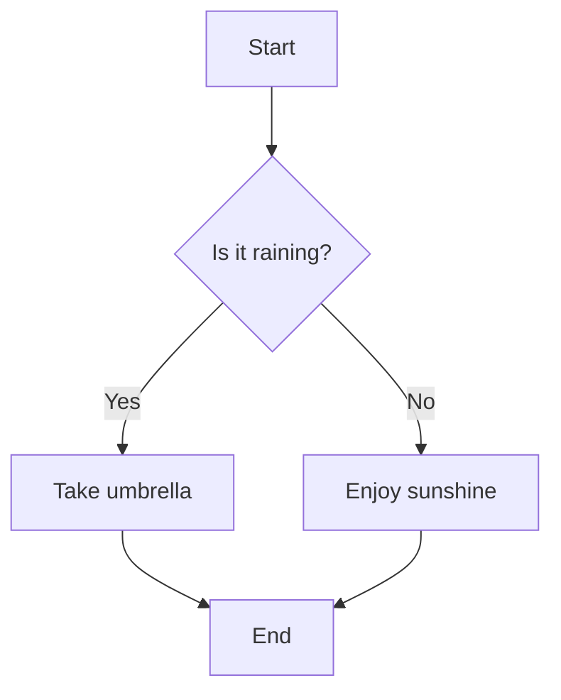
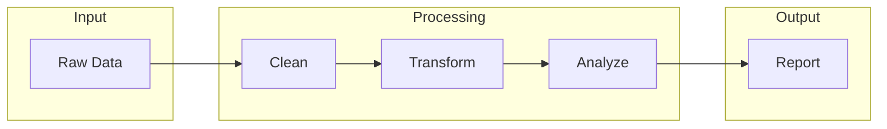
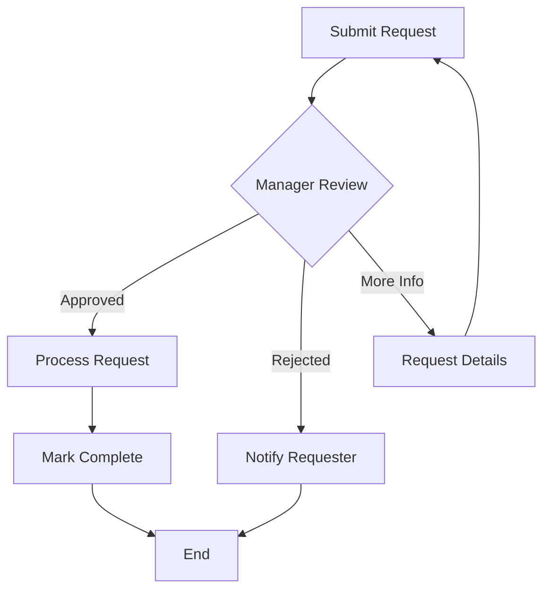
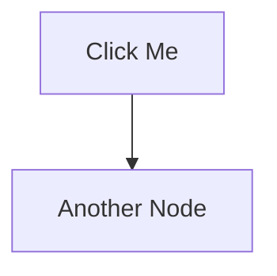

# Charts, Diagrams, and Infographics

## Summary

This chapter introduces specialized JavaScript libraries for creating charts, diagrams, and infographics. You will learn about p5.js MicroSims as the most flexible option, then explore Mermaid.js for declarative diagrams including flowcharts and process diagrams. The chapter covers Chart.js for data visualization with bar charts, line charts, pie charts, and bubble charts. You will learn about different chart types and how to match data types to appropriate visualization methods, plus techniques for adding tooltips and creating informative infographics.

## Concepts Covered

This chapter covers the following 23 concepts from the learning graph:

1. p5.js MicroSim
2. Mermaid.js Diagrams
3. Process Diagrams
4. Flowcharts
5. Chart.js Library
6. Bar Charts
7. Pie Charts
8. Line Charts
9. Other MicroSim Libraries
10. General vs. Specialized
11. Mermaid
12. Declarative Layout
13. Infographics
14. Flowchart
15. Workflow
16. ToolTips
17. ChartJS
18. Chart Types
19. Bar Chart
20. Line Chart
21. Bubble Chart
22. Other Chart Types
23. Data Type to Chart Types

## Prerequisites

This chapter builds on concepts from:

- [Chapter 2: Web Development Essentials](../02-web-development-essentials/index.md)
- [Chapter 9: Bloom's Taxonomy and Learning Objectives](../09-blooms-taxonomy-and-learning-objectives/index.md)

---

## Beyond p5.js: No One Size Fits All

Despite the remarkable power and flexibility of p5.js, there is no "one size fits all" rule in generating MicroSims. Sometimes you need a simple bar chart, not a custom physics simulation. Sometimes a flowchart communicates better than an animated visualization. Sometimes an infographic—a carefully designed visual that connects components with understanding—is exactly what your learning objective demands.

In this chapter, we explore the world beyond p5.js: specialized JavaScript libraries designed for specific visualization tasks. You'll learn how simple charts work and discover how the type of data you want to present will guide your chart selection. The right tool for the job makes your MicroSims more effective and your development faster.

!!! tip "The Right Tool Principle"
    Choosing a specialized library over p5.js isn't a compromise—it's smart design. Chart.js creates better charts than hand-coded p5.js. Mermaid.js creates better flowcharts. Use each tool where it excels.

## General vs. Specialized Libraries

Understanding when to use **general-purpose** versus **specialized** libraries is a key design decision.

### The Spectrum

| Library Type | Examples | Best For | Trade-offs |
|-------------|----------|----------|------------|
| **General-purpose** | p5.js, D3.js | Custom visualizations, unique interactions | More code, more control |
| **Specialized** | Chart.js, Mermaid.js | Specific chart/diagram types | Less code, less customization |
| **Hybrid** | Plotly.js, vis.js | Charts with custom features | Balance of both |

### When to Choose Each

**Choose p5.js (general-purpose) when:**

- Building physics simulations or games
- Need pixel-level control over rendering
- Creating unique, non-standard visualizations
- Combining multiple visualization types
- Real-time animation is critical

**Choose specialized libraries when:**

- Creating standard chart types (bar, line, pie)
- Need built-in interactivity (tooltips, zooming)
- Want to minimize development time
- Data updates dynamically
- Consistency with web standards matters

## p5.js MicroSim: The Flexible Foundation

A **p5.js MicroSim** remains your most flexible option. With p5.js, you can build virtually any visualization—but you write all the code yourself.

### p5.js Strengths

- Complete control over every pixel
- Built-in animation loop (`draw()`)
- Canvas-based rendering (fast)
- Large community and examples
- Works standalone or embedded

### p5.js Limitations

- No built-in chart types
- Tooltip handling is manual
- Responsive design requires custom code
- Accessibility requires extra work

### When p5.js Is the Right Choice

Use p5.js for MicroSims when you need:

```javascript
// Custom physics simulation
function draw() {
  background(240);

  // Apply gravity
  velocity.add(gravity);
  position.add(velocity);

  // Bounce off walls
  if (position.y > height - radius) {
    position.y = height - radius;
    velocity.y *= -0.8;
  }

  // Draw ball
  fill(100, 150, 255);
  circle(position.x, position.y, radius * 2);
}
```

This physics simulation would be difficult to achieve with Chart.js or Mermaid—p5.js is clearly the right tool.

## Mermaid.js: Declarative Diagrams

**Mermaid.js** creates diagrams from text descriptions using a **declarative layout** approach. Instead of specifying pixel positions, you describe relationships—and Mermaid figures out how to draw them.

### What Is Declarative Layout?

**Declarative layout** means you describe *what* you want, not *how* to draw it. Compare:

| Approach | Description | Example |
|----------|-------------|---------|
| **Imperative** (p5.js) | "Draw box at (100, 50), draw arrow from (150, 75) to (200, 75)..." | Full control, tedious |
| **Declarative** (Mermaid) | "A connects to B, B connects to C" | Automatic positioning |

### Mermaid Diagram Types

Mermaid supports many diagram types relevant to educational content:

| Diagram Type | Use Case | Mermaid Syntax Start |
|-------------|----------|---------------------|
| **Flowchart** | Processes, decisions, algorithms | `flowchart TD` |
| **Sequence** | Interactions over time | `sequenceDiagram` |
| **Class** | Object relationships | `classDiagram` |
| **State** | State machines | `stateDiagram-v2` |
| **Entity-Relationship** | Database schemas | `erDiagram` |
| **Gantt** | Project timelines | `gantt` |
| **Pie** | Simple proportions | `pie` |

### Mermaid Flowchart Syntax

A **flowchart** shows processes and decisions as connected nodes:



**Syntax breakdown:**

- `flowchart TD` - Top-down direction (also: LR, BT, RL)
- `A[Text]` - Rectangle node with ID "A"
- `B{Text}` - Diamond (decision) node
- `A --> B` - Arrow connection
- `B -->|Label| C` - Labeled connection

### Process Diagrams

**Process diagrams** show sequential steps in a workflow:



Process diagrams use `subgraph` to group related steps.

### Workflow Diagrams

A **workflow** diagram models business or system processes:



### Mermaid in MicroSims

To embed Mermaid in a MicroSim, include the library and use a container:

```html
<div class="mermaid">
flowchart TD
    A[User Action] --> B[Event Handler]
    B --> C[Update State]
    C --> D[Re-render]
</div>

<script src="https://cdn.jsdelivr.net/npm/mermaid/dist/mermaid.min.js"></script>
<script>mermaid.initialize({startOnLoad:true});</script>
```

#### Diagram: Mermaid Flowchart Example

<details markdown="1">
    <summary>Algorithm Decision Flowchart</summary>
    Type: diagram

    Purpose: Demonstrate Mermaid.js flowchart capabilities with an algorithm decision tree (Bloom: Understand)

    Flowchart content:
    ```
    flowchart TD
        Start[Start: Choose Sort Algorithm]
        Q1{Data size?}
        Q2{Nearly sorted?}
        Q3{Memory constrained?}

        Start --> Q1
        Q1 -->|Small < 50| Insertion[Insertion Sort]
        Q1 -->|Medium| Q2
        Q1 -->|Large > 1000| Q3

        Q2 -->|Yes| Insertion
        Q2 -->|No| Quick[QuickSort]

        Q3 -->|Yes| Heap[HeapSort]
        Q3 -->|No| Merge[MergeSort]

        Insertion --> End[End]
        Quick --> End
        Heap --> End
        Merge --> End
    ```

    Visual style:
    - Decision diamonds in yellow
    - Algorithm boxes in blue
    - Start/End in green
    - Clear arrow labels

    Educational annotations:
    - Hover text on each algorithm explaining complexity
    - Brief description of when each is optimal

    Implementation: Mermaid.js with custom styling
</details>

## Chart.js: Data Visualization Made Easy

**Chart.js** (also called **ChartJS**) is a popular library for creating standard **chart types** with minimal code. It handles rendering, animations, tooltips, and responsiveness automatically.

### Chart.js Features

- 8+ built-in chart types
- Responsive by default
- Animated transitions
- Interactive tooltips
- Legend management
- Accessible (ARIA labels)
- Small file size (~60KB)

### Basic Chart.js Setup

```html
<canvas id="myChart"></canvas>

<script src="https://cdn.jsdelivr.net/npm/chart.js"></script>
<script>
const ctx = document.getElementById('myChart');

new Chart(ctx, {
    type: 'bar',
    data: {
        labels: ['Red', 'Blue', 'Yellow'],
        datasets: [{
            label: 'Votes',
            data: [12, 19, 3],
            backgroundColor: ['red', 'blue', 'yellow']
        }]
    }
});
</script>
```

### Chart Types Overview

Chart.js supports these **chart types**:

| Chart Type | Data Pattern | Best For |
|-----------|--------------|----------|
| **Bar** | Categories with values | Comparing discrete items |
| **Line** | Values over time | Trends, changes |
| **Pie/Doughnut** | Parts of a whole | Proportions, percentages |
| **Radar** | Multiple dimensions | Profile comparisons |
| **Scatter** | X-Y pairs | Correlations |
| **Bubble** | X-Y pairs with size | Three-variable relationships |
| **Polar Area** | Categories with magnitude | Cyclical data |

## Bar Charts: Comparing Categories

**Bar charts** display categorical data with rectangular bars. Bar height (or length) represents the value.

### When to Use Bar Charts

- Comparing values across categories
- Showing rankings
- Displaying discrete, non-continuous data
- When labels are long (use horizontal bars)

### Bar Chart Code

```javascript
new Chart(ctx, {
    type: 'bar',
    data: {
        labels: ['Physics', 'Chemistry', 'Biology', 'Math'],
        datasets: [{
            label: 'Student Scores',
            data: [85, 72, 91, 78],
            backgroundColor: [
                'rgba(255, 99, 132, 0.7)',
                'rgba(54, 162, 235, 0.7)',
                'rgba(255, 206, 86, 0.7)',
                'rgba(75, 192, 192, 0.7)'
            ],
            borderWidth: 1
        }]
    },
    options: {
        scales: {
            y: {
                beginAtZero: true,
                max: 100
            }
        }
    }
});
```

### Grouped and Stacked Bar Charts

**Grouped bars** compare multiple datasets:

```javascript
datasets: [
    { label: '2023', data: [65, 59, 80], backgroundColor: 'blue' },
    { label: '2024', data: [72, 68, 85], backgroundColor: 'green' }
]
```

**Stacked bars** show totals and composition:

```javascript
options: {
    scales: {
        x: { stacked: true },
        y: { stacked: true }
    }
}
```

#### Diagram: Interactive Bar Chart MicroSim

<details markdown="1">
    <summary>Adjustable Bar Chart Demonstration</summary>
    Type: microsim

    Learning objective: Allow students to modify bar chart data and see immediate visual updates (Bloom: Apply)

    Canvas layout:
    - Chart area: 500x300 pixels
    - Control area: 100 pixels

    Visual elements:
    - Chart.js bar chart with 5 categories
    - Each bar represents a student score (0-100)
    - Y-axis labeled "Score"
    - X-axis shows subject names

    Interactive controls:
    - 5 sliders: One per category (0-100)
    - Toggle: "Horizontal/Vertical" orientation
    - Toggle: "Show Values" (display numbers on bars)
    - Button: "Randomize" (random values)

    Behavior:
    - Sliders update chart data in real-time
    - Chart animates smoothly on data change
    - Tooltips show exact values on hover
    - Responsive to container width

    Educational emphasis:
    - Shows relationship between data and visual representation
    - Demonstrates bar chart best practices
    - Immediate feedback on changes

    Color scheme:
    - Bars: gradient from low (red) to high (green)
    - Background: white
    - Grid: light gray

    Implementation: Chart.js with slider controls
</details>

## Line Charts: Trends Over Time

**Line charts** connect data points with lines, emphasizing trends and changes over continuous scales (usually time).

### When to Use Line Charts

- Showing change over time
- Displaying trends
- Comparing multiple series over same time period
- Highlighting rates of change

### Line Chart Code

```javascript
new Chart(ctx, {
    type: 'line',
    data: {
        labels: ['Jan', 'Feb', 'Mar', 'Apr', 'May', 'Jun'],
        datasets: [{
            label: 'Temperature °C',
            data: [4, 6, 10, 15, 20, 24],
            borderColor: 'rgb(75, 192, 192)',
            tension: 0.1,  // Smooth curves
            fill: false
        }]
    },
    options: {
        responsive: true,
        plugins: {
            title: {
                display: true,
                text: 'Monthly Average Temperature'
            }
        }
    }
});
```

### Line Chart Variations

| Variation | Setting | Effect |
|-----------|---------|--------|
| **Smooth lines** | `tension: 0.4` | Curved connections |
| **Area fill** | `fill: true` | Shaded area below line |
| **Stepped** | `stepped: true` | Stair-step pattern |
| **No points** | `pointRadius: 0` | Line only |

## Pie Charts: Parts of a Whole

**Pie charts** show proportions as slices of a circle. The entire pie represents 100%.

### When to Use Pie Charts

- Showing parts of a whole
- When you have 2-7 categories
- When proportions are the message
- For simple, high-level overviews

!!! warning "Pie Chart Caution"
    Humans struggle to compare slice angles. If precise comparison matters, use a bar chart instead. Pie charts work best for showing obvious majorities or rough proportions.

### Pie Chart Code

```javascript
new Chart(ctx, {
    type: 'pie',  // or 'doughnut' for ring style
    data: {
        labels: ['Rent', 'Food', 'Transport', 'Entertainment', 'Savings'],
        datasets: [{
            data: [35, 20, 15, 15, 15],
            backgroundColor: [
                '#ff6384', '#36a2eb', '#ffce56', '#4bc0c0', '#9966ff'
            ]
        }]
    },
    options: {
        plugins: {
            legend: {
                position: 'bottom'
            }
        }
    }
});
```

### Doughnut Charts

A **doughnut chart** is a pie chart with a hole in the center—useful for placing summary statistics:

```javascript
type: 'doughnut',
options: {
    cutout: '60%'  // Size of center hole
}
```

## Bubble Charts: Three Variables at Once

**Bubble charts** extend scatter plots by adding a third dimension: bubble size. Each point shows X position, Y position, and magnitude (size).

### When to Use Bubble Charts

- Comparing three numerical variables
- Showing clusters and outliers
- Displaying magnitude alongside position
- Creating impact/effort matrices

### Bubble Chart Code

```javascript
new Chart(ctx, {
    type: 'bubble',
    data: {
        datasets: [{
            label: 'Projects',
            data: [
                { x: 20, y: 30, r: 15 },  // r = radius
                { x: 40, y: 10, r: 10 },
                { x: 30, y: 20, r: 25 }
            ],
            backgroundColor: 'rgba(255, 99, 132, 0.5)'
        }]
    },
    options: {
        scales: {
            x: { title: { display: true, text: 'Effort' }},
            y: { title: { display: true, text: 'Impact' }}
        }
    }
});
```

### Bubble Chart Applications

| Application | X-Axis | Y-Axis | Size |
|------------|--------|--------|------|
| Project prioritization | Effort | Impact | Cost |
| Market analysis | Price | Quality | Market share |
| Student performance | Time spent | Score | Engagement |
| Risk assessment | Probability | Impact | Cost of mitigation |

#### Diagram: Priority Matrix Bubble Chart

<details markdown="1">
    <summary>Impact/Effort Priority Matrix</summary>
    Type: microsim

    Learning objective: Use bubble chart to visualize project priorities across three dimensions (Bloom: Analyze, Evaluate)

    Canvas layout:
    - Chart area: 500x400 pixels
    - Control area: 80 pixels

    Visual elements:
    - Bubble chart with quadrant lines at midpoints
    - Quadrant labels:
      - Top-left: "Quick Wins" (high impact, low effort)
      - Top-right: "Major Projects" (high impact, high effort)
      - Bottom-left: "Fill-ins" (low impact, low effort)
      - Bottom-right: "Thankless Tasks" (low impact, high effort)
    - Project bubbles with names

    Sample data:
    - "Website Redesign": effort=70, impact=80, budget=50K
    - "Email Update": effort=20, impact=60, budget=5K
    - "New Feature A": effort=90, impact=90, budget=100K
    - "Bug Fixes": effort=30, impact=40, budget=10K
    - "Documentation": effort=40, impact=30, budget=15K

    Interactive controls:
    - Button: "Add Project" (opens input dialog)
    - Drag projects to reposition
    - Click project: Show details panel
    - Slider: "Scale bubbles" (adjust size factor)

    Behavior:
    - Bubbles draggable to update effort/impact
    - Size reflects budget/importance
    - Color indicates status (green=approved, yellow=pending, red=blocked)
    - Tooltips show all three values

    Educational emphasis:
    - Teaches prioritization frameworks
    - Three-variable visualization
    - Decision-making tool

    Color scheme:
    - Quadrants: subtle background tints
    - Bubbles: status-based colors with alpha
    - Grid: light gray dashed lines

    Implementation: Chart.js bubble chart with drag interaction
</details>

## Other Chart Types

Beyond the core types, Chart.js and other libraries support additional visualizations:

### Radar Charts

**Radar charts** (spider charts) display multiple variables as axes radiating from a center:

```javascript
type: 'radar',
data: {
    labels: ['Speed', 'Strength', 'Intelligence', 'Agility', 'Endurance'],
    datasets: [{
        label: 'Character Stats',
        data: [65, 80, 90, 70, 85]
    }]
}
```

**Best for:** Comparing profiles, showing skill assessments, displaying multi-attribute items.

### Scatter Charts

**Scatter charts** show correlation between two variables:

```javascript
type: 'scatter',
data: {
    datasets: [{
        label: 'Study Hours vs Score',
        data: [
            {x: 2, y: 55}, {x: 5, y: 78}, {x: 8, y: 92}
        ]
    }]
}
```

**Best for:** Correlation analysis, identifying clusters, regression visualization.

### Polar Area Charts

**Polar area charts** combine pie and bar concepts—each slice has equal angle but variable radius:

```javascript
type: 'polarArea',
data: {
    labels: ['Mon', 'Tue', 'Wed', 'Thu', 'Fri'],
    datasets: [{
        data: [11, 16, 7, 14, 12]
    }]
}
```

**Best for:** Cyclical data (days, months), comparing magnitudes across categories.

## Data Type to Chart Type: The Selection Guide

Choosing the right chart type depends on your **data type** and what you want to communicate. This guide maps data patterns to appropriate visualizations.

### The Decision Matrix

| Your Data Pattern | Best Chart Types | Avoid |
|------------------|------------------|-------|
| **Categories** (discrete items) | Bar, Pie, Polar Area | Line, Scatter |
| **Time series** (values over time) | Line, Area, Bar | Pie, Radar |
| **Parts of whole** (percentages) | Pie, Doughnut, Stacked Bar | Line, Scatter |
| **Correlation** (X-Y relationship) | Scatter, Bubble | Pie, Bar |
| **Distribution** (spread of values) | Histogram, Box Plot | Pie |
| **Comparison** (multiple series) | Grouped Bar, Multi-line | Single Pie |
| **Hierarchy** (nested categories) | Treemap, Sunburst | Line, Scatter |
| **Flow/Process** | Sankey, Flowchart | Bar, Pie |
| **Geographic** | Map, Choropleth | Bar, Line |
| **Multi-dimensional** (3+ variables) | Bubble, Radar, Parallel | Pie, Simple Bar |

### Data Type Characteristics

| Data Type | Characteristics | Example |
|-----------|-----------------|---------|
| **Categorical** | Named groups, no order | Colors, countries, products |
| **Ordinal** | Named groups, ordered | Grades (A,B,C), satisfaction levels |
| **Continuous** | Numerical, any value | Temperature, price, time |
| **Discrete** | Numerical, specific values | Count of items, year |

### Quick Selection Questions

Answer these questions to choose your chart:

1. **Are you comparing categories?** → Bar chart
2. **Showing change over time?** → Line chart
3. **Showing parts of a whole?** → Pie (few parts) or Stacked Bar (many parts)
4. **Showing correlation between variables?** → Scatter or Bubble
5. **Comparing profiles across dimensions?** → Radar chart
6. **Showing a process or flow?** → Flowchart (Mermaid)

#### Diagram: Chart Selection Flowchart

<details markdown="1">
    <summary>Data to Chart Type Selection Guide</summary>
    Type: diagram

    Purpose: Help users select appropriate chart types based on their data and communication goals (Bloom: Apply)

    Layout: Top-down decision flowchart

    Starting point:
    - "What do you want to show?"

    First level decisions:
    - "Comparison" → Branch A
    - "Composition" → Branch B
    - "Distribution" → Branch C
    - "Relationship" → Branch D
    - "Process/Flow" → Branch E

    Branch A (Comparison):
    - "How many categories?"
    - Few (≤7) → "Bar Chart"
    - Many (>7) → "Horizontal Bar"
    - Over time? → "Line Chart"

    Branch B (Composition):
    - "Static or changing?"
    - Static, few parts → "Pie/Doughnut"
    - Static, many parts → "Stacked Bar"
    - Changing over time → "Stacked Area"

    Branch C (Distribution):
    - "One variable?" → "Histogram"
    - "Two variables?" → "Scatter Plot"
    - "Groups to compare?" → "Box Plot"

    Branch D (Relationship):
    - "Two variables?" → "Scatter"
    - "Three variables?" → "Bubble"
    - "Many dimensions?" → "Radar/Parallel"

    Branch E (Process/Flow):
    - "Sequential steps?" → "Flowchart"
    - "Interactions?" → "Sequence Diagram"
    - "State changes?" → "State Diagram"

    Visual style:
    - Color-coded branches
    - Chart icons at terminals
    - Clear decision labels

    Annotations:
    - "Most common choice" markers
    - "Advanced" markers for complex types

    Implementation: Mermaid.js or custom SVG
</details>

## Tooltips: Adding Context on Demand

**Tooltips** are small information boxes that appear when users hover over chart elements. They provide details without cluttering the visualization.

### Why Tooltips Matter

- Show exact values without label clutter
- Provide additional context
- Enable exploration of dense data
- Improve accessibility

### Chart.js Tooltip Customization

```javascript
options: {
    plugins: {
        tooltip: {
            enabled: true,
            backgroundColor: 'rgba(0, 0, 0, 0.8)',
            titleFont: { size: 14 },
            bodyFont: { size: 12 },
            padding: 10,
            callbacks: {
                label: function(context) {
                    return `Score: ${context.parsed.y} points`;
                },
                afterLabel: function(context) {
                    return `Rank: #${context.dataIndex + 1}`;
                }
            }
        }
    }
}
```

### Tooltip Callbacks

| Callback | When Called | Use For |
|----------|------------|---------|
| `title` | Tooltip title | Category name |
| `beforeLabel` | Before value | Context info |
| `label` | Main value | Formatted data |
| `afterLabel` | After value | Additional info |
| `footer` | Bottom of tooltip | Calculations, notes |

### Mermaid Click Actions

Mermaid supports click interactions for nodes:



## Infographics: Visual Understanding

**Infographics** are designed visuals that combine data, graphics, and text to communicate complex information clearly. Unlike charts (which display data) or diagrams (which show relationships), infographics tell a story.

### Characteristics of Good Infographics

| Characteristic | Description |
|---------------|-------------|
| **Focused message** | One main point or story |
| **Visual hierarchy** | Important elements stand out |
| **Minimal text** | Words support visuals, not replace them |
| **Consistent style** | Unified color palette and typography |
| **Flow** | Clear reading path through content |
| **Data integrity** | Accurate, not misleading |

### Infographic Types

1. **Statistical infographics** - Charts with supporting visuals and annotations
2. **Informational infographics** - Explanatory content with icons and sections
3. **Timeline infographics** - Chronological events with visual markers
4. **Process infographics** - Step-by-step guides with icons
5. **Comparison infographics** - Side-by-side visual comparisons
6. **Geographic infographics** - Map-based data visualization

### Building Infographics as MicroSims

Infographics can be interactive MicroSims with:

- Hover effects revealing additional data
- Click interactions for drill-down
- Animated transitions between sections
- Responsive layout adaptation

```javascript
// Infographic with hover zones
let zones = [
  { x: 50, y: 100, w: 150, h: 80, info: "First section details..." },
  { x: 250, y: 100, w: 150, h: 80, info: "Second section details..." }
];

function draw() {
  // Draw zones
  for (let zone of zones) {
    fill(isHovered(zone) ? '#e0e0e0' : '#f5f5f5');
    rect(zone.x, zone.y, zone.w, zone.h);
  }

  // Show tooltip for hovered zone
  let hovered = zones.find(z => isHovered(z));
  if (hovered) {
    drawTooltip(mouseX, mouseY, hovered.info);
  }
}

function isHovered(zone) {
  return mouseX > zone.x && mouseX < zone.x + zone.w &&
         mouseY > zone.y && mouseY < zone.y + zone.h;
}
```

#### Diagram: Interactive Infographic MicroSim

<details markdown="1">
    <summary>Learning Pathway Infographic</summary>
    Type: microsim

    Learning objective: Present educational pathway information as an interactive infographic with hover details (Bloom: Understand)

    Canvas layout:
    - Full canvas: 600x500 pixels
    - No separate control region (integrated)

    Visual elements:
    - Central pathway graphic (vertical flow)
    - Milestone nodes (circles with icons)
    - Connecting path (curved line)
    - Side panels appearing on hover
    - Progress indicator

    Content (MicroSim Learning Path):
    1. "Start Here" - Introduction to concepts
    2. "p5.js Basics" - Core drawing and animation
    3. "Interactivity" - Controls and events
    4. "Visualization" - Charts and diagrams
    5. "Advanced" - Physics, AI integration
    6. "Master" - Create original MicroSims

    Interactive features:
    - Hover over node: Side panel slides in with details
    - Click node: Expand to show sub-topics
    - Progress dots show completion status
    - Smooth animations between states

    Hover panel content:
    - Milestone name and description
    - Estimated time to complete
    - Prerequisites
    - Key skills gained
    - Related resources (clickable)

    Behavior:
    - Only one panel open at a time
    - Panels animate in from side
    - Path highlights from start to hovered node
    - Visual distinction for completed/current/future nodes

    Visual design:
    - Modern flat design with subtle shadows
    - Iconography for each milestone
    - Color progression (cool to warm as path advances)
    - Consistent typography

    Color scheme:
    - Completed nodes: green
    - Current node: blue (animated pulse)
    - Future nodes: gray
    - Path: gradient from start to end
    - Panels: white with accent color border

    Implementation: p5.js with custom animation
</details>

## Other MicroSim Libraries

Beyond p5.js, Chart.js, and Mermaid, several other libraries serve specialized purposes:

### Visualization Libraries

| Library | Specialty | When to Use |
|---------|-----------|-------------|
| **D3.js** | Custom data visualization | Complex, unique visualizations |
| **Three.js** | 3D graphics | 3D models, virtual environments |
| **Plotly.js** | Scientific charts | Interactive scientific plots |
| **vis.js** | Networks and timelines | Graph visualization, scheduling |
| **Leaflet** | Maps | Geographic data |
| **Vega-Lite** | Grammar of graphics | Specification-based charts |

### When to Venture Beyond

Consider other libraries when you need:

- **D3.js** - Complete control over data-driven documents
- **Three.js** - 3D molecular models, architectural visualization
- **Plotly.js** - Publication-quality scientific charts
- **vis.js** - Interactive network graphs (like learning graphs)
- **Leaflet** - Interactive maps with markers and layers

### Library Selection Checklist

Before choosing a library, consider:

- [ ] Does it support my chart/diagram type?
- [ ] Is the file size acceptable for my use case?
- [ ] Does it handle responsiveness?
- [ ] Are tooltips and interactions built in?
- [ ] How steep is the learning curve?
- [ ] Is it actively maintained?
- [ ] Does it work in my target browsers?

## Complete Example: Multi-Library MicroSim

Here's a MicroSim that combines multiple visualization approaches:

```html
<!DOCTYPE html>
<html>
<head>
    <script src="https://cdn.jsdelivr.net/npm/chart.js"></script>
    <script src="https://cdn.jsdelivr.net/npm/mermaid/dist/mermaid.min.js"></script>
</head>
<body>
    <h2>Project Dashboard</h2>

    <!-- Chart.js for data -->
    <canvas id="progressChart" width="400" height="200"></canvas>

    <!-- Mermaid for process -->
    <div class="mermaid">
    flowchart LR
        Plan --> Design --> Build --> Test --> Deploy
    </div>

    <script>
    // Chart.js initialization
    new Chart(document.getElementById('progressChart'), {
        type: 'bar',
        data: {
            labels: ['Plan', 'Design', 'Build', 'Test', 'Deploy'],
            datasets: [{
                label: 'Completion %',
                data: [100, 80, 45, 10, 0],
                backgroundColor: '#4CAF50'
            }]
        }
    });

    // Mermaid initialization
    mermaid.initialize({ startOnLoad: true });
    </script>
</body>
</html>
```

## Key Takeaways

You've learned to select and use specialized visualization libraries for educational MicroSims:

1. **p5.js MicroSims** offer maximum flexibility but require more code.

2. **General vs. specialized** libraries present trade-offs between control and convenience.

3. **Mermaid.js** uses **declarative layout** for diagrams without positioning code.

4. **Flowcharts** and **process diagrams** show decisions and sequential steps.

5. **Workflow** diagrams model business and system processes.

6. **Chart.js (ChartJS)** provides built-in **chart types** with minimal configuration.

7. **Bar charts** compare categories; use them for discrete data comparisons.

8. **Line charts** show trends over time; use them for continuous data.

9. **Pie charts** show parts of a whole; limit to 2-7 clear categories.

10. **Bubble charts** display three variables using position and size.

11. **Data type to chart type** mapping guides visualization selection.

12. **Tooltips** add context on demand without visual clutter.

13. **Infographics** combine data, graphics, and text to tell stories.

14. Other libraries (**D3, Three.js, Plotly, vis.js**) serve specialized needs.

15. Choose the right tool for the job—specialized libraries often outperform general-purpose code.

??? question "Challenge: Match Data to Visualization"
    You have three datasets: (1) monthly sales figures for a year, (2) market share percentages for 5 competitors, (3) the relationship between advertising spend and revenue. For each dataset, select the most appropriate chart type and explain why. Then identify which library you would use.

## Next Steps

You now have a toolkit of visualization options beyond p5.js. You can create flowcharts with Mermaid, data charts with Chart.js, and know when to reach for specialized libraries. In the next chapter, we'll explore **physics and animation**, learning how to add realistic motion, collisions, and dynamic behavior to your MicroSims.

Remember: the best visualization is the one that communicates your message clearly. Sometimes that's a custom p5.js animation. Sometimes it's a simple bar chart. Let your data and learning objectives guide the choice.

## References

- [Chart.js Documentation](https://www.chartjs.org/docs/) - Official Chart.js documentation
- [Mermaid.js Live Editor](https://mermaid.live/) - Interactive Mermaid diagram editor
- [Data Visualization Catalogue](https://datavizcatalogue.com/) - Comprehensive chart type guide
- [D3.js Gallery](https://d3-graph-gallery.com/) - D3.js examples and tutorials
- [From Data to Viz](https://www.data-to-viz.com/) - Decision tree for chart selection
