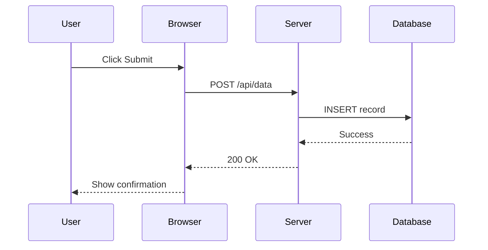

# Maps, Networks, and Timeline Visualizations

## Summary

This chapter covers specialized visualization libraries for geographic, network, and temporal data. You will learn to create interactive maps using Leaflet.js with OpenMaps data, build network graphs and org charts with vis-network including force-directed layouts and node coloring. The chapter explores timeline visualizations with vis-timeline for events, durations, and sequences. You will also learn about specialized MicroSims for 3D visualization, circuit simulation, equation graphing, and advanced libraries like ReactFlow for complex interactive diagrams.

## Concepts Covered

This chapter covers the following 28 concepts from the learning graph:

1. Timeline Visualization
2. Geographic Maps
3. Leaflet.js
4. Network Graphs
5. vis-network Library
6. Causal Loop Diagrams
7. Equation Graphing
8. Specialized MicroSims
9. 3D Visualization
10. Circuit Simulation
11. Vis-network JS Library
12. Graph Layout Algorithms
13. History of GraphViz
14. Forced Directed Layout
15. Graph Node Coloring
16. Org Chart Example
17. Maps
18. Leaflet JS Library
19. OpenMaps Data
20. Timelines
21. Event Lists
22. Durations
23. Sequence Diagrams
24. Heavyweight Libraries
25. ReactFlow
26. ER Diagram Example
27. Vis-Timeline
28. Venn Diagrams

## Prerequisites

This chapter builds on concepts from:

- [Chapter 2: Web Development Essentials](../02-web-development-essentials/index.md)
- [Chapter 9: Bloom's Taxonomy and Learning Objectives](../09-blooms-taxonomy-and-learning-objectives/index.md)
- [Chapter 10: Charts, Diagrams, and Infographics](../10-charts-diagrams-and-infographics/index.md)

---

## The Power of Relationship Visualization

Welcome to some of the most powerful MicroSims for analyzing concepts and their relationships. In this chapter, we move beyond simple charts to visualizations that reveal structure, connection, and flow.

Have you ever tried to manually lay out an organizational chart? Perhaps you've spent hours arranging boxes, drawing lines, only to have the structure change the next week. Then you start over. It's slow. It's painful. And it doesn't scale.

Fortunately, there are ways to automate the layout of complex structures. The origin story takes us back to Bell Labs in the 1980s, where a team created a product called **GraphViz**—a collection of layout algorithms that could automatically arrange nodes and edges into readable diagrams. From that pioneering work, many generations of products evolved. Today, many of these layout algorithms are available through JavaScript libraries like **vis-network**.

!!! tip "The Layout Algorithm Advantage"
    When you let algorithms handle positioning, you can focus on what matters: the relationships. Add a node, remove an edge, reorganize departments—the layout adapts automatically. That's the power we'll harness in this chapter.

Let's explore how these algorithms work and how we can bring order to complex network diagrams to build fun and insightful MicroSims.

## Network Graphs: Visualizing Relationships

**Network graphs** (also called node-link diagrams) show entities as nodes and relationships as edges connecting them. They're ideal for:

- Organizational hierarchies
- Social networks
- Concept dependencies
- System architectures
- Knowledge graphs

### Anatomy of a Network Graph

| Component | Description | Examples |
|-----------|-------------|----------|
| **Nodes** | Entities or concepts | People, departments, topics |
| **Edges** | Relationships between nodes | Reports-to, connects-to, depends-on |
| **Labels** | Text identifying nodes/edges | Names, relationship types |
| **Weights** | Numeric values on edges | Strength, frequency, cost |
| **Groups** | Categories for nodes | Departments, types, levels |

### When Network Graphs Excel

Use network graphs when:

- Relationships are as important as entities
- Structure is complex or hierarchical
- Users need to explore connections
- The graph changes over time
- Patterns emerge from connectivity

## The History of GraphViz

The **history of GraphViz** begins at AT&T Bell Labs in the late 1980s. Researchers faced a common problem: how do you draw a graph with hundreds of nodes so that humans can understand it?

### The Timeline

| Year | Development |
|------|-------------|
| 1988 | Initial GraphViz development at Bell Labs |
| 1991 | "dot" algorithm for hierarchical layouts |
| 1993 | "neato" for spring-model layouts |
| 1997 | Open-source release |
| 2000s | Web-based visualization libraries emerge |
| 2010s | JavaScript libraries (D3, vis.js) dominate |
| 2020s | Modern libraries (vis-network, ReactFlow) mature |

### GraphViz Layout Algorithms

GraphViz introduced several **graph layout algorithms** that remain influential:

| Algorithm | Type | Best For |
|-----------|------|----------|
| **dot** | Hierarchical | Org charts, flow diagrams, trees |
| **neato** | Spring model | Undirected graphs, clusters |
| **fdp** | Force-directed | Large graphs, organic layouts |
| **twopi** | Radial | Center-focused hierarchies |
| **circo** | Circular | Ring-structured graphs |

These algorithms solved the fundamental problem: given nodes and edges, compute (x, y) positions that make the structure readable.

## Force-Directed Layout

The **force-directed layout** (also called spring-embedded layout) treats the graph as a physical system:

- **Nodes repel** each other like charged particles
- **Edges attract** connected nodes like springs
- The system reaches equilibrium when forces balance

### How It Works

```
1. Place nodes randomly
2. Calculate repulsion between all node pairs
3. Calculate attraction along edges
4. Move nodes according to net forces
5. Repeat until stable (or max iterations)
```

### Force-Directed Advantages

- Produces aesthetically pleasing layouts
- Reveals natural clusters
- No manual positioning required
- Adapts to graph changes
- Works for any graph structure

### Force-Directed Limitations

- Computationally expensive for large graphs
- May produce different layouts each run
- Can get stuck in local minima
- Doesn't respect hierarchy without constraints

## The vis-network Library

**vis-network** (part of the vis.js ecosystem) is a JavaScript library that brings GraphViz-style layout algorithms to the browser. It's the primary library we'll use for network graph MicroSims.

### vis-network Features

- Multiple layout algorithms (hierarchical, force-directed)
- Interactive manipulation (drag, zoom, click)
- Node and edge styling
- Clustering and grouping
- Physics simulation
- Events and callbacks
- Performance optimization for large graphs

### Basic vis-network Setup

```html
<div id="network" style="width: 600px; height: 400px;"></div>

<script src="https://unpkg.com/vis-network/standalone/umd/vis-network.min.js"></script>
<script>
// Define nodes
const nodes = new vis.DataSet([
    { id: 1, label: 'CEO' },
    { id: 2, label: 'CTO' },
    { id: 3, label: 'CFO' },
    { id: 4, label: 'Developer' },
    { id: 5, label: 'Accountant' }
]);

// Define edges
const edges = new vis.DataSet([
    { from: 1, to: 2 },
    { from: 1, to: 3 },
    { from: 2, to: 4 },
    { from: 3, to: 5 }
]);

// Create network
const container = document.getElementById('network');
const data = { nodes: nodes, edges: edges };
const options = {};
const network = new vis.Network(container, data, options);
</script>
```

### Layout Options

```javascript
const options = {
    layout: {
        hierarchical: {
            enabled: true,
            direction: 'UD',        // Up-Down
            sortMethod: 'directed', // Follow edge direction
            levelSeparation: 100,   // Vertical spacing
            nodeSpacing: 150        // Horizontal spacing
        }
    },
    physics: {
        enabled: false  // Disable physics for hierarchical
    }
};
```

## Graph Node Coloring

**Graph node coloring** uses color to encode additional information about nodes. Common patterns include:

| Coloring Strategy | Information Encoded | Example |
|------------------|---------------------|---------|
| **By group** | Category or type | Department colors |
| **By level** | Hierarchy depth | Darker = higher level |
| **By metric** | Numerical value | Red = high risk |
| **By state** | Current status | Green = active |
| **By selection** | User focus | Highlighted path |

### Implementing Node Colors

```javascript
const nodes = new vis.DataSet([
    { id: 1, label: 'CEO', color: '#e74c3c', group: 'executive' },
    { id: 2, label: 'CTO', color: '#3498db', group: 'tech' },
    { id: 3, label: 'CFO', color: '#2ecc71', group: 'finance' },
    { id: 4, label: 'Dev', color: '#3498db', group: 'tech' },
    { id: 5, label: 'Acct', color: '#2ecc71', group: 'finance' }
]);

// Or use group-based styling
const options = {
    groups: {
        executive: { color: { background: '#e74c3c' }},
        tech: { color: { background: '#3498db' }},
        finance: { color: { background: '#2ecc71' }}
    }
};
```

## Org Chart Example

An **org chart** is a classic application of hierarchical network visualization. Let's build one:

#### Diagram: Interactive Org Chart MicroSim

<details markdown="1">
    <summary>Dynamic Organization Chart</summary>
    Type: microsim

    Learning objective: Create and manipulate an organizational chart with hierarchical layout (Bloom: Apply, Analyze)

    Canvas layout:
    - Network area: 600x400 pixels
    - Control area: 80 pixels

    Visual elements:
    - vis-network graph with hierarchical layout
    - Nodes: rounded rectangles with name and title
    - Edges: straight lines with arrow indicating "reports to"
    - Color coding by department

    Sample data:
    ```
    CEO (Executive)
    ├── CTO (Tech) - blue
    │   ├── Lead Developer
    │   ├── DevOps Engineer
    │   └── QA Manager
    ├── CFO (Finance) - green
    │   ├── Controller
    │   └── Analyst
    └── COO (Operations) - orange
        ├── HR Manager
        └── Facilities
    ```

    Interactive controls:
    - Button: "Add Employee" (opens dialog)
    - Button: "Remove Selected"
    - Dropdown: "Layout Direction" (UD, DU, LR, RL)
    - Toggle: "Show Titles" (display job titles)
    - Slider: "Spacing" (adjust node separation)

    Behavior:
    - Click node to select
    - Double-click to edit
    - Drag to reposition (temporarily)
    - Add employee prompts for name, title, reports-to
    - Layout recalculates automatically on changes

    Educational emphasis:
    - Shows hierarchical layout algorithm in action
    - Demonstrates automatic repositioning
    - Highlights relationship visualization

    Color scheme:
    - Executive: red
    - Tech: blue
    - Finance: green
    - Operations: orange
    - Edges: gray with arrows

    Implementation: vis-network with hierarchical layout
</details>

## Causal Loop Diagrams

**Causal loop diagrams** visualize feedback systems. They show how variables influence each other with positive (+) or negative (-) relationships.

### Elements of Causal Loop Diagrams

| Element | Symbol | Meaning |
|---------|--------|---------|
| **Variable** | Node | A quantity that changes |
| **Positive link** | → + | Same direction change |
| **Negative link** | → - | Opposite direction change |
| **Reinforcing loop** | R | Amplifying feedback |
| **Balancing loop** | B | Stabilizing feedback |

### Example: Population Dynamics

```
Population → (+) Births → (+) Population  [Reinforcing]
Population → (+) Deaths → (-) Population  [Balancing]
```

### Building with vis-network

```javascript
const nodes = new vis.DataSet([
    { id: 1, label: 'Population', shape: 'box' },
    { id: 2, label: 'Birth Rate', shape: 'box' },
    { id: 3, label: 'Death Rate', shape: 'box' },
    { id: 4, label: 'Resources', shape: 'box' }
]);

const edges = new vis.DataSet([
    { from: 1, to: 2, label: '+', arrows: 'to' },
    { from: 2, to: 1, label: '+', arrows: 'to' },
    { from: 1, to: 3, label: '+', arrows: 'to' },
    { from: 3, to: 1, label: '-', arrows: 'to' },
    { from: 4, to: 1, label: '+', arrows: 'to' },
    { from: 1, to: 4, label: '-', arrows: 'to' }
]);
```

## ER Diagram Example

**Entity-Relationship (ER) diagrams** model database schemas. They show entities (tables), attributes (columns), and relationships.

### ER Diagram Elements

| Element | Representation |
|---------|---------------|
| **Entity** | Rectangle |
| **Attribute** | Oval connected to entity |
| **Relationship** | Diamond between entities |
| **Cardinality** | 1, N, M on edges |

### vis-network for ER Diagrams

```javascript
const nodes = new vis.DataSet([
    { id: 1, label: 'Student', shape: 'box', color: '#3498db' },
    { id: 2, label: 'Course', shape: 'box', color: '#3498db' },
    { id: 3, label: 'Enrolls', shape: 'diamond', color: '#e74c3c' },
    { id: 4, label: 'student_id', shape: 'ellipse' },
    { id: 5, label: 'name', shape: 'ellipse' },
    { id: 6, label: 'course_id', shape: 'ellipse' },
    { id: 7, label: 'title', shape: 'ellipse' }
]);

const edges = new vis.DataSet([
    { from: 1, to: 3, label: 'N' },
    { from: 3, to: 2, label: 'M' },
    { from: 1, to: 4 },
    { from: 1, to: 5 },
    { from: 2, to: 6 },
    { from: 2, to: 7 }
]);
```

## Geographic Maps with Leaflet.js

**Geographic maps** visualize location-based data. **Leaflet.js** (also called **Leaflet JS Library**) is a lightweight, open-source library for interactive maps.

### Why Leaflet?

| Feature | Benefit |
|---------|---------|
| Lightweight | ~42KB gzipped |
| Mobile-friendly | Touch and gesture support |
| Extensible | Hundreds of plugins |
| Free tile sources | OpenStreetMap, others |
| Simple API | Easy to learn |

### OpenMaps Data

**OpenMaps data** (primarily OpenStreetMap) provides free map tiles. Unlike Google Maps, there are no API keys or usage limits for basic tiles.

### Basic Leaflet Setup

```html
<link rel="stylesheet" href="https://unpkg.com/leaflet/dist/leaflet.css" />
<div id="map" style="width: 600px; height: 400px;"></div>

<script src="https://unpkg.com/leaflet/dist/leaflet.js"></script>
<script>
// Create map centered on coordinates
const map = L.map('map').setView([51.505, -0.09], 13);

// Add OpenStreetMap tiles
L.tileLayer('https://{s}.tile.openstreetmap.org/{z}/{x}/{y}.png', {
    attribution: '© OpenStreetMap contributors'
}).addTo(map);

// Add a marker
L.marker([51.5, -0.09])
    .addTo(map)
    .bindPopup('Hello from London!')
    .openPopup();
</script>
```

### Map Features for Education

| Feature | Use Case | Leaflet Method |
|---------|----------|----------------|
| **Markers** | Point locations | `L.marker()` |
| **Polygons** | Regions, boundaries | `L.polygon()` |
| **Circles** | Range, radius | `L.circle()` |
| **Polylines** | Routes, paths | `L.polyline()` |
| **Popups** | Information on click | `.bindPopup()` |
| **Custom icons** | Category markers | `L.icon()` |

#### Diagram: Interactive Map MicroSim

<details markdown="1">
    <summary>Historical Events Map</summary>
    Type: microsim

    Learning objective: Explore historical events by location using an interactive map (Bloom: Understand, Analyze)

    Canvas layout:
    - Map area: 600x400 pixels
    - Control area: 60 pixels

    Visual elements:
    - Leaflet map with OpenStreetMap tiles
    - Custom markers for event types:
      - Battle: crossed swords icon
      - Treaty: handshake icon
      - Discovery: lightbulb icon
    - Popup cards with event details

    Sample data (American Revolution):
    - Boston Tea Party (1773): Boston, MA
    - Lexington and Concord (1775): Lexington, MA
    - Declaration of Independence (1776): Philadelphia, PA
    - Valley Forge (1777-78): Valley Forge, PA
    - Yorktown (1781): Yorktown, VA

    Interactive controls:
    - Dropdown: "Select Era" (Revolution, Civil War, Modern)
    - Checkbox filters: Battle, Treaty, Discovery
    - Slider: "Year Range" (filter by date)
    - Button: "Fit All" (zoom to show all markers)

    Behavior:
    - Click marker: Show popup with event details
    - Changing era: Load different marker set
    - Date slider: Filter visible events
    - Checkboxes: Toggle marker categories
    - Responsive zoom and pan

    Educational emphasis:
    - Geographic context for historical events
    - Temporal filtering reveals patterns
    - Click for detailed information

    Color scheme:
    - Battle markers: red
    - Treaty markers: blue
    - Discovery markers: yellow
    - Map: standard OpenStreetMap style

    Implementation: Leaflet.js with custom markers
</details>

## Timeline Visualization

**Timeline visualization** displays events across time. They're essential for:

- Historical education
- Project planning
- Process documentation
- Biographical content
- Event sequencing

### Timeline Components

| Component | Description |
|-----------|-------------|
| **Axis** | Time scale (dates/years) |
| **Items** | Events with start (and optional end) |
| **Groups** | Categories or tracks |
| **Range** | Items with duration |
| **Point** | Single-moment events |

## Vis-Timeline Library

**Vis-Timeline** (part of vis.js) creates interactive timelines with minimal code.

### Basic Vis-Timeline Setup

```html
<link href="https://unpkg.com/vis-timeline/styles/vis-timeline-graph2d.min.css" rel="stylesheet" />
<div id="timeline"></div>

<script src="https://unpkg.com/vis-timeline/standalone/umd/vis-timeline-graph2d.min.js"></script>
<script>
const items = new vis.DataSet([
    { id: 1, content: 'Event A', start: '2024-01-15' },
    { id: 2, content: 'Event B', start: '2024-02-20' },
    { id: 3, content: 'Project', start: '2024-03-01', end: '2024-03-15' }
]);

const container = document.getElementById('timeline');
const timeline = new vis.Timeline(container, items, {});
</script>
```

### Event Lists and Durations

**Event lists** are collections of time-based items. Each event can be:

- A **point** (single moment): `{ start: '2024-01-15' }`
- A **duration/range** (time span): `{ start: '2024-01-15', end: '2024-02-20' }`

```javascript
const items = new vis.DataSet([
    // Point events
    { id: 1, content: 'Meeting', start: '2024-01-15', type: 'point' },

    // Duration events
    { id: 2, content: 'Sprint 1', start: '2024-01-15', end: '2024-01-29', type: 'range' },

    // Background highlighting
    { id: 3, content: 'Holiday', start: '2024-12-24', end: '2024-12-26', type: 'background' }
]);
```

### Grouped Timelines

Groups create parallel tracks:

```javascript
const groups = new vis.DataSet([
    { id: 1, content: 'Team A' },
    { id: 2, content: 'Team B' },
    { id: 3, content: 'Team C' }
]);

const items = new vis.DataSet([
    { id: 1, group: 1, content: 'Task 1', start: '2024-01-15', end: '2024-01-20' },
    { id: 2, group: 2, content: 'Task 2', start: '2024-01-18', end: '2024-01-25' },
    { id: 3, group: 3, content: 'Task 3', start: '2024-01-20', end: '2024-01-30' }
]);

const timeline = new vis.Timeline(container, items, groups, options);
```

#### Diagram: Historical Timeline MicroSim

<details markdown="1">
    <summary>Interactive History Timeline</summary>
    Type: microsim

    Learning objective: Explore historical periods and events through an interactive timeline (Bloom: Remember, Understand)

    Canvas layout:
    - Timeline area: 700x300 pixels
    - Control area: 60 pixels

    Visual elements:
    - vis-timeline with grouped tracks
    - Era backgrounds (color-coded periods)
    - Event markers with icons
    - Hover cards with details

    Sample data (Technology History):
    Groups:
    - Computing
    - Internet
    - Mobile

    Events:
    - 1946: ENIAC (Computing)
    - 1969: ARPANET (Internet)
    - 1973: First mobile call (Mobile)
    - 1981: IBM PC (Computing)
    - 1991: World Wide Web (Internet)
    - 2007: iPhone (Mobile)

    Durations:
    - 1940-1970: Mainframe Era
    - 1970-1990: Personal Computer Era
    - 1990-2010: Internet Era
    - 2010-present: Mobile Era

    Interactive controls:
    - Zoom in/out buttons
    - Pan left/right
    - Dropdown: "Focus on Era"
    - Toggle groups visibility
    - Button: "Fit All"

    Behavior:
    - Scroll to zoom timeline
    - Drag to pan
    - Click event: Show detail popup
    - Double-click: Zoom to item
    - Era backgrounds show context

    Educational emphasis:
    - Temporal relationships visible
    - Era context through backgrounds
    - Details on demand via popups

    Color scheme:
    - Computing: blue
    - Internet: green
    - Mobile: orange
    - Era backgrounds: pastel versions

    Implementation: vis-timeline with groups and backgrounds
</details>

## Sequence Diagrams

**Sequence diagrams** show interactions between entities over time. They're ideal for:

- API call flows
- User interactions
- Protocol documentation
- System architecture

### Mermaid Sequence Diagrams



### Sequence Diagram Elements

| Element | Mermaid Syntax | Meaning |
|---------|---------------|---------|
| Participant | `participant A` | Entity in diagram |
| Sync message | `A->>B: text` | Request with reply expected |
| Async message | `A-)B: text` | Fire and forget |
| Return | `B-->>A: text` | Response (dashed) |
| Note | `Note right of A: text` | Annotation |
| Loop | `loop text...end` | Repeated section |
| Alt | `alt...else...end` | Conditional branches |

## Venn Diagrams

**Venn diagrams** show set relationships—overlaps, unions, and intersections. They're useful for:

- Comparing concepts
- Showing shared characteristics
- Classification exercises
- Logical relationships

### Building Venn Diagrams

While no major library specializes in Venn diagrams, they can be created with:

- **SVG/CSS** for simple static diagrams
- **D3.js** for interactive versions
- **p5.js** for educational MicroSims

```javascript
// Simple 2-circle Venn in p5.js
function draw() {
    background(255);

    // Circle A (left)
    fill(255, 100, 100, 150);
    ellipse(width/2 - 60, height/2, 200, 200);

    // Circle B (right)
    fill(100, 100, 255, 150);
    ellipse(width/2 + 60, height/2, 200, 200);

    // Labels
    fill(0);
    text('Set A', width/2 - 100, height/2);
    text('Set B', width/2 + 80, height/2);
    text('A ∩ B', width/2, height/2);
}
```

## Specialized MicroSims

Beyond standard visualizations, **specialized MicroSims** serve specific educational domains.

### 3D Visualization

**3D visualization** uses WebGL libraries like Three.js for:

- Molecular structures
- Architectural models
- Geometric concepts
- Physics simulations

```javascript
// Basic Three.js scene
const scene = new THREE.Scene();
const camera = new THREE.PerspectiveCamera(75, width/height, 0.1, 1000);
const renderer = new THREE.WebGLRenderer();

// Add a cube
const geometry = new THREE.BoxGeometry();
const material = new THREE.MeshBasicMaterial({ color: 0x00ff00 });
const cube = new THREE.Mesh(geometry, material);
scene.add(cube);

camera.position.z = 5;

function animate() {
    requestAnimationFrame(animate);
    cube.rotation.x += 0.01;
    cube.rotation.y += 0.01;
    renderer.render(scene, camera);
}
animate();
```

### Circuit Simulation

**Circuit simulation** MicroSims teach electronics:

- Virtual breadboards
- Component libraries (resistors, capacitors, LEDs)
- Real-time voltage/current calculation
- Oscilloscope visualization

Libraries: **CircuitJS**, **Falstad Circuit Simulator**, custom p5.js

### Equation Graphing

**Equation graphing** visualizes mathematical functions:

- Function plotting (y = f(x))
- Parametric curves
- 3D surfaces
- Interactive parameter exploration

Libraries: **Desmos API**, **Plotly.js**, **JSXGraph**, **Function Plot**

```javascript
// Plotly.js function plot
const x = [];
const y = [];
for (let i = -10; i <= 10; i += 0.1) {
    x.push(i);
    y.push(Math.sin(i));
}

Plotly.newPlot('graph', [{
    x: x,
    y: y,
    type: 'scatter',
    mode: 'lines',
    name: 'sin(x)'
}]);
```

## Heavyweight Libraries

**Heavyweight libraries** are full-featured frameworks for complex applications. They offer more power but require more setup.

### ReactFlow

**ReactFlow** is a React-based library for building node-based interfaces:

- Drag-and-drop node creation
- Custom node types
- Connection handles
- Zoom and pan controls
- Undo/redo support

```jsx
import ReactFlow from 'reactflow';

const nodes = [
  { id: '1', position: { x: 0, y: 0 }, data: { label: 'Node 1' } },
  { id: '2', position: { x: 100, y: 100 }, data: { label: 'Node 2' } }
];

const edges = [
  { id: 'e1-2', source: '1', target: '2' }
];

function Flow() {
  return <ReactFlow nodes={nodes} edges={edges} />;
}
```

### When to Use Heavyweight Libraries

| Choose Heavyweight When | Choose Lightweight When |
|------------------------|------------------------|
| Building production apps | Creating educational demos |
| Need React/Vue integration | Standalone HTML pages |
| Complex interaction patterns | Simple visualization |
| Professional-grade features | Quick prototypes |
| Long-term maintenance | One-off MicroSims |

### Heavyweight vs. Lightweight Comparison

| Library | Type | Size | Learning Curve |
|---------|------|------|----------------|
| vis-network | Lightweight | ~300KB | Low |
| D3.js | Flexible | ~250KB | High |
| ReactFlow | Heavyweight | ~150KB + React | Medium |
| Cytoscape.js | Heavyweight | ~500KB | Medium |
| GoJS | Commercial | ~1MB | Medium |

## Complete Network MicroSim Example

Here's a complete vis-network MicroSim with interactive features:

```html
<!DOCTYPE html>
<html>
<head>
    <script src="https://unpkg.com/vis-network/standalone/umd/vis-network.min.js"></script>
    <style>
        #network { width: 600px; height: 400px; border: 1px solid #ccc; }
        .controls { padding: 10px; background: #f5f5f5; }
    </style>
</head>
<body>
    <div id="network"></div>
    <div class="controls">
        <button onclick="addNode()">Add Node</button>
        <button onclick="togglePhysics()">Toggle Physics</button>
        <select id="layout" onchange="changeLayout()">
            <option value="force">Force-Directed</option>
            <option value="hierarchical">Hierarchical</option>
        </select>
    </div>

    <script>
    // Data
    const nodes = new vis.DataSet([
        { id: 1, label: 'Concept A', color: '#e74c3c' },
        { id: 2, label: 'Concept B', color: '#3498db' },
        { id: 3, label: 'Concept C', color: '#2ecc71' },
        { id: 4, label: 'Concept D', color: '#f39c12' }
    ]);

    const edges = new vis.DataSet([
        { from: 1, to: 2, label: 'relates' },
        { from: 2, to: 3, label: 'enables' },
        { from: 3, to: 4, label: 'requires' },
        { from: 1, to: 4, label: 'supports' }
    ]);

    // Options
    let options = {
        physics: { enabled: true },
        edges: { arrows: 'to' }
    };

    // Create network
    const container = document.getElementById('network');
    const network = new vis.Network(container, { nodes, edges }, options);

    // Functions
    let nodeId = 5;
    function addNode() {
        nodes.add({ id: nodeId, label: 'Node ' + nodeId, color: '#9b59b6' });
        // Connect to random existing node
        const existingIds = nodes.getIds();
        const randomId = existingIds[Math.floor(Math.random() * (existingIds.length - 1))];
        edges.add({ from: nodeId, to: randomId });
        nodeId++;
    }

    function togglePhysics() {
        options.physics.enabled = !options.physics.enabled;
        network.setOptions(options);
    }

    function changeLayout() {
        const layout = document.getElementById('layout').value;
        if (layout === 'hierarchical') {
            options.layout = { hierarchical: { enabled: true, direction: 'UD' }};
            options.physics = { enabled: false };
        } else {
            options.layout = { hierarchical: { enabled: false }};
            options.physics = { enabled: true };
        }
        network.setOptions(options);
    }
    </script>
</body>
</html>
```

## Key Takeaways

You've learned to create powerful visualizations for relationships, geography, and time:

1. **Network graphs** show entities and relationships as nodes and edges.

2. **GraphViz history** established foundational layout algorithms at Bell Labs in the 1980s.

3. **Graph layout algorithms** automatically position nodes for readability.

4. **Force-directed layout** simulates physics to find balanced arrangements.

5. **vis-network** brings professional graph visualization to JavaScript.

6. **Graph node coloring** encodes categories, status, or values visually.

7. **Org charts** use hierarchical layout for reporting structures.

8. **Causal loop diagrams** visualize feedback systems with +/- relationships.

9. **ER diagrams** model database schemas with entities and relationships.

10. **Leaflet.js** creates interactive **maps** using **OpenMaps data**.

11. **Timeline visualization** displays events and **durations** across time.

12. **Vis-Timeline** creates interactive timelines with groups and ranges.

13. **Sequence diagrams** show interactions between entities over time.

14. **Venn diagrams** visualize set relationships and overlaps.

15. **Specialized MicroSims** serve domains like **3D visualization**, **circuit simulation**, and **equation graphing**.

16. **Heavyweight libraries** like **ReactFlow** offer production-grade features.

17. Choose the right library based on complexity, integration needs, and learning curve.

??? question "Challenge: Build a Concept Map"
    Create a vis-network MicroSim that visualizes concepts from a subject you teach. Include at least 10 nodes with labeled relationships. Use color to indicate concept categories and implement both force-directed and hierarchical layouts.

## Next Steps

You now command powerful visualization tools for relationships, locations, and time. You can create org charts that reorganize themselves, maps that reveal geographic patterns, and timelines that make history interactive. In the next chapter, we'll explore **physics and animation**, adding realistic motion and behavior to your MicroSims.

Remember: the magic of layout algorithms is that they free you from manual positioning. Focus on the relationships, and let vis-network bring order to complexity.

## References

- [vis-network Documentation](https://visjs.github.io/vis-network/docs/network/) - Official vis-network docs
- [Leaflet.js Documentation](https://leafletjs.com/reference.html) - Leaflet API reference
- [vis-timeline Documentation](https://visjs.github.io/vis-timeline/docs/timeline/) - Timeline component docs
- [GraphViz Documentation](https://graphviz.org/documentation/) - Original GraphViz project
- [OpenStreetMap](https://www.openstreetmap.org/) - Free map data source
- [ReactFlow Documentation](https://reactflow.dev/) - React-based node graphs
