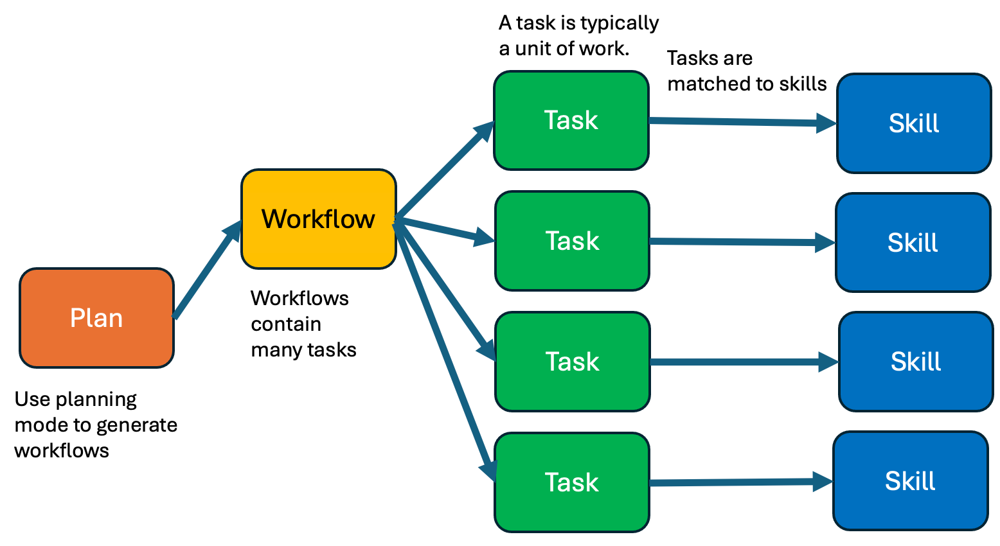
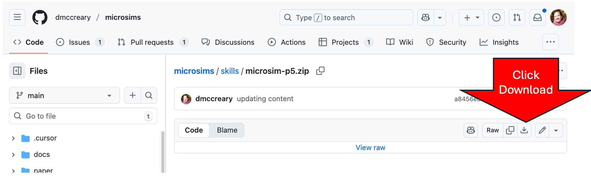
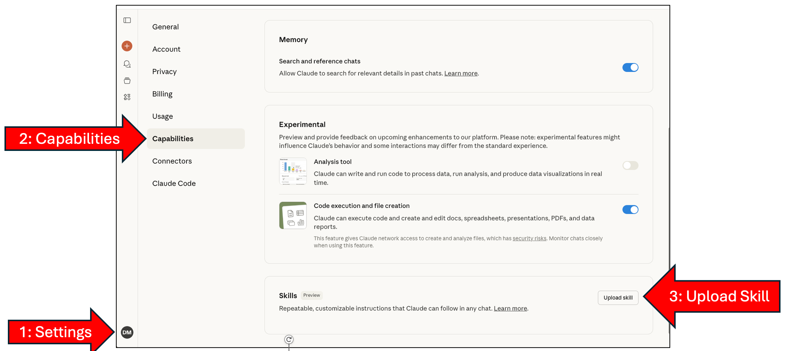
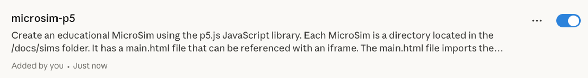
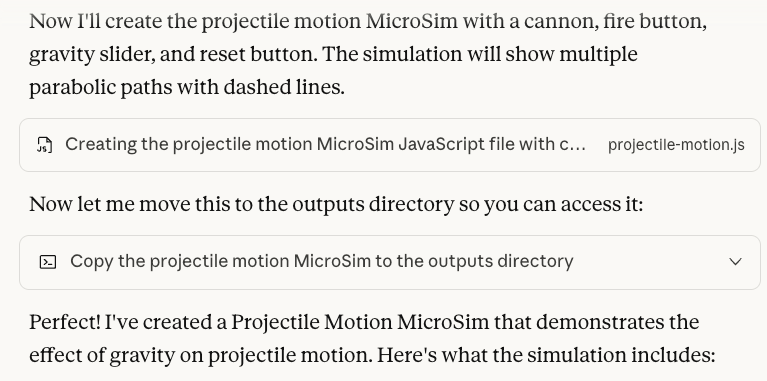
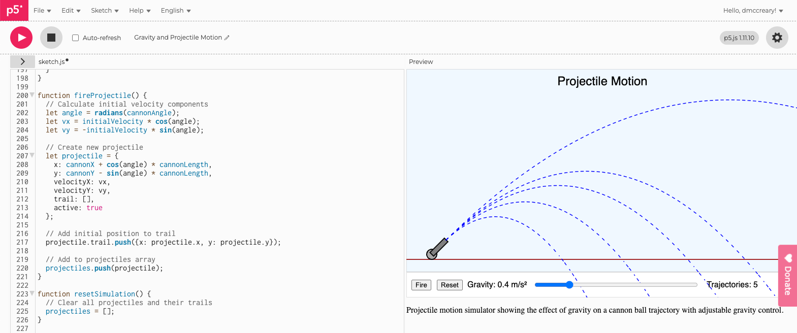
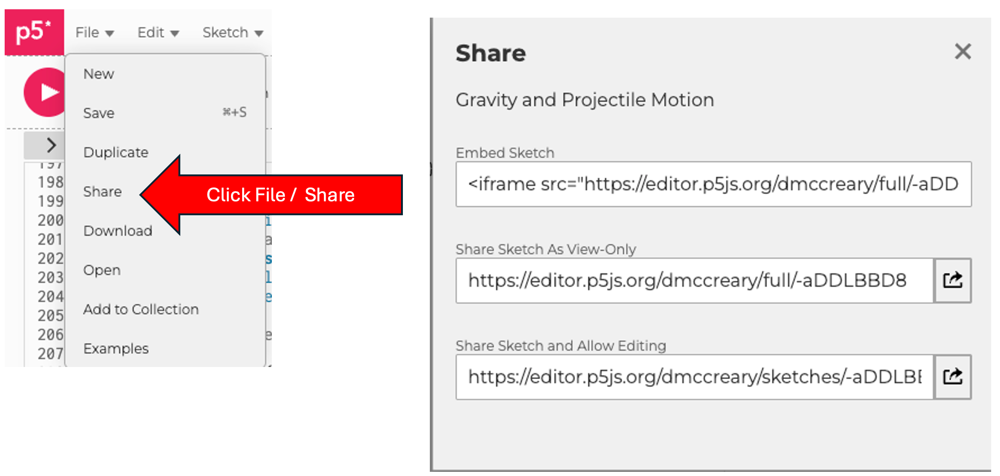

# Using The MicroSim P5 Skill with Anthropic Claude

**By Dan McCreary**
**October 23, 2025**

## Overview

This comprehensive guide demonstrates how to use Claude Skills to generate high-quality, interactive MicroSims for educational purposes. This tutorial covers:

- What is a Claude Skill?
- Loading the MicroSim-p5 skill into Claude's Capabilities
- Using the Skill to generate a p5.js file
- Testing the p5.js MicroSim with the p5.js editor
- Generating a full MicroSim package
- Installing the package in your intelligent book
- Testing the MicroSim package in your textbook
- Adding a Social Media Preview Image


## What is a Claude Skill?


A Claude Skill is a highly detailed set of rules for executing specific tasks. Think of it as a specialized instruction manual that Claude can reference when performing particular types of work.

Key characteristics of Claude Skills:

- **Standardized** by Anthropic in October 2025
- **Portable** - Stored in a zip file that can be quickly added to your Anthropic settings
- **Easy to use** - Works with both the Claude webpage and the Terminal using Claude Code
- **Available** with the Pro ($20/month) plan and other more expensive plans

For more information, visit: [https://www.anthropic.com/news/skills](https://www.anthropic.com/news/skills)


## How Skills Work with Agents

Building an entire intelligent textbook is a complex process requiring careful planning, the creation of detailed workflows
with human feedback and the decomposition of workflows into small discrete tasks.  
Once we have a task clearly defined, we need to match it to a set of complex content generation rules.
We use the name `skill` as a packaging systems for the rules associated with a given task.

A description of this workflow is shown below:

<!-- TOOD: Turn this graphic image into an interactive infographics 
Infographic Workflow Description.
Use a width-responsive design.
## Boxes
For each box, use rounded corners.
There are colorful boxes in four columns.
The Infographc has a single orange "Plan" box in the first column.
The Infographc has a single gold "Workflow" box in the second column.
Ihe Infographic has four green "Task" boxes in the third column.
Ihe Infographic has four blue "Skill" boxes in the fourth column.
## Connections
Connections are black arrows with an arrowhead on the right end.
A single black arrow connects the "Plan" box in the first column to the "Workflow" box in the second column.
Four arrows connect the single Workflow to the four "Tasks" in the third column.
Each "Task" in the third column is connected to a "Skill" in the fourth column.

## Hover
As the user hovers over a box, a tooltip box displays the definition of the box to the upper right of the box.
## Clickthroughs
When a user clicks on a box the page moves to the section of this document with that label by added #label to the end of the current URL
-->


Claude uses an intelligent task-matching system for skills:

While working on tasks, Claude scans available skills to find relevant matches. 
When one matches, it loads only the minimal information and files needed—keeping Claude fast while accessing specialized expertise.

## Workflow Diagram

### Plan
Generative AI have strong planning mode to generate an overall strategy for the MicroSim.  This plan
uses rules of good instructional design to create a great user experience for students.

### Workflows
Contain many tasks that are all connected in a specific order.  Between tasks there may
be decision points and iteration to verify correctness.

### Task
A unit of work that can be matched to a single Skill.

### Skill
A set of rules for completing a task.

This architecture ensures efficient resource usage while maintaining access to specialized knowledge.


## Sample MicroSim Created by Skill

Here's an example of what the MicroSim-p5 skill can create with a simple prompt.

<iframe src="../sims/projectile-motion-gravity/main.html" height="452px" scrolling="no"></iframe>

Here is the prompt that was used to create this skill.

!!! prompt
   Using the MicroSim-p5 skill, create a new MicroSim that demonstrates
   the effect of gravity on projectile motion.  
   Name the MicroSim "projectile-motion-gravity".
   A canon is located in the lower left that shoots a ball.
   The MicroSim has a "Fire" and a "Reset" button and a single range control slider to change the gravity.  
   Each time the user presses "Fire" a parabolic path is drawn with a dashed line.
   The lines are only erased when the "Reset" button is pressed.

!!! note
   Some of the controls were not placed correctly in the control area.  The x coordinate of several controls were
   edited manually.  The rest of the code was correctly generated.

## What the MicroSim Creates

When you use the MicroSim-p5 skill, Claude generates a complete package including:

- **427-line** width-responsive p5.js application
- **121-line** index.md file that includes a user guide and lesson plan
- **12-line** main.html driver file
- **427-line** metadata.json file for search optimization

All files follow consistent patterns and best practices for educational simulations.

Here's the complete list of the steps for using the MicroSim-p5 skill:

1. **Step 1: Download MicroSim-p5 Skill from the MicroSim GitHub** - This will place the `MicroSim-p5.zip` file to your local hard drive
2. **Step 2: Upload the MicroSim-p5 Skill to Claude** - the skill file to your Anthropic Settings Capabilities
3. **Step 3: Reference the Skill In Your Prompt** - "Using the MicroSim-p5 skill..." to your prompt:
   - Example: *"Using the MicroSim-p5 skill create a new MicroSim that will show the effect of gravity on projectile motion. Have a slider change the gravity."*
4. **Step 4: Download your new MicroSim zip file to your local hard drive** download the zip file that Claude creates
5. **Step 5: Test the new JavaScript File in the p5 Editor** open the zip file and copy the JavaScript using the p5.js editor
6. **Step 6: Intall the Package in your textbook** Place the files in the `sims` folder of your textbook
7. **Step 7: Create a Social Media Preview**

**Note:** `Claude Code`, the Terminal version of Claude, can also use these skills and automatically install the MicroSim in your book.

## Detailed Step-by-Step Instructions

### Step 1: Download the MicroSim p5 Skill from the MicroSim GitHub site to Your Local System

To begin, you need to download the MicroSim-p5 skill file:

**Go to:**
[https://github.com/dmccreary/microsims/blob/main/skills/microsim-p5.zip](https://github.com/dmccreary/microsims/blob/main/skills/microsim-p5.zip)

Click the download icon to save the `microsim-p5.zip` file to your local system.



### Step 2: Upload the MicroSim-p5 Skill to Claude

Navigate to the Claude Settings Capabilities Menu:

**CLICK HERE:** [http://claude.ai/settings/capabilities](http://claude.ai/settings/capabilities)

In the **Skills** area, click the **"Upload skill"** button.



This page allows you to manage all your Claude capabilities, including Skills, Experimental features, and Connectors.

Once you're on the capabilities page with the Skills section open:

1. Locate the upload area for skills
2. **Drag and drop** the `microsim-p5.zip` file you downloaded

The skill will be uploaded and processed automatically.  You will then see a confirmation such as the following:



After successful upload, you'll see a confirmation message indicating that the MicroSim-p5 skill has been added to your account.


The skill is now ready to use in your Claude conversations!

### Step 3: Reference the MicroSim-p5 Skill in Your Prompt

Now you can start using the skill. Here's a sample prompt we described above:

!!! prompt
   Using the MicroSim-p5 skill, create a new MicroSim that demonstrates
   the effect of gravity on projectile motion.  
   Name the MicroSim "projectile-motion-gravity".
   A canon is located in the lower left that shoots a ball.
   The MicroSim has a "Fire" and a "Reset" button and a single range control slider to change the gravity.  
   Each time the user presses "Fire" a parabolic path is drawn with a dashed line.
   The lines are only erased when the "Reset" button is pressed.

!!! note
   Some of the controls were not placed correctly in the control area.  The x coordinate of several controls were
   edited manually.  The rest of the code was correctly generated.

**Note:** It's important to specify the name of your MicroSim so Claude knows what to call the folder and files.

Here is a sample response dialog from Claude:





Claude will respond with a detailed implementation, including:

- Complete p5.js code
- Explanation of the physics
- User guide
- Implementation notes


The output follows all the conventions and patterns defined in the MicroSim-p5 skill.


### Step 4: Testing the New MicroSim with the p5.js Editor



Before integrating into your textbook, test the MicroSim using the p5.js online editor:

**Example:** [https://editor.p5js.org/dmccreary/sketches/-aDDLBBD8](https://editor.p5js.org/dmccreary/sketches/-aDDLBBD8)


The p5.j editor allows you to:
- Test interactivity
- Verify responsive behavior
- Make adjustments in layout before deployment
- Share directly from the editor

## Note on Control Placement

**Important Caveat:**

LLMs are not always perfect at the exact placement of UI controls. In this example, Claude made mistakes placing the button and slider controls in the controls area of the MicroSim.

You may need to manually adjust:
- X-position of sliders in the control region
- Button placement
- Label alignment

**Future Improvement:** Specific rules will be added to the skill to prevent these errors in the next version.

### Step 5 Share Your MicroSim Directly from p5.js

Within the p5.js editor there is a `File` menu in the upper left corner.  After you click on the `File` menu
it will then present a drop-down menu with the `Share` option.  By Clicking that it will open a
window that allows you to share the new MicroSim after a `Save` has been done.



The p5.js editor makes it easy to share your work in three ways:


#### Embed Iframe

In this mode, you just add a single `iframe` to your website.  This is ideal for authors
that want to embed a MicroSim in a region of their web page.

```html
<iframe src="https://editor.p5js.org/dmccreary/full/-aDDLBBD8"></iframe>
```

#### Share URL for Full Screen for Execution but No Editing (Read Only)

```
https://editor.p5js.org/dmccreary/full/-aDDLBBD8
```

This mode is ideal if you want to provide a link to the MicroSim such as in
a webpage, email or chat.  In this mode, you can run the MicroSim but
you can't see or edit the source code.

#### Share with Full Editing:
```
https://editor.p5js.org/dmccreary/sketches/-aDDLBBD8
```


This generates a shareable link to your MicroSim that others can view and remix.

---

## Integrating Into a Textbook


The following steps are for integrating your MicroSim into an intelligent textbook:

Intelligent textbooks put MicroSims "inline" into chapters of online books. They use a specific folder and file structure that facilitates sharing.

The MicroSim skill generates three additional files for textbook integration:

- Sample `main.html` file
- Sample `index.md` containing user guide and lesson plans
- Sample `metadata.json` to facilitate search in MicroSim search engines

The main JavaScript file (bouncing-ball.js) can then be modified and versioned as needed.

## Integrating into Web Pages is Easy!

Adding any MicroSim to a web page requires just one line of HTML:

```html
<iframe
   src="https://dmccreary.github.io/microsims/sims/projectile-motion-gravity/main.html"
   height="452px"
   scrolling="no">
</iframe>
```

This `iframe` element allows you to securely add the file to your webpage.

**Benefits:**
- Can be added without jeopardizing the security of your site
- The simulation runs in a secure "sandbox"
- You do not need to make other changes to your website
- You can use CSS to style the border of the iframe

## Generate the MicroSim Package Zip File


To get all the supporting files (not just the JavaScript), request a complete package:

!!! prompt
   Please generate a complete MicroSim package with all supporting files.


This forces the skill to generate not just the JavaScript, but all the supporting files in a MicroSim package.

## Sample Dialog for Package Generation


Claude will generate the complete package and provide a download link.


**CLICK HERE** to download the complete package as a zip file.

### Download the MicroSim Package that Claude Created

Click the download link to save the MicroSim package to your computer.


The package will download as `projectile-motion.zip` (or whatever name you specified).

### Unzip the MicroSim Package


Move and/or rename the extracted files to your textbook directory:

```bash
$ cd /tmp
$ mv projectile-motion $BOOK/docs/sims/projectile-motion-gravity
```


**Note:** Remove the zip file when you're done. The zip file should not be checked into your textbook site.

### Add to Navigation in mkdocs.yml


Update your MkDocs configuration to include the new MicroSim in the navigation:

```yaml
- Projectile Motion With Gravity: sims/projectile-motion-gravity/index.md
```


Add this line in the `nav:` section, indented with the other sims.


## Optional: Social Media Preview


You can add a social media preview image that will appear when you share the MicroSim link:

This image will show when you:
- Copy the link into a chat
- Share on Messenger, Slack, Discord, or Zoom
- Reference the MicroSim on Facebook, Twitter, or LinkedIn


**To enable this feature:**
1. Take a screen image of the MicroSim
2. Place it in the MicroSim folder with the same name as the folder:
   - Example: `projectile-motion-gravity.png`

**Note:** A future version of the skill might render the MicroSim and capture a screen image automatically. However, for now this is a manual step.

## Sample Metadata in HTML Head

The social media preview requires Open Graph (og) metadata in the HTML head element.  All Open Graph elements have the "og:" prefix in their property.

```html
<meta property="og:image"
      content="https://dmccreary.github.io/microsims/sims/projectile-motion-gravity/projectile-motion-gravity.png">
```

This tag tells social media platforms which image to display when sharing your link.

## Sample Metadata in the index.md


The `index.md` file also includes metadata for the preview image:


**Note:** The path names are all relative to the `/docs` directory. You do not need to put in the full path.

---

## Test the Social Media Preview

There are many free websites that will test if the right metadata tags are placed correctly in the HTML header.

**Example:** [https://socialsharepreview.com/](https://socialsharepreview.com/)


**Paste the URL of your MicroSim here** to see how it will appear when shared on social media.

---

## Positive Result!


When properly configured, your preview will look great:


For further details, you can search for **Open Graph standards** for title, description, and images.

---

## OG Tags Advice


The social media preview validator will provide feedback:


Common recommendations:
- Our title and description are fine
- The ideal ratio for social preview images is **1.91:1** (width to height)
- Recommended dimensions: **1200 x 628 pixels**

---

## Claude Generates Massive Metadata!


Given a robust JSON Schema, Claude will generate fantastic, highly detailed metadata that can be used to analyze and extend a MicroSim.


**Key benefits:**
- The schema is an exhaustive list of fields that Claude will happily fill in for each MicroSim
- Metadata is critical for building faceted search tools for MicroSims
- Enables powerful discovery and categorization

**Schema location:**
[https://github.com/dmccreary/microsims/blob/main/src/microsim-schema/microsim-schema.json](https://github.com/dmccreary/microsims/blob/main/src/microsim-schema/microsim-schema.json)

---

## Sample Metadata File (metadata.json)


Here's what a complete metadata file looks like:


This file contains comprehensive information about the MicroSim, making it discoverable and useful for educational purposes.

---

## How To View Metadata


To view the metadata for any MicroSim, simply add `/metadata.json` to the end of the path:

**Example:**
[https://dmccreary.github.io/microsims/sims/projectile-motion-gravity/metadata.json](https://dmccreary.github.io/microsims/sims/projectile-motion-gravity/metadata.json)


---

## What is in the metadata.json File


The metadata file includes:

**Dublin Core** (standard library catalog information):
- Title, creator, subject, description
- Publisher, date, type, format
- Language, rights

**Education Standards:**
- NGSS (Next Generation Science Standards)
- Common Core Math (e.g., "HSF-IF.B.4")

**License:**
- CC BY 4.0 - Creative Commons Attribution 4.0 International

**Grade Levels:**
- Target: 6th to 12th grades

**Subjects:**
- Physics, Science, Mathematics

**Topics:**
- Projectile Motion
- Gravity
- Parabolic Trajectories
- Kinematics
- Newton's Laws
- Acceleration

---

## Metadata Contents (Continued)


**Learning Objectives:**

The metadata includes detailed, measurable learning objectives:

- Understand that gravity affects the vertical motion of projectiles
- Apply concepts of parabolic motion to predict trajectory shapes
- Analyze how changes in gravity affect projectile range and height
- Evaluate the relationship between gravitational acceleration and trajectory characteristics
- Compare projectile motion under different gravitational conditions

---

## Metadata Contents (Continued)


**Additional Fields:**

**Prerequisites:**
- Required prior knowledge

**Duration:**
- Estimated times (typical, minimum, maximum)

**Difficulty:**
- Level indicators

**Curriculum Standards:**
- Framework, ID, description

**Technical Details:**
- JavaScript library and version
- Responsive design capabilities
- Browser compatibility analysis
- Accessibility features

---

## Metadata (Continued)


**User Interface Details:**

**List of UI Controls:**
- Buttons (Start, Pause, Reset)
- Sliders (ranges and purposes)

**Visual Elements:**
- Diagram components
- Animation features
- Text elements

**Simulation Types:**
- Physics simulations
- Equations used
- Algorithms implemented

**Model Assumptions:**
- No friction
- No wind resistance
- Vacuum environment
- Point mass projectile

**Possible Variations:**
- Initial velocity adjustments
- Launch angle modifications
- Projectile type changes

**Scenarios:**
- Earth gravity (9.8 m/s²)
- Moon gravity (1.6 m/s²)
- Mars gravity (3.7 m/s²)
- Space (0 m/s²)

**Analytics for AI Textbooks:**
- Events tracked (start, stop, adjust, reset)
- Metrics (engagement time, number of adjustments)

---

## Metadata (Continued)


**Pedagogical Information:**


**Recommended Usage:**
- Demonstrations
- Exploration activities
- Guided practice
- Group activities
- Individual study

**Instructional Strategies:**
- Inquiry-based learning
- Problem-solving approaches
- Visualization techniques

**Assessment Questions:**
- Question types
- Difficulty levels
- Bloom's taxonomy alignment

**Extensions:**
- What UI components could be added?
- How could the simulation be enhanced?
- Related concepts to explore

---

## Conclusion


Using Claude Skills can make MicroSim generation MUCH easier for non-programmers.

**Key Takeaways:**

- **Fast Generation:** Some simple MicroSims can be generated in under five minutes
- **May Need Tweaking:** The layouts may not be perfect and may require adjustments in the placement of controls
- **Rich Metadata:** The skill prompts Claude to generate a large number of precise metadata elements for each MicroSim
- **Claude Code Integration:** Claude Code can be used to quickly iterate these designs, though it can be challenging for non-programmers
- **Easy Integration:** Using a MicroSim in any web-based textbook is as simple as adding a single line of HTML (iframe)

---

## Thank You!


**Resources:**

- **Feedback, Bugs, Enhancements:**
  [https://github.com/dmccreary/microsims/issues](https://github.com/dmccreary/microsims/issues)

- **Questions:** Please connect with me on LinkedIn
  [https://www.linkedin.com/in/danmccreary/](https://www.linkedin.com/in/danmccreary/)

---

## Additional Resources

For more information about the MicroSims project:

- **MicroSim Documentation**: See `CLAUDE.md` in the project root
- **Cursor Rules**: Check `.cursor/rules/microsims.mdc` for detailed patterns
- **Metadata Schema**: `src/microsim-schema.json`
- **Example Simulations**: Browse `docs/sims/` directory
- **Gallery**: View all simulations at `/sims/gallery.md`
- **MicroSim Skill File**: Download from `skills/microsim-p5.zip` in the repository

## Next Steps

1. Download and upload the MicroSim-p5 skill to Claude
2. Try generating a simple simulation to test the skill
3. Test in the p5.js online editor
4. Iterate and refine based on the output
5. Generate the complete package
6. Validate the generated code and metadata
7. Add the new simulation to your textbook
8. Share your simulation with educators and students!
