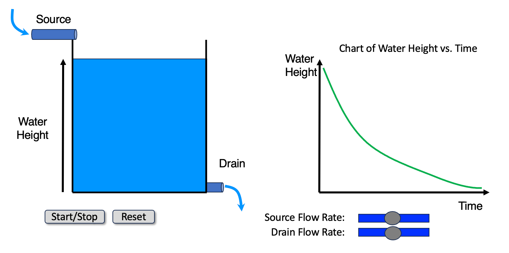

# Bathtub MicroSim

<iframe src="main.html" height="552px" width="100%" scrolling="no"></iframe>

[Run the Bathtub MicroSim Fullscreen](main.html){ .md-button .md-button--primary }
<br/>
[Edit in the p5.js Editor](https://editor.p5js.org/)

## About This MicroSim

This MicroSim demonstrates the flow of water in and out of a bathtub. The bathtub is the
classic first example of a **stock and flow** system. The water in the tub is the *stock*.
The source pipe is an *inflow* and the drain pipe is an *outflow*.

The user can change the rate of flow in and the rate of flow out. On every animation frame
the model adds the source flow rate to the water height and subtracts the drain flow:

```
water height = water height + source flow rate - drain flow
```

The water height can never go below 0 (an empty tub) or above 200 (a full tub). The readout
under the tub shows the water height and the **net flow**, which is the source flow rate
minus the drain flow.

A chart also displays the bathtub water height history. The chart and the tub share the same
vertical scale, so the water surface in the tub always lines up with the newest point on the
chart. The slope of the line is the net flow: a positive net flow gives a rising line, a
negative net flow gives a falling line, and a net flow of zero gives a flat line.

### Two Drain Models

The **Drain depends on water height** checkbox picks how the drain flow is calculated.

| Checkbox | Drain model | Drain flow on each frame | Chart of a draining tub |
|----------|-------------|--------------------------|-------------------------|
| Unchecked (default) | Constant | drain flow rate | A straight line |
| Checked | Torricelli's law | max drain flow rate × √(water height ÷ 200) | A curve that starts steep and flattens |

With the **constant** drain, the same amount of water leaves on every frame, so the net flow
never changes and every line on the chart is straight.

With the **Torricelli** drain, deeper water pushes harder on the drain, so a fuller tub drains
faster. The drain slider now sets the drain flow of a *full* tub, and its label changes to
**Max Drain Flow Rate**. A **Drain Flow** readout under the tub shows the flow at the current
water height. At the starting height of 150 and a max drain flow rate of 0.2, the drain flow
is 0.2 × √(150 ÷ 200) = 0.17. The drain flow shrinks as the tub empties, so the net flow
changes on every frame and the line bends. The tub takes more than twice as long to empty as
it does with the constant drain.

The Torricelli drain also lets the tub find its own level. When the source is smaller than
the max drain flow rate, the water height settles where the drain flow equals the source flow
rate:

```
settled water height = 200 × (source flow rate ÷ max drain flow rate)²
```

A source flow rate of 0.5 and a max drain flow rate of 1.0 settle at 200 × 0.5² = 50, no matter
where the water height starts.

**Learning objective:** The learner will explain how the difference between the source flow
rate and the drain flow rate changes the water height over time.

**Bloom's taxonomy level:** Understand (verb: *explain*)

## How to Use

1. Press **Start**. With the default settings the source is off and the drain is set to 0.2,
   so the water height falls in a straight line.
2. Move the **Source Flow Rate** slider until the water height stops changing. Compare the
   two flow rates.
3. Make the source larger than the drain and watch the line on the chart turn upward.
4. Press **Pause** to freeze the tub and read the chart. Press **Start** to continue.
5. Press **Reset**, check **Drain depends on water height** and press **Start**. The line now
   starts steep and flattens as the tub empties. Watch the **Drain Flow** readout under the
   tub shrink as the water height falls.
6. Keep the box checked. Set the **Source Flow Rate** to 0.5 and the **Max Drain Flow Rate**
   to 1.0. The water height settles near 50 instead of emptying or filling the tub.
7. Check or uncheck the box while the simulation runs to see a straight line and a curve on
   the same chart.
8. Press **Reset** to return the tub to 75% full, both sliders to their starting values and
   the checkbox to unchecked.

## Iframe Embed Code

You can add this MicroSim to any web page by adding this to your HTML:

```html
<iframe src="https://dmccreary.github.io/microsims/microsims-old/bathtub/main.html"
        height="552px"
        width="100%"
        scrolling="no"></iframe>
```

## Design Sketch

This is the original design drawing for the MicroSim. The full design deck is available as a
[PowerPoint file](./Bathtub-Simulation.pptx).

{ width="500" }

The sketch shows a curved line because a real tub drains faster when it is fuller. With the
checkbox unchecked the MicroSim uses a constant drain flow rate, so its lines are straight.
Check **Drain depends on water height** to get the non-linear behavior of the sketch: a line
that falls quickly at first and more slowly as the tub empties.

## Lesson Plan

### Audience

High school and college undergraduate students in an introductory systems thinking,
system dynamics, environmental science or algebra course.

### Duration

15 minutes

### Prerequisites

- Reading a line chart of a quantity over time
- The idea of a rate (an amount of change per unit of time)

### Activities

1. **Predict (3 min):** The tub starts 75% full with the source off and the drain at 0.2.
   Before you press Start, sketch what you think the chart of water height will look like.
2. **Test (4 min):** Press Start and compare the chart to your sketch. Then find three
   different pairs of slider settings that keep the water height constant. Write down what
   the three pairs have in common.
3. **Explain (5 min):** Set the source to 1.0 and the drain to 0.4. Then set the source to
   1.6 and the drain to 1.0. In pairs, explain why both settings fill the tub at the same
   speed even though far more water is moving in the second case.
4. **Extend (3 min):** A real bathtub drains faster when it is fuller. Sketch how the chart
   of a draining tub would change if the drain flow depended on the water height. Then press
   Reset, check **Drain depends on water height**, press Start and compare the chart to your
   sketch. Explain why the line gets flatter as the tub empties. If you finish early, keep
   the box checked and find two pairs of slider settings that hold the water height near 50.
   Write down what the pairs have in common.

### Assessment

- The learner states that the water height rises when the source flow rate is larger than the
  drain flow rate, falls when it is smaller, and stays constant when the two are equal.
- The learner predicts the direction and relative steepness of the chart line for a new pair
  of flow rates before running the simulation.
- The learner explains that the slope of the chart line equals the net flow, not the size of
  either flow alone.
- The learner explains that when the drain flow depends on the water height, the net flow
  changes as the water height changes, so the chart line curves instead of staying straight.

## References

1. [Stock and flow](https://en.wikipedia.org/wiki/Stock_and_flow) - Wikipedia - Defines stocks
   and flows and uses the bathtub as the standard example.
2. [System dynamics](https://en.wikipedia.org/wiki/System_dynamics) - Wikipedia - The modeling
   approach that is built on stocks, flows and feedback loops.
3. [Bathtub dynamics: initial results of a systems thinking inventory](https://doi.org/10.1002/sdr.198) -
   December 2000 - System Dynamics Review 16(4), 249-286 - Linda Booth Sweeney and John
   Sterman show that many well-educated adults misjudge how a stock responds to its flows,
   which is the misconception this MicroSim targets.
4. [Thinking in Systems: A Primer](https://en.wikipedia.org/wiki/Thinking_In_Systems:_A_Primer) -
   2008 - Donella Meadows - Opens with the bathtub as the mental model for every stock.
5. [Torricelli's law](https://en.wikipedia.org/wiki/Torricelli%27s_law) - Wikipedia - The
   physics behind the **Drain depends on water height** checkbox: water leaves a tank at a
   speed proportional to the square root of the water depth.
6. [p5.js createSlider() reference](https://p5js.org/reference/p5/createSlider/) - p5.js - The
   built-in slider control used for the two flow rates.
