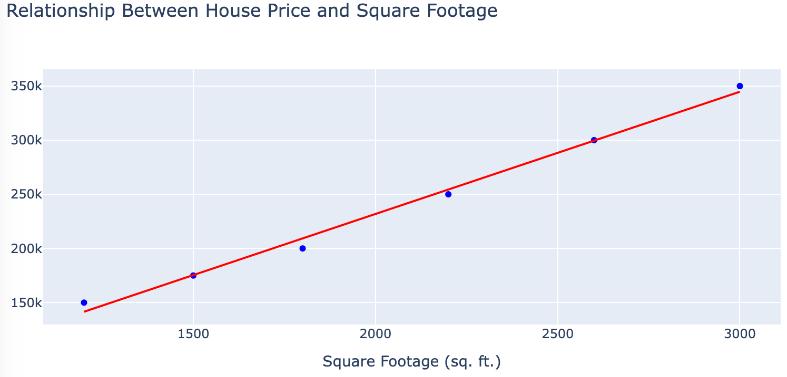

# Least Squares

<iframe src="main.html" width="100%" height="557px" scrolling="no"></iframe>

Copy this iframe to your website:

```html
<iframe src="https://dmccreary.github.io/microsims/microsims-old/least-squares/main.html" width="100%" height="557px" scrolling="no"></iframe>
```

[Run the Least Squares MicroSim Fullscreen](main.html){ .md-button .md-button--primary }
<br/>
[Edit the Least Squares MicroSim in the p5.js Editor](https://editor.p5js.org/dmccreary/sketches/voN2RROfE)

## About This MicroSim

This MicroSim shows how to fit a straight line to a set of data points. Four green
**data points** sit on a grid. A blue **line** runs across the grid, and you control it
with two sliders: one for the **slope** and one for the **intercept**.

For each data point, a purple **predicted point** on the line shows the y value that the
line predicts for that x value. The vertical distance between a green point and its purple
point is the **error** of that prediction:

```
predicted y = slope × x + intercept
error       = actual y - predicted y
```

A colored square is drawn between each green point and its purple point. The side of the
square is the size of the error, so the area of the square is the **error squared**. A
point that is twice as far from the line gets a square with four times the area. Squaring
does two jobs: it makes every error count as a positive amount, and it makes a large miss
count for much more than a small one.

The **least squares** line is the line that makes the total area of the squares as small as
possible. You find it here by moving the sliders until the squares shrink as far as they
will go.

### The Plot

The plot runs from 0 to 500 on both axes, with (0, 0) in the lower left corner. Grid lines
are 50 units apart, and every other grid line is heavier to mark each 100 units. The line
crosses the left edge of the plot at the intercept.

| Data point | x | y | Square color when the point is above the line | Square color when the point is below the line |
|------------|-----|-----|-------------|-------------|
| 1 | 100 | 220 | red | orange |
| 2 | 200 | 180 | yellow | pink |
| 3 | 300 | 300 | cyan | blue |
| 4 | 400 | 290 | light green | olive |

Each square changes color when the line crosses its data point, so the colors tell you at a
glance which points are above the line and which are below it.

### The Best Fit

With the starting line (slope 0.50, intercept 0), all four data points are above the line
and the squares are large. The errors are 170, 80, 150 and 90, so the sum of the squared
errors is 28,900 + 6,400 + 22,500 + 8,100 = 65,900.

The least squares line for these four points is:

```
y = 0.33 × x + 165
```

With this line the errors are 22, -51, 36 and -7, and the sum of the squared errors drops
to 484 + 2,601 + 1,296 + 49 = 4,430. Two points are above the line and two are below it. No
other slope and intercept give a smaller total.

## How to Use

1. Look at the starting line. All four green points are above it, so you see a red, a
   yellow, a cyan and a light green square.
2. Move the **Intercept** slider to the right. The whole line moves up without tilting, and
   the squares start to shrink.
3. Move the **Slope** slider. The line tilts around the point where it meets the left edge
   of the plot.
4. Work back and forth between the two sliders until the squares are as small as you can
   make them. Write down your slope and intercept.
5. Compare your values with the least squares line: a slope of 0.33 and an intercept of 165.
6. For small steps, click a slider and press the left and right arrow keys. Each press
   changes the slope by 0.01 or the intercept by 1.

## Real-World Example: Home Prices

A common use of a least squares line is to predict the price of a home from its size. This
chart shows the sale price and the square footage of six homes, with a red line fitted to
the points:

{ width="600" }

The next image is a conversation with ChatGPT that asks for a scatter plot of 20 sample home
sales. The dashed green line from each point to the red regression line is the error for
that home. These are the same errors that the MicroSim draws as squares.

{ width="600" }

## Lesson Plan for High School Algebra

**Lesson Title:** Linear Functions: Understanding Slope and Intercept

**Duration:** 50 minutes

**Grade Level:** 9-10

**Subject:** Algebra 1

### Learning Objectives

By the end of this lesson, students will be able to:

- Define slope as a rate of change
- Explain the meaning of y-intercept in a linear function
- Identify how changes in slope and intercept affect the graph of a line
- Use an interactive visualization to explore linear functions
- Solve real-world problems involving slope and intercept

### Materials Needed

- Interactive Slope-Intercept Visualization (p5.js application)
- Student devices (computers, tablets, or smartphones)
- Guided worksheet (printed or digital)
- Whiteboard/projector

### Prerequisite Knowledge

- Basic understanding of coordinate plane
- Ability to plot points on a graph
- Familiarity with the equation y = mx + b

### Lesson Outline

#### 1. Introduction (5 minutes)

- Begin with a real-world scenario: "If you earn $15 per hour at your job, how would you calculate your total earnings?"
- Discuss how the relationship between hours worked and money earned forms a linear relationship
- Introduce the lesson focus: understanding how slope and intercept affect linear functions

#### 2. Review of Key Concepts (10 minutes)

- Review the slope-intercept form of a line: y = mx + b
- Define slope (m) as the rate of change (rise/run)
- Define y-intercept (b) as the point where the line crosses the y-axis (0,b)
- Demonstrate examples on the board with different values for m and b

#### 3. Interactive Exploration (15 minutes)

- Introduce the Slope-Intercept Visualization tool
- Demonstrate how to use the sliders to change slope and intercept values
- Explain the visual elements:
    - Green points represent actual data points
    - Purple points show where the line would predict those values
    - Colored squares show the "error" or difference between actual and predicted points
- Guided exploration:
    1. What happens when the slope increases? Decreases? Becomes negative?
    2. What happens when the y-intercept changes?
    3. Can you find values that minimize the differences between actual and predicted points?

#### 4. Pair Work (10 minutes)

- Students work in pairs using the visualization tool
- Challenge: Find the linear function that best fits the green data points
- Each pair should record their "best fit" values for slope and intercept
- Discuss strategy: How can you tell when you've found a good fit?

#### 5. Connection to Real-World Applications (5 minutes)

Discuss how the slope-intercept model applies to:

- Economics: price vs. quantity relationships
- Physics: distance vs. time in constant velocity
- Business: fixed costs (y-intercept) and variable costs (slope)

Show how the colored squares relate to "error" in predictions

#### 6. Closure and Assessment (5 minutes)

- Quick check for understanding:
    - "If a line has a slope of 2 and a y-intercept of -3, what is its equation?"
    - "If a line has a negative slope, what does that tell us about the relationship?"
- Exit ticket: Students write one insight they gained from using the visualization

### Extension Activities

- Challenge students to create their own set of points and find the best-fitting line
- Introduce the concept of "least squares regression" as a mathematical way to find the best fit
- Connect to data science concepts: predictions, error measurements, and model accuracy

### Differentiation

- **Support:** Provide a step-by-step guide for using the visualization tool
- **Extension:** Ask advanced students to modify the code to add new features or data points

### Assessment

- Formative: Observation during interactive exploration and pair work
- Summative: Exit ticket responses and follow-up homework assignment

### Homework

- Complete practice problems involving writing equations in slope-intercept form
- Find a real-world example where a linear relationship exists and identify what the slope and intercept represent in that context

### Follow-Up Lesson Ideas

- Comparing linear vs. non-linear relationships
- Introduction to systems of linear equations
- Linear regression with larger datasets

## Lesson Plan Focusing on Prediction of Future Events

### Learning Objectives

By the end of this lesson, students will be able to:

- Define slope as a rate of change
- Explain the meaning of y-intercept in a linear function
- Identify how changes in slope and intercept affect the graph of a line
- Use an interactive visualization to explore linear functions
- Use a linear model to make predictions for new x-values
- Evaluate the reliability of predictions using a linear model
- Solve real-world problems involving slope and intercept

### Materials Needed

- Interactive Slope-Intercept Visualization (p5.js application)
- Student devices (computers, tablets, or smartphones)
- Guided worksheet (printed or digital)
- Whiteboard/projector

### Prerequisite Knowledge

- Basic understanding of coordinate plane
- Ability to plot points on a graph
- Familiarity with the equation y = mx + b

### Lesson Outline

#### 1. Introduction (5 minutes)

- Begin with a real-world scenario: "If you earn $15 per hour at your job, how would you calculate your total earnings?"
- Discuss how the relationship between hours worked and money earned forms a linear relationship
- Introduce the lesson focus: understanding how slope and intercept affect linear functions

#### 2. Review of Key Concepts (10 minutes)

- Review the slope-intercept form of a line: y = mx + b
- Define slope (m) as the rate of change (rise/run)
- Define y-intercept (b) as the point where the line crosses the y-axis (0,b)
- Demonstrate examples on the board with different values for m and b

#### 3. Interactive Exploration (15 minutes)

- Introduce the Slope-Intercept Visualization tool
- Demonstrate how to use the sliders to change slope and intercept values
- Explain the visual elements:
    - Green points represent actual data points
    - Purple points show where the line would predict those values
    - Colored squares show the "error" or difference between actual and predicted points
- Guided exploration:
    1. What happens when the slope increases? Decreases? Becomes negative?
    2. What happens when the y-intercept changes?
    3. Can you find values that minimize the differences between actual and predicted points?

#### 4. Pair Work (10 minutes)

- Students work in pairs using the visualization tool
- Challenge: Find the linear function that best fits the green data points
- Each pair should record their "best fit" values for slope and intercept
- Discuss strategy: How can you tell when you've found a good fit?

#### 5. Prediction and Real-World Applications (10 minutes)

- Discuss how the slope-intercept model applies to:
    - Economics: price vs. quantity relationships
    - Physics: distance vs. time in constant velocity
    - Business: fixed costs (y-intercept) and variable costs (slope)
- Show how the colored squares relate to "error" in predictions
- Prediction activity:
    - Given our current "best fit" line with slope m and intercept b, what would be the predicted y-value for:
        1. x = 250 (a value within our current data range)
        2. x = 600 (a value outside our current data range)
    - Discuss the concept of interpolation vs. extrapolation
    - Question: "How confident are we in these predictions and why?"
    - Question: "What factors might affect the accuracy of our predictions?"

#### 6. Closure and Assessment (5 minutes)

- Quick check for understanding:
    - "If a line has a slope of 2 and a y-intercept of -3, what is its equation?"
    - "If a line has a negative slope, what does that tell us about the relationship?"
    - "Using the equation y = 0.5x + 25, predict the y-value when x = 120"
    - "How would you use our linear model to predict a new value not shown on the graph?"
- Exit ticket: Students write one insight they gained about using linear models for prediction

### Extension Activities

- Challenge students to create their own set of points and find the best-fitting line
- Introduce the concept of "least squares regression" as a mathematical way to find the best fit
- Connect to data science concepts: predictions, error measurements, and model accuracy

### Differentiation

- **Support:** Provide a step-by-step guide for using the visualization tool
- **Extension:** Ask advanced students to modify the code to add new features or data points

### Assessment

- Formative: Observation during interactive exploration and pair work
- Summative: Exit ticket responses and follow-up homework assignment

### Homework

- Complete practice problems involving writing equations in slope-intercept form
- Find a real-world example where a linear relationship exists and identify what the slope and intercept represent in that context
- Prediction challenge: Given the linear model y = 1.5x + 10:
    1. Predict values for x = 50, x = 100, and x = 150
    2. If you measured y = 85, what would be the corresponding x value?
    3. Create a real-world scenario where this model might be useful, and explain what the slope and intercept represent
    4. Explain a situation where this model might break down or become unreliable for predictions

### Follow-Up Lesson Ideas

- Comparing linear vs. non-linear relationships
- Introduction to systems of linear equations
- Linear regression with larger datasets

## Version History

- **Version 2:** Drew an orange line from each data point to the fit line and had a fixed
  width of 500 pixels. It is still available as
  [Least Squares Fit Version 2](least-squares-fit-2.html). The prompt that generated it is
  in the comment at the top of `least-squares-fit-2.js`.
- **Version 3:** Replaced the orange lines with colored squares and made the width
  responsive. The old `least-squares-fit-3.html` page now redirects to `main.html`.
- **Current version:** Uses p5.js 2.3.2 and the standard MicroSim file names
  (`main.html` and `least-squares.js`). The slope and the intercept are now measured in plot
  units, so the best fit values are the same at every window width. The line and the points
  are drawn on top of the squares so that a square can no longer hide them.

## References

1. [Least squares](https://en.wikipedia.org/wiki/Least_squares) - Wikipedia - Explains the
   method of choosing the line that makes the sum of the squared errors as small as possible.
2. [Simple linear regression](https://en.wikipedia.org/wiki/Simple_linear_regression) -
   Wikipedia - Gives the formulas for the slope and the intercept of the least squares line,
   which you can use to check the best fit values in this MicroSim.
3. [Errors and residuals](https://en.wikipedia.org/wiki/Errors_and_residuals) - Wikipedia -
   Defines the residual, which is the vertical distance that this MicroSim draws as the side
   of each square.
4. [Linear equation](https://en.wikipedia.org/wiki/Linear_equation) - Wikipedia - Covers the
   slope-intercept form y = mx + b used by the two sliders.
5. [Least-Squares Regression](https://phet.colorado.edu/en/simulations/least-squares-regression) -
   PhET Interactive Simulations, University of Colorado Boulder - A related simulation that
   also draws the squared residuals and lets students compare their line with the best fit line.
6. [p5.js createSlider() reference](https://p5js.org/reference/p5/createSlider/) - p5.js - The
   built-in slider control used for the slope and the intercept.
