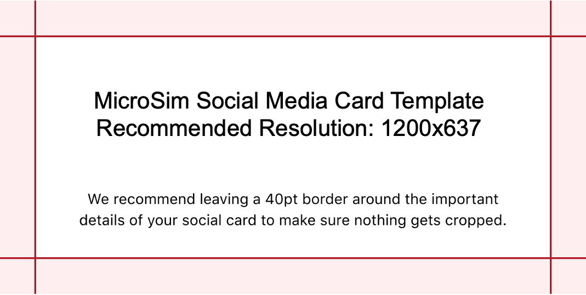

# Link Previews on Social Media

Many of our teachers use tools such as Zoom, Teams or Google to
run their classes.  The instructors copy the link
of each simulation and past it into a chat window.
They have told us it is very helpful if a high-quality
image appears above or as the link.  This is
called a [Link Preview](../glossary.md#link-preview).

Each of the simulations can contain its own link preview image.

## Image Standards

For creating high-quality preview images on 
social media using the OpenGraph image standard, 
the recommended resolution and aspect ratio are as follows:

1. **Recommended Resolution:** The ideal resolution for Open Graph images is generally 1200 pixels by 627 pixels (1.91:1 aspect ratio)​​. However, some sources suggest a slightly different size of 1200×630 pixels, which also maintains the 1.91 aspect ratio​​.
2. The minimum requirement is 200 by 200 pixels.
3. **Aspect Ratio:** The common aspect ratio recommended is 1.91:1. This ratio is consistent across various guidelines, ensuring that the image displays effectively in social media link previews​​.
4. **Image Size Limit:** The image size should not exceed 5MB to ensure optimal loading and compatibility across platforms​​. For Facebook, specifically, it is recommended that the Open Graph image should not be more than 8MB​​.

These specifications are designed to ensure that your images
display correctly and attractively across various social media platforms when shared as link previews.

## References

* [Social media preview with open graph meta tags](https://svaerm.com/en/blog/open-graph-meta-tags/)
* [The Open Graph Image](https://kaydee.net/blog/open-graph-image/)

