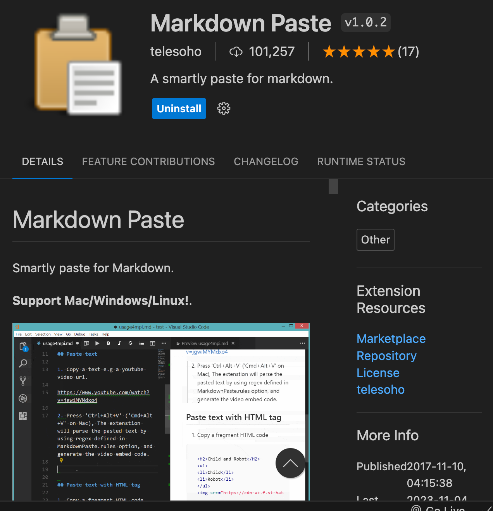

# MicroSim User Experience Tips

We have been testing our MicroSims with teachers, students and mentors
and they have given us some valuable tips to make it easier to
integrate these simulations into their classrooms.

We should note that it gets easier every month to have tools like
ChatGPT generate working MicroSims.  The challenge is that the
user interface controls are not always easy to use. This requires
a bit of "tweaking" of the simulation code to get the right placement
and alignment of the MicroSim.

To help you with these tips we have provided a [Template](../sims/template/index.md)
MicroSim that you can copy.

## Use Consistent Structure

We would like our MicroSims to all have a consistent structure:

1. A directory that the MicroSim is contained
2. A main index.md file that describes the MicroSim
3. Links in the main index file to the demos and images
4. Lesson plans in the main index.md file or links to lesson plans

## Include an Image as the First Element

Including a static image (or a gif) is critical for people to
quickly see if this is the MicroSim they have been expecting.
These images can also be used to build link previews for posting
on social media as well as for generating "catalog cards" that
users can scroll through.

Getting a good image is not always easy.  Some screen
capture tools don't work well with a moving animation.

Try to create an image that is large enough to be clear even
on a wide computer screen.  There are also detailed guidelines
for creating images that are used on link previews for social media.

Posting your MicroSim with an image tends to get almost double
the amount of clickthroughs and retweets!

Here are the key points suggested by the Open Graph standard:

1. Use an image that is a minimum of 600 x 314 pixels (width and height)
2. Facebook recommends a size of 1200 x 630
3. Keep the image sizes under 7MB
4. The aspect ratio should be 1 to 1.91 (height to width)
4. Test the page link preview using a tool such as
the [Open Graph Testing Tool](https://www.opengraph.xyz/)

Here is a sample of how you can include a centered image with a caption
in your Markdown content.

You can learn more about the Open Graph Protocol at the [ogp.md](https://ogp.me/)
website.

Here is a template of code you can include in your mkdocs markdown index.md file:

```html
<figure markdown>
   { width="400" }
   <figcaption>Figure caption.</figcaption>
</figure>
```

Note this depends on your mkdocs.yml file having the right
configuration.

## Include a Link to the Demo as the Second Element

Place your demo in either an HTML file or another file that
places the MicroSim at the top upper left corner of the page.
Don't require the user to scroll down on the demo page.

## Place Simulation Controls Under the MicroSim

This allows teachers at a smart board to use the MicroSims
at the front of a classroom.  Teachers can change
the slider values without blocking the screen.

## Provide a "Back To Lesson Plan" Link under the Simulation

```html
<a href="./">Back to Lesson Plan</a>
```

## Make Sliders Wide

By default, many generated MicroSims make the slider
the default width, which does not provide the fine
resolution of setting a value.

## Provide Sound-Off Versions

If you include sound in your MicroSims (encouraged), please
allow the sound to be off by default or have a version of the
sim that runs without sound.

If you have ever been in a classroom of 30 students all
hearing the sound of bouncing balls you will understand
why this is important.

## Provide a Link to the p5.js Editor

Sometimes you want to make it easy for users to quickly
change some aspect of your simulation that is not available
in the controls.  One way to do this is to provide a
link to a working simulation in the [P5.js edito](https://editor.p5js.org/).

This can be an extra maintenance step and I frequently make
small changes to the simulation and then forget to update
the editor code.