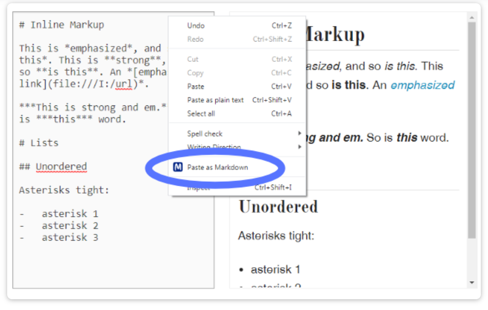

# Paste as Markdown

When you copy text from ChatGPT, it puts the formatted text in a paste buffer in a rich-text format.   But if you simply do a "Paste" function
within your editor, it may lose all the formatting.  What
we need is a "Paste as Markdown" function that preserves the
Markdown formatting within the paste buffer.

Note that the **Copy** function usually retains the structure of your selected Markdown text.  The problem is that the default **Paste** function tends to remove formatting information such as header levels, links, bold, italics, numbered lists etc.

Depending on your desktop, there are several ways of adding the "Paste as Markdown" feature.

## Paste as Markdown Chrome Extension

One way is to add the [Paste As Markdown Chrome Extension](https://chromewebstore.google.com/detail/paste-as-markdown/lmelpnmpkekjahgdihfajfebaddffokl).  This will add an additional menu to your Chrome browser.

## Paste as Markdown Visual Studio Extension

Within Visual Studio, you can install and extension called
[Markdown Paste](https://marketplace.visualstudio.com/items?itemName=telesoho.vscode-markdown-paste-image).  If you then do a Option/Command V you
will retain all the formatting in your Markdown file!

