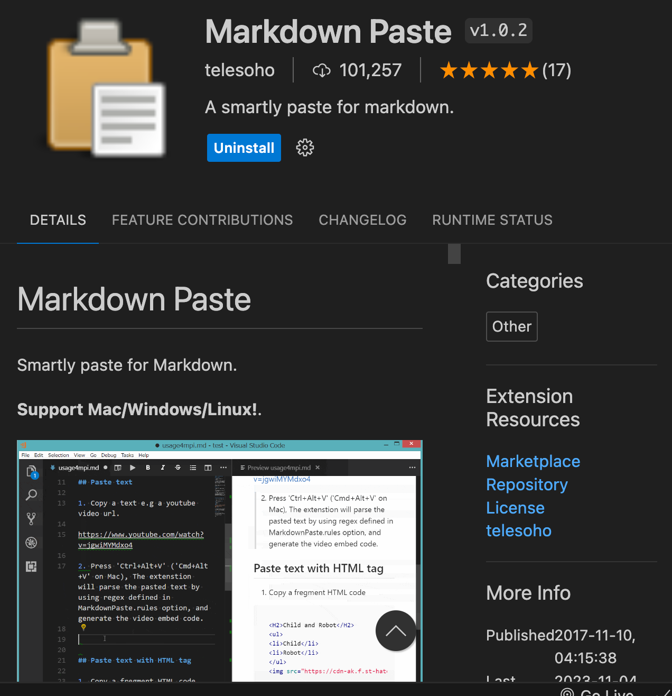

# Paste as Markdown

When you copy text from ChatGPT, it puts the formatted text in a paste buffer in a rich-text format.   But if you simply do a "Paste" function
within your editor, it may lose all the formatting.

Within Visual Studio you can install and extension called
"Markdown Paste".  If you then do a Option/Command V you
will retain all the formatting in your Markdown file!

