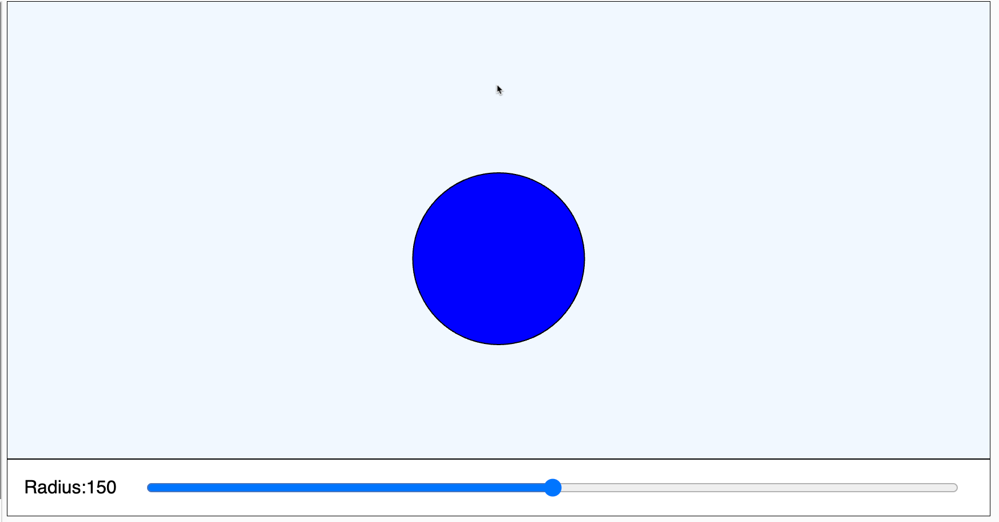

# Getting Started MicroSim Template

{ width="400" }

[Run the Template MicroSim](template.html){ .md-button .md-button--primary }
[Edit tne MicroSim Template](https://editor.p5js.org/dmccreary/sketches/dJq4nTXE4)

## About this MicroSim

This MicroSim teaches us ...

## Use an iFrame

```html
<iframe src="template.html" height="400px"></iframe>
```

<iframe src="template.html" height="400px"></iframe>
## Sample Prompt

```linenums="0"
Create a p5.js sketch.
Draw a blue circle in the center.
Have a slider change the radius of the circle.
Use the attached template.js file.
```

## Sample template.js file

```javascript
// MicroSim Template
// canvas regions setup
// let canvasWidth = 750;
let drawHeight = 335;
let controlHeight = 50;
let canvasHeight = drawHeight + controlHeight;
let aspectRatio = 1.91; // Open Graph standard
let canvasWidth = canvasHeight * aspectRatio;
let margin = 50;

function setup() {
  const canvas = createCanvas(canvasWidth, canvasHeight);
  var mainElement = document.querySelector('main');
  canvas.parent(mainElement);
  textSize(16);
  
  // create a new slider at th bottom of the canvas
  mySlider = createSlider(0, 300, 150, 1);
  mySlider.position(120, drawHeight + 15);
  mySlider.size(canvasWidth - 3*margin); 
}

function draw() {
  // background of drawing region
  fill('aliceblue');
  rect(0, 0, canvasWidth, drawHeight);

  // background of controls
  fill('whitegray');
  rect(0, drawHeight, canvasWidth, controlHeight);
  
  // get the updated slider value
  radius = mySlider.value();
  
  // custom drawing here
  fill('blue');
  circle(canvasWidth/2, canvasHeight/2, radius);
  
  // add the slider label and value in control area
  fill('black');
  text("Radius:"+radius, 15, drawHeight + 30)
}
```

## Explanation Of Code

### Drawing Regions

### Setup

### Draw