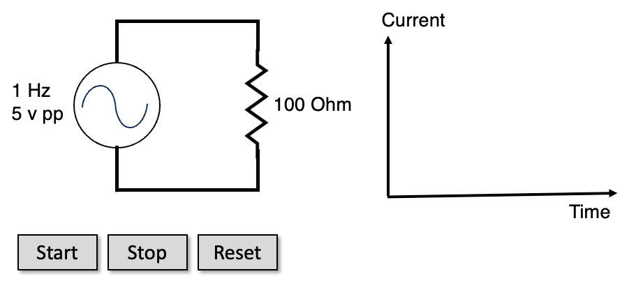

# AC Circut

<figure markdown>
   { width="400" }
   <figcaption>AC Circuit</figcaption>
</figure>

[Run AC Circuit MicroSim](./ac-circuit.html){ .md-button .md-button--primary }

[Edit This MicroSim](https://editor.p5js.org/dmccreary/sketches/TYNk9OFvI)