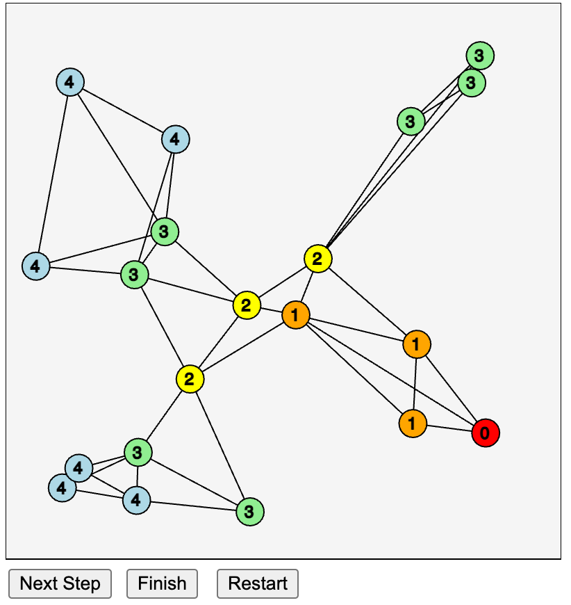

# Breath First Graph Search

<figure markdown>
   { width="400" }
   <figcaption>Breath First Search</figcaption>
</figure>

[Run Breath First Graph Search MicroSim](./bfs.html){ .md-button .md-button--primary }
Note you must click on the Next Button twice to get to level 1 search.

## Sample Prompt

```linenums="0"
Generate a simulation of breadth-first-search on a graph.  
Place a green vertex at the center of a network of 20 
vertices that are placed on the canvas.  
Connect each vertex to the 2 or 3 closest vertices 
using edges. For each step in the search, 
color the next vertex red.  
Repeat until all vertices have been visited.
```

[Link to Transcript](https://chat.openai.com/share/1b72c39f-32d6-478d-98a6-d9292374c844)