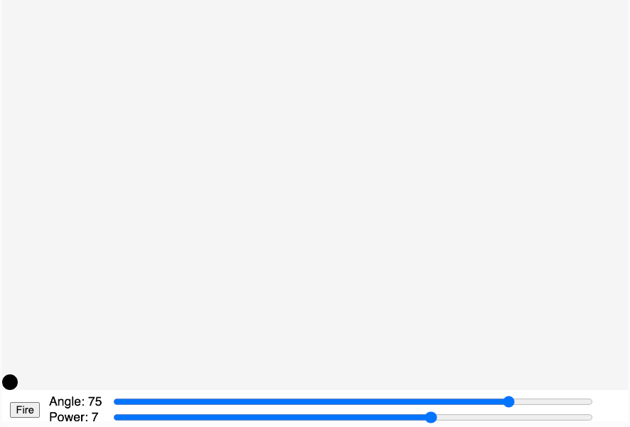

# Canon and Projectile Motion

<figure markdown>
   { width="400" }
   <figcaption>Figure caption.</figcaption>
</figure>

[Run Demo of Canon Projectile Motion](./canon.html){ .md-button .md-button--primary }

In this lesson, we add gravity to our simulation.  The program has a "Fire" button
and you can adjust the angle an power of the canon that fires the ball.

## Sample Prompts

!!! prompt
  Generate a new P5 MicroSim using the MicroSim-p5 skill that will demonstrate projectile
  motion.  Create a folder called projectile-motion to store the MicroSim.
  A canon is in the lower-left corner of the canvas.
  A "Fire" button is in the control area along with two sliders.
  One slider controls the angle and the other slider controls the power.
  When the user presses the Fire button, a small blue ball will exit the canon and fly
  in the pattern of parabola.
  A dashed line will trace the trajectory of the canon ball.
  Pressing the Fire button again will fire a new canon ball, but will not erase the prior paths.
  A Reset button will erase all the prior paths.
  Using the default values for the angle and power will have the ball land 3/4 of the way to the right side.


[Edit this Code Using the p5.js Editor](https://editor.p5js.org/dmccreary/sketches/KK75id7n4)

## Sample Code

```js
// Cannon Ball - a demonstration of projectile motion
// Gravity is a constant
let canvasWidth = 800;
let drawHeight = 500;
let canvasHeight = drawHeight + 40; // add 20 per slider
let angleSlider, powerSlider;
let angle, power;
let cannonBall;
let firing = false;
let sliderLeftMargin = 140;

// setup the canvas and controls and 
// create a new cannonBall in the lower left corner
function setup() {
  const canvas = createCanvas(canvasWidth, canvasHeight);
  // uncomment when placing into HTML
  // canvas.parent('canvas-container');
  textSize(16);

  angleSlider = createSlider(0, 90, 75, 1);
  angleSlider.position(sliderLeftMargin, drawHeight + 5);
  angleSlider.style('width', canvasWidth - sliderLeftMargin - 200 + 'pt')
  
  powerSlider = createSlider(1, 10, 7, 0.1);
  powerSlider.position(sliderLeftMargin, drawHeight + 25);
  powerSlider.style('width', canvasWidth - sliderLeftMargin - 200 + 'pt')

  fireButton = createButton('Fire');
  fireButton.position(10, drawHeight+15);
  fireButton.mousePressed(fireCannon);

  cannonBall = new CannonBall(10, drawHeight-10, 0, 0);
}

function draw() {
  // only draw the drawing region light gray
  fill(245);
  rect(0, 0, canvasWidth, drawHeight);
  // fill the bottom control region with a white background
  fill('white');
  rect(0, drawHeight, canvasWidth, canvasHeight- drawHeight);
  
  // get the new angle and power
  angle = angleSlider.value();
  power = powerSlider.value();

  if(firing) {
    cannonBall.applyForce(createVector(0, 0.05)); // Gravity is here
    cannonBall.update();
  }
  
  // draws the new cannon ball
  cannonBall.display();

  // are we still on the canvas?
  if(cannonBall.pos.y > drawHeight || cannonBall.pos.y < 0) {
    firing = false;
    // get a new ball ready
    cannonBall = new CannonBall(10, drawHeight-10, 0, 0);
  }
  
  fill(1);
  noStroke();
  text('Angle: ' + angle, 60, drawHeight + 20);
  text('Power: ' + power, 60, drawHeight + 40);
}

function fireCannon() {
  let force = p5.Vector.fromAngle(radians(-angle));
  force.mult(power);
  cannonBall.applyForce(force);
  firing = true;
}

class CannonBall {
  constructor(x, y, vx, vy) {
    this.pos = createVector(x, y);
    this.vel = createVector(vx, vy);
    this.acc = createVector(0, 0);
    this.r = 10;
  }

  applyForce(force) {
    this.acc.add(force);
  }

  update() {
    this.vel.add(this.acc);
    this.pos.add(this.vel);
    this.acc.mult(0);
  }

  display() {
    fill('black')
    circle(this.pos.x, this.pos.y, this.r * 2);
  }
}

```

## Learnings from the Code

1. The p5.js has a library for simulating forces on an object.
2. We can use the Class operator to create functions on the canon ball.

## References

1. 