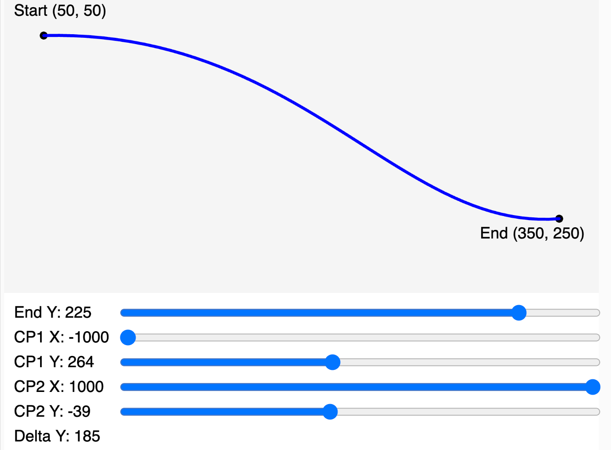
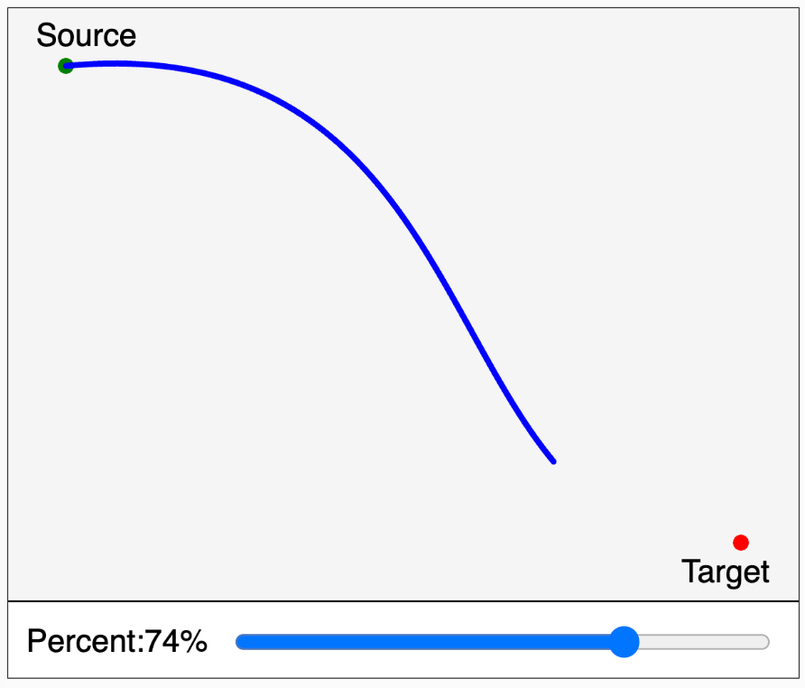

# Curve Control PointerEvent

<figure markdown>
   { width="400" }
   <figcaption>Curve Control Points</figcaption>
</figure>

[Run the Curve Control Point MicroSim](./curve.html){ .md-button .md-button--primary }
[Edit Curve Control Points MicroSim](https://editor.p5js.org/dmccreary/sketches/XS9qIjZdZ)

## Curve Percent


[Curve Percent](./curve-percent.html)
[Edit Curve Percent](https://editor.p5js.org/dmccreary/sketches/T0tSaTPCr)

### Custom Curve with Percent Function

```js
// Draw a curve with only the percent drawin
function customCurve(c1x, c1y, x1, y1, x2, y2, c2x, c2y, percent) {
  beginShape();
  for (let t = -0.01; t <= percent + 0.01; t += 0.01) {
    let v0 = createVector(c1x, c1y);
    let v1 = createVector(x1, y1);
    let v2 = createVector(x2, y2);
    let v3 = createVector(c2x, c2y);
    let x = curvePoint(v0.x, v1.x, v2.x, v3.x, t);
    let y = curvePoint(v0.y, v1.y, v2.y, v3.y, t);
    curveVertex(x, y);
  }
  endShape();
}
```
