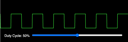

# Gallery

|     |     |     |     |
| --- | --- | --- | --- |
| [Simulation of an Arithmetic Logic Unit (ALU)](../alu)  | [Analog Clock](../analog-clock)  | [Battery Drain](../battery-drain)  | [Breadth First Graph Search](../bfs)  |
| [Binary Number](../binary-number)  | [Bouncing Ball](../bouncing-ball)  | [Canon and Projectile Motion](../canon)  | [Circle](../circle)  |
| [Battery Circuit](../circuits)  | [Collision Avoidance Robot](../collision-avoidance-robot)  | [Gold Star](../gold-star)  | [Logic Gates](../logic-gates)  |
| [Named Colors](../named-colors)  | [Polygon](../polygon)  | [Pulse-Width Modulation](../pwm)  | [Sine Wave](../sine-wave)  |
| [String Harmonics](../string-harmonics)  | [Supply and Demand](../supply-and-demand)  |
