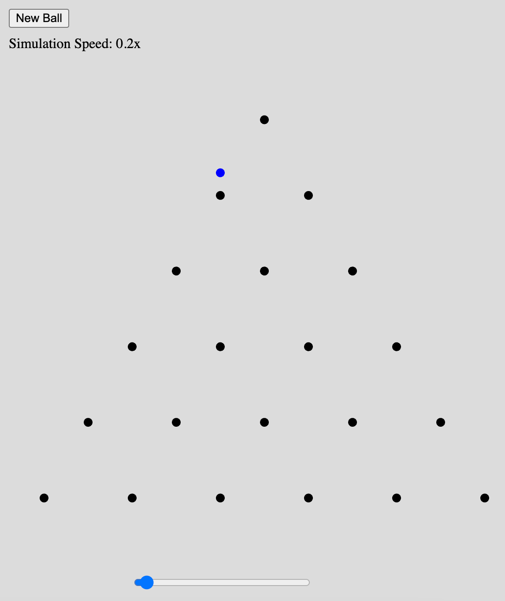

# Galton Board


[Run the Galton Board MicroSim](galton-board.html){ .md-button .md-button--primary }
[Edit the MicroSim](https://editor.p5js.org/dmccreary/sketches/3aTaQ4KvI)

## Prompt

```linenums="0"
Create a p5.js sketch that simulates a Galton Board.
It is also called a Plinko game.
The sketch has "New Ball" button that triggers a blue
circle with radius=5 falling from the top middle of the
canvas.  Below it is a set of pins in a triangular pattern.
The ball will bounce on the top pin.
There is a 50% chance the ball bounces left and 50% on the right.
There is a second row of two pins, each with the same odds.
On the third row, there are three pins.
On the fourth row there are four pins.
Continue this pattern for 6 rows.
```


[Simon Tiger's Galton Board](https://editor.p5js.org/simontiger/sketches/h7p-wZCw8)

Other sketches by Simon Tiger
https://editor.p5js.org/simontiger/sketches

[Plinko by Coding Train](https://editor.p5js.org/codingtrain/sketches/wAe_oPVHo)