# MicroSims

These MicroSims were generated for the current edition of this book (MicroSims 2.0). They are grouped by the chapter that embeds them, and each card links to the MicroSim's own page with its lesson plan and embed code. The first edition's MicroSims are kept in [Original MicroSims (1.0)](../microsims-old/index.md).

## Chapter 1: What Is a MicroSim

[Read Chapter 1](../chapters/01-what-is-a-microsim/index.md)

- **[AI Generation Pipeline](./ai-generation-pipeline/index.md)**

    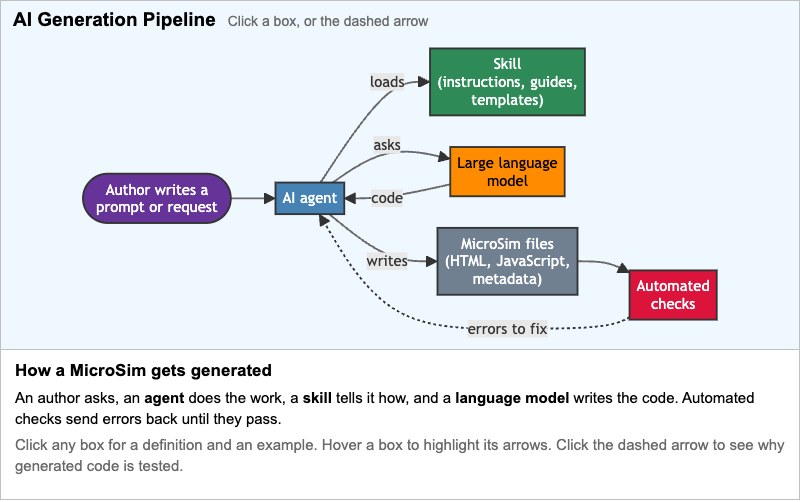

    A clickable flowchart that shows how an author's prompt, an AI agent, a skill, a large language model and automated checks work together to…

- **[Bouncing Ball Gravity Lab](./bouncing-ball-gravity-lab/index.md)**

    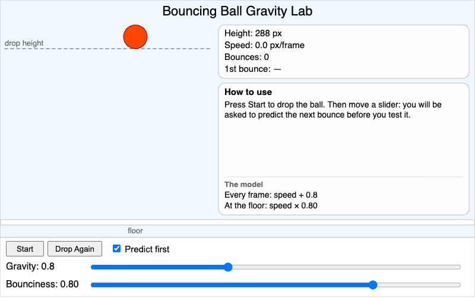

    Predict, then test, how the gravity and bounciness sliders change a falling ball's motion and the height of its first bounce.

- **[From Author to Learner](./author-to-learner-workflow/index.md)**

    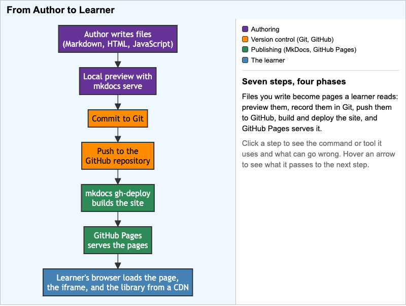

    A clickable workflow that traces a MicroSim from the author's files through mkdocs serve, Git, GitHub, mkdocs gh-deploy and GitHub Pages to the…

- **[MicroSim Family Tree](./microsim-family-tree/index.md)**

    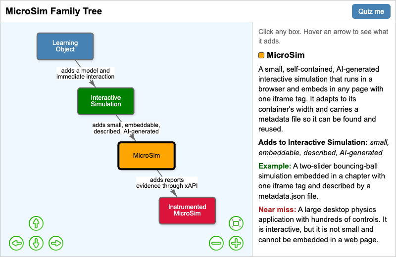

    Explore how a learning object, an interactive simulation, a MicroSim and an instrumented MicroSim nest, then classify examples by the property…

- **[MicroSim Technology Stack](./microsim-technology-stack/index.md)**

    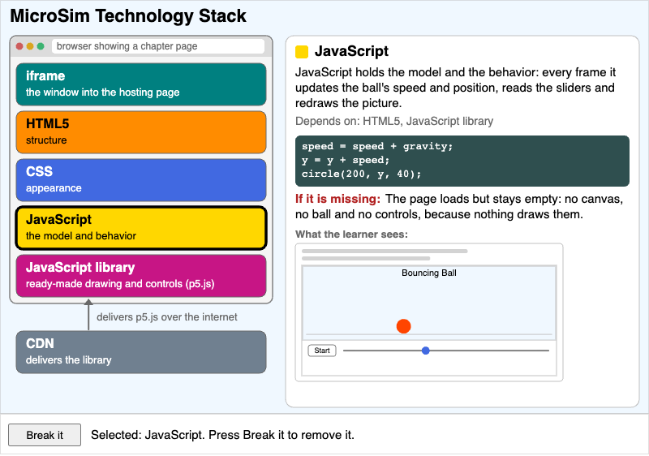

    Click each layer of a running MicroSim (iframe, HTML5, CSS, JavaScript, a JavaScript library and a CDN) to see its role and code, then break it to…

- **[MicroSims Milestones Timeline](./microsims-milestones-timeline/index.md)**

    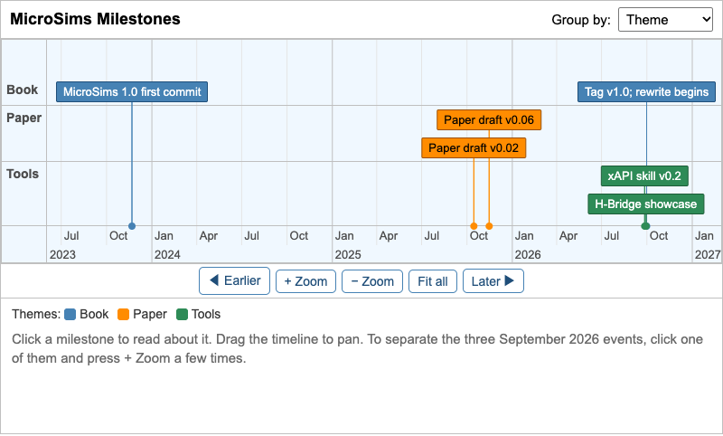

    A zoomable timeline of the milestones from the first MicroSims 1.0 commit in 2023 to the start of the MicroSims 2.0 rewrite in 2026, grouped by…

- **[Which Kind of Object Is It?](./which-kind-of-object-classifier/index.md)**

    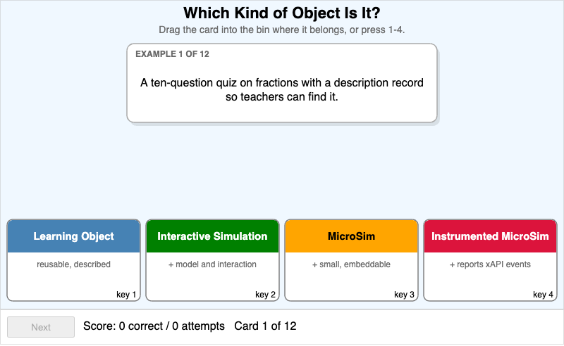

    Drag twelve example cards into four bins to distinguish learning objects, interactive simulations, MicroSims and instrumented MicroSims, with…

## Chapter 2: Anatomy of a MicroSim

[Read Chapter 2](../chapters/02-anatomy-of-a-microsim/index.md)

- **[Canvas Height Calculator](./canvas-height-calculator/index.md)**

    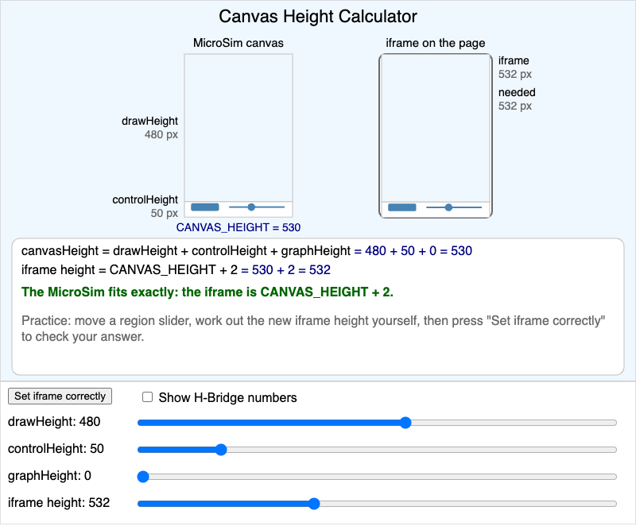

    Set a MicroSim's drawHeight, controlHeight and graphHeight, calculate CANVAS_HEIGHT and the iframe height, and see exactly how many pixels of…

- **[MicroSim Directory Audit](./microsim-directory-audit/index.md)**

    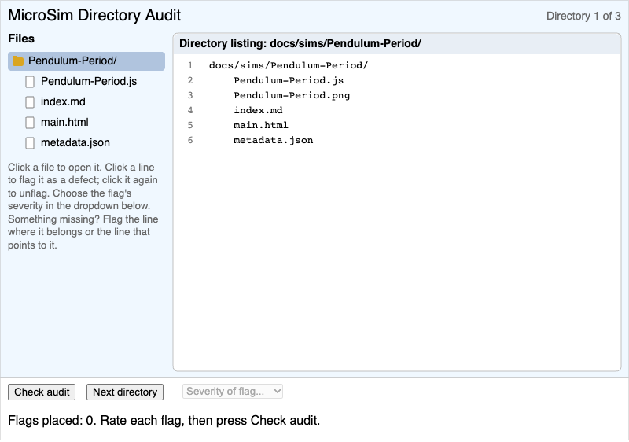

    Audit three sample MicroSim directories, flag the planted defects line by line, rate each one from cosmetic to breaks-embedding, and check your…

- **[MicroSim Directory Explorer](./microsim-directory-explorer/index.md)**

    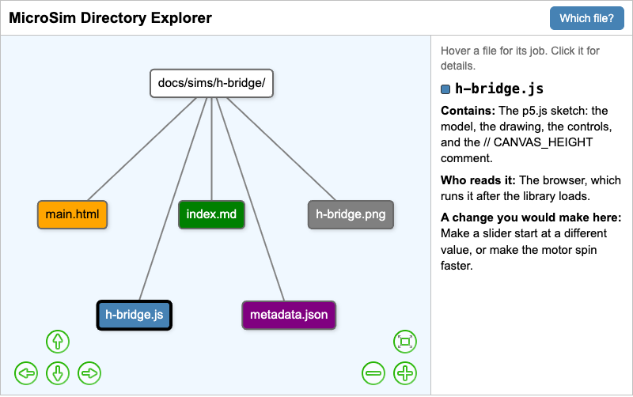

    Explore the five files in a MicroSim directory (main.html, the sketch, index.md, metadata.json and the preview image) and practice choosing which…

## Chapter 3: Learning Objectives and Bloom's Taxonomy

[Read Chapter 3](../chapters/03-learning-objectives-and-blooms-taxonomy/index.md)

- **[Bloom Level Ladder](./bloom-level-ladder/index.md)**

    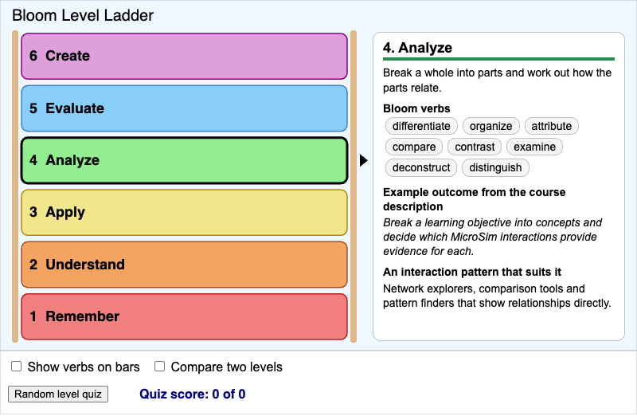

    A six-rung ladder of Bloom's 2001 levels; click a rung to see its eight verbs, an example outcome from the course description and an interaction…

- **[Bloom Objective Sorter](./bloom-objective-sorter/index.md)**

    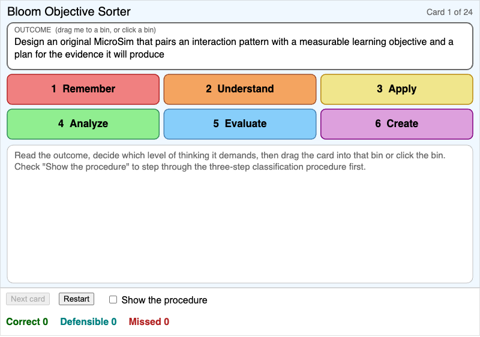

    Sort 24 real learning outcomes from this course's description into the six Bloom levels with the three-step classification procedure, and defend…

- **[Bloom-to-Pattern Matrix](./bloom-to-pattern-matrix/index.md)**

    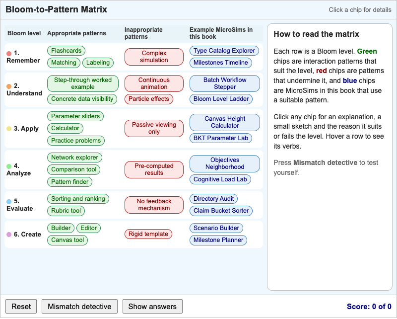

    A clickable matrix of the six Bloom levels showing which MicroSim interaction patterns suit each level, which undermine it and why, with a…

- **[Cognitive Load Balance Lab](./cognitive-load-balance-lab/index.md)**

    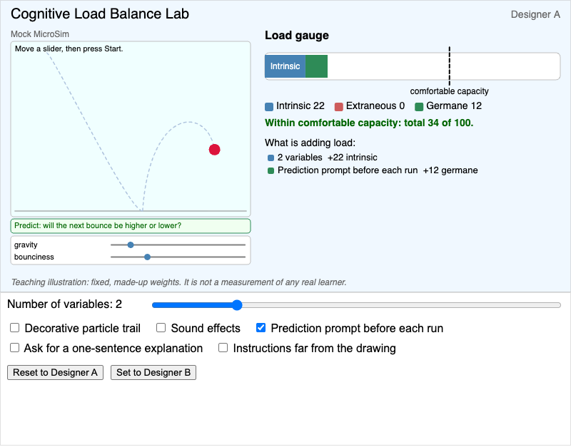

    Toggle features on a mock bouncing-ball MicroSim and watch a qualitative gauge split the load into intrinsic, extraneous and germane parts against…

- **[Instructional Design Checkpoint Navigator](./design-checkpoint-navigator/index.md)**

    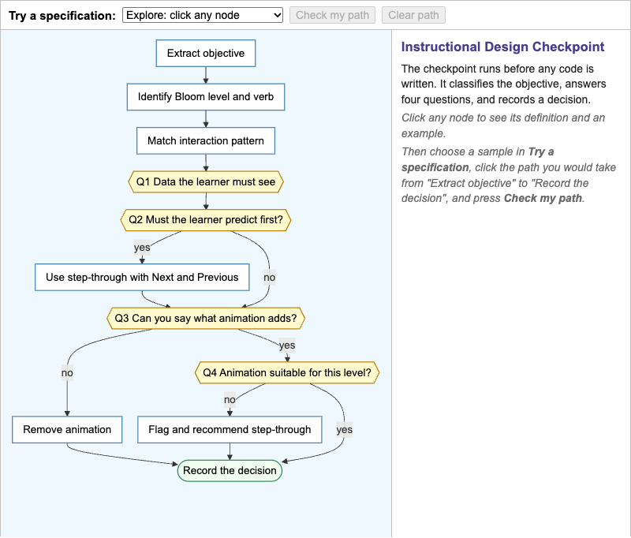

    A clickable Mermaid flowchart of the instructional design checkpoint in which you run the checkpoint on four sample specifications, compare your…

- **[Objective Rewriter Workbench](./objective-rewriter-workbench/index.md)**

    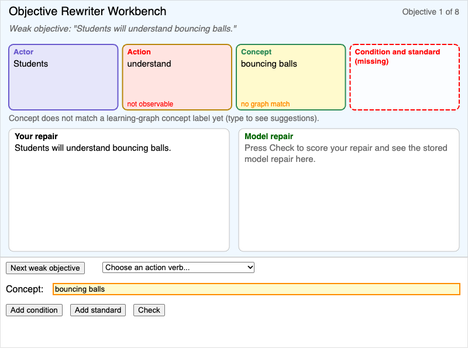

    Repair eight weak learning objectives by filling the actor, action, concept, and condition-and-standard slots, choosing an observable verb and a…

- **[Objectives Neighborhood of the Learning Graph](./objectives-graph-neighborhood/index.md)**

    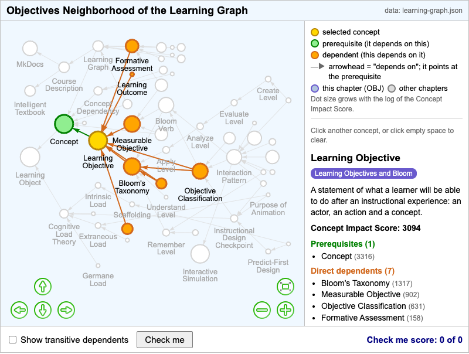

    Explore the 26 learning-objective concepts of this book's learning graph with their direct prerequisites and dependents, and test yourself on…

## Chapter 4: Choosing a MicroSim Type

[Read Chapter 4](../chapters/04-choosing-a-microsim-type/index.md)

- **[Choose the Type Challenge](./choose-the-type-challenge/index.md)**

    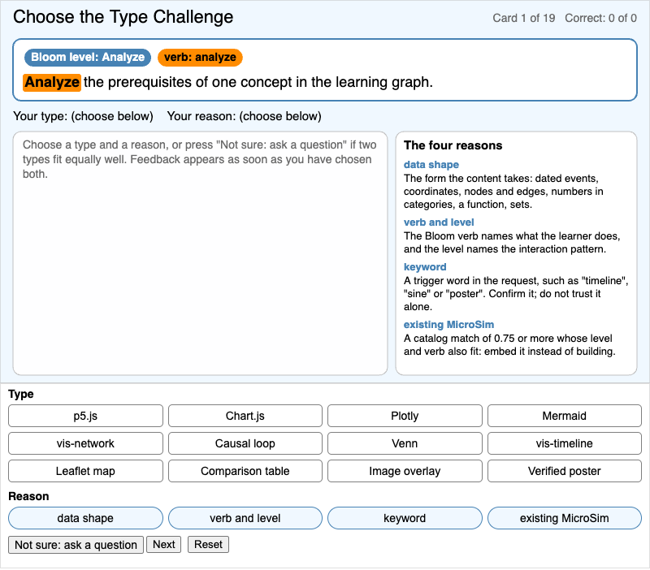

    A 19-card challenge in which you justify the MicroSim type for each learning objective by choosing a type and a reason, spot ambiguous objectives…

- **[MicroSim Type Catalog Explorer](./microsim-type-catalog-explorer/index.md)**

    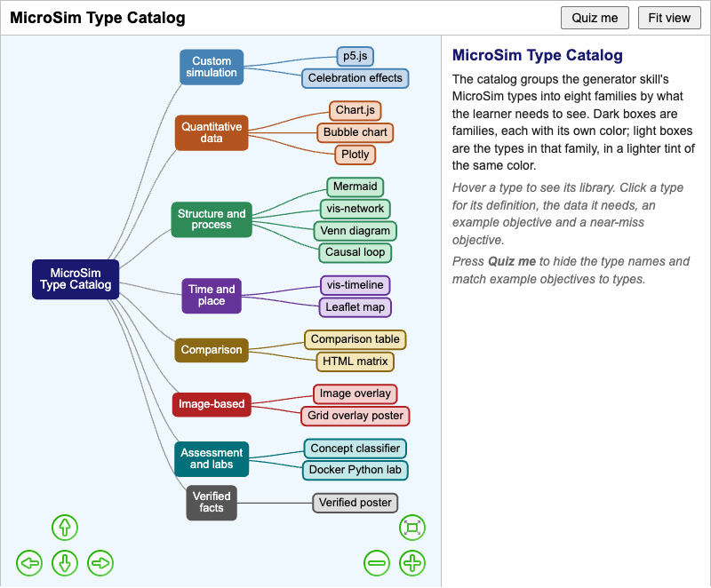

    A vis-network explorer of the MicroSim Type Catalog's eight families and eighteen types, with hover-for-library, click-for-details and a Quiz me…

- **[Routing Score Workbench](./routing-score-workbench/index.md)**

    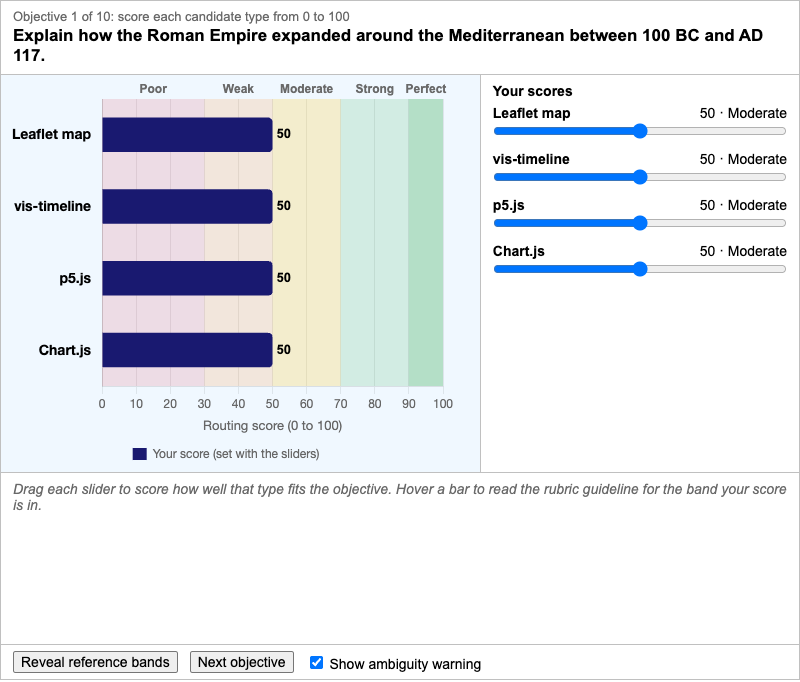

    A Chart.js workbench in which you score competing MicroSim types for ten objectives against the five-band routing rubric, resolve close scores…

- **[Type Routing Decision Tree](./type-routing-decision-tree/index.md)**

    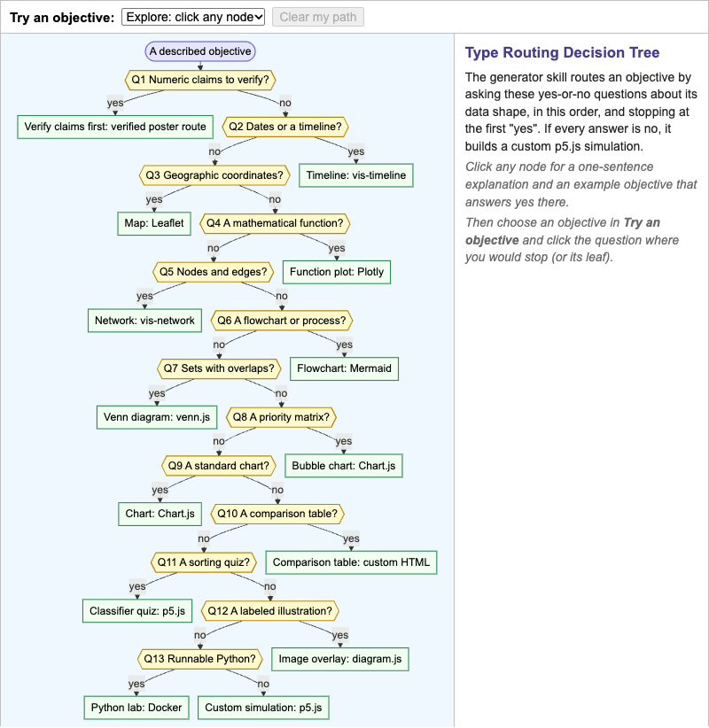

    A clickable Mermaid decision tree of the generator skill's routing questions, asked in order until the first yes, with a practice mode that routes…

## Chapter 5: Generating MicroSims with AI Skills

[Read Chapter 5](../chapters/05-generating-microsims-with-ai-skills/index.md)

- **[Batch Generation Workflow Stepper](./batch-generation-workflow-stepper/index.md)**

    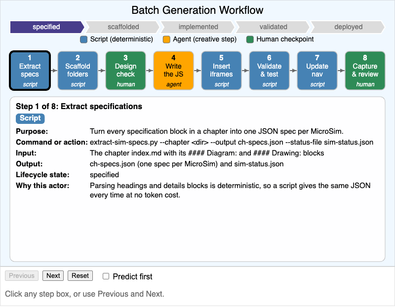

    A step-through of the eight steps of the MicroSim generator skill's batch workflow that shows each step's command, input, output and lifecycle…

- **[Generation Failure Mode Triage](./generation-failure-mode-triage/index.md)**

    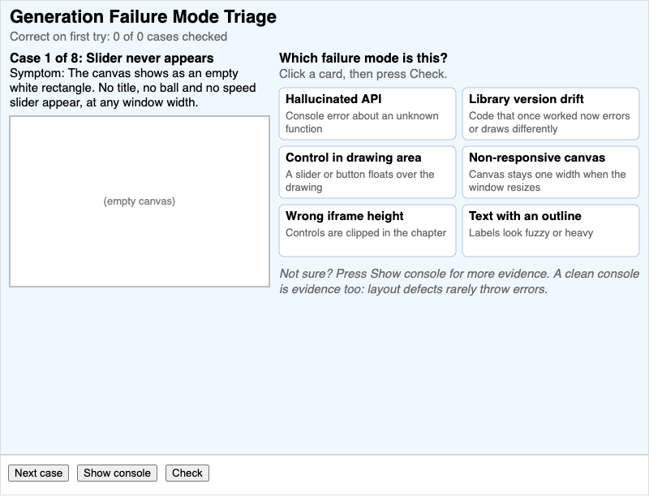

    Diagnose eight defective AI-generated MicroSims by matching each symptom and simulated console message to one of six generation failure modes, its…

- **[Generator Skill Anatomy Explorer](./generator-skill-anatomy-explorer/index.md)**

    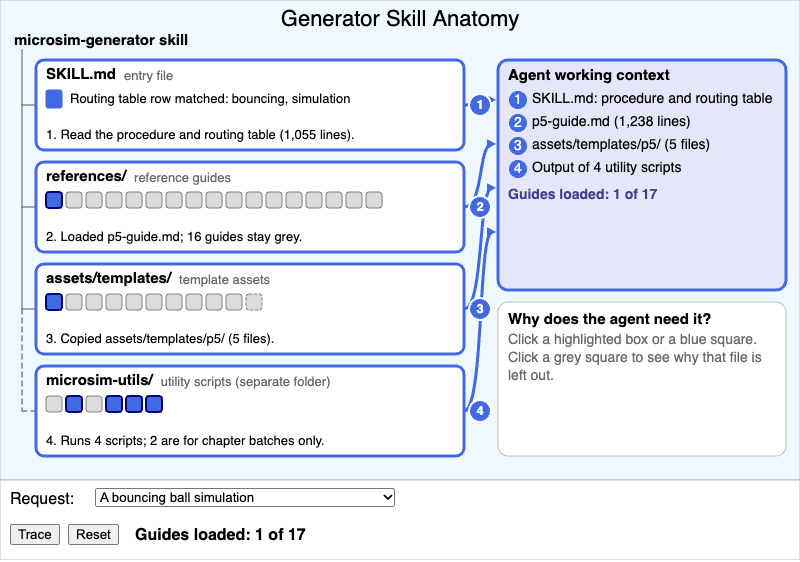

    An explorer that traces which parts of the microsim-generator skill an agent reads for a request — the SKILL.md routing table, one reference…

- **[p5.js 2.x Migration Mapper](./p5-2x-migration-mapper/index.md)**

    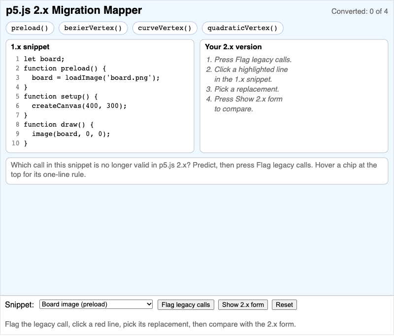

    Convert four short p5.js 1.x snippets to their 2.x form by flagging the v1-only call, choosing its replacement and checking the choice against the…

- **[Prompt Quality Workbench](./prompt-quality-workbench/index.md)**

    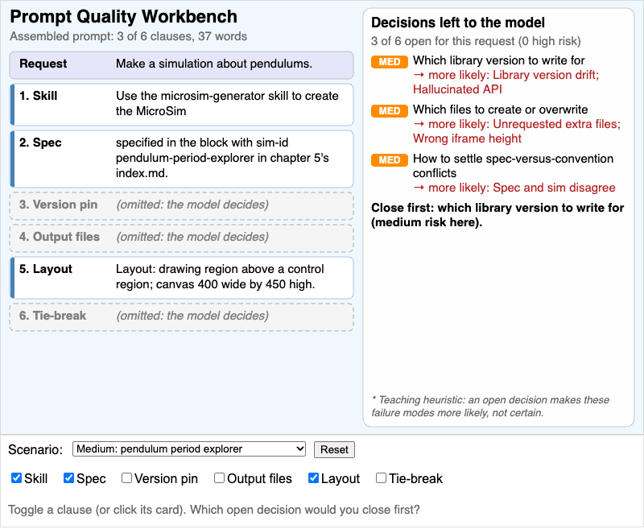

    Toggle the six clauses of a MicroSim generation prompt and see which decisions each omission hands to the model and which generation failure modes…

- **[Specification Block Anatomy Explorer](./spec-block-anatomy-explorer/index.md)**

    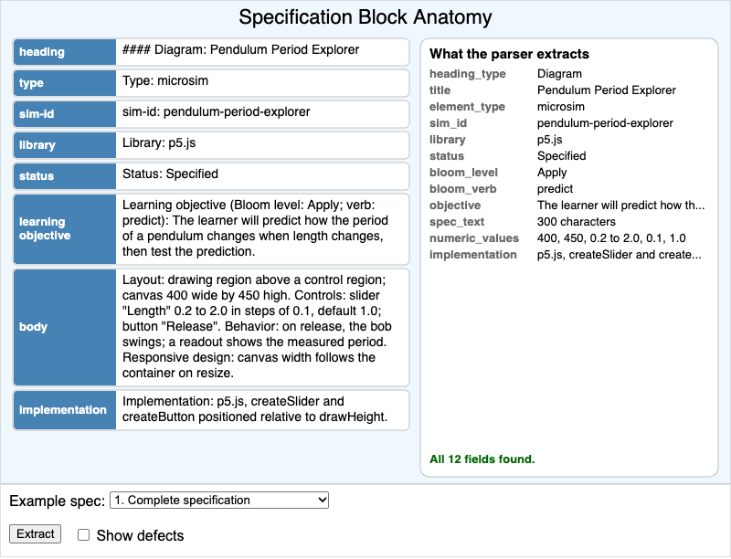

    An explorer that breaks a MicroSim specification block into its eight fields, runs a simulated extraction that marks missing fields in red, and…

## Chapter 6: p5.js MicroSims

[Read Chapter 6](../chapters/06-p5js-microsims/index.md)

- **[Coordinate System Explorer](./p5-coordinate-system-explorer/index.md)**

    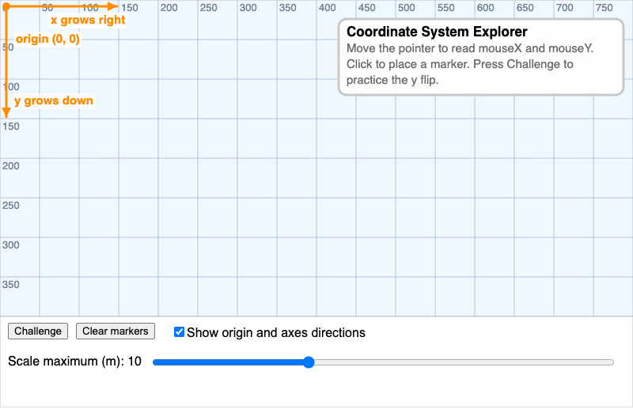

    Read mouseX and mouseY on a labeled p5.js pixel grid, then calculate where a height on a meter scale lands, including the y flip, and check the…

- **[Flowing Current and Idle Pause](./p5-flowing-current-idle-pause/index.md)**

    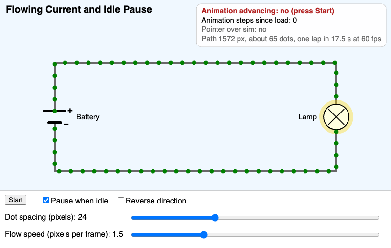

    Design a flowing-current animation around a battery-and-lamp loop by choosing dot spacing, flow speed and direction, and decide whether…

- **[Sketch Lifecycle Explorer](./p5-sketch-lifecycle-explorer/index.md)**

    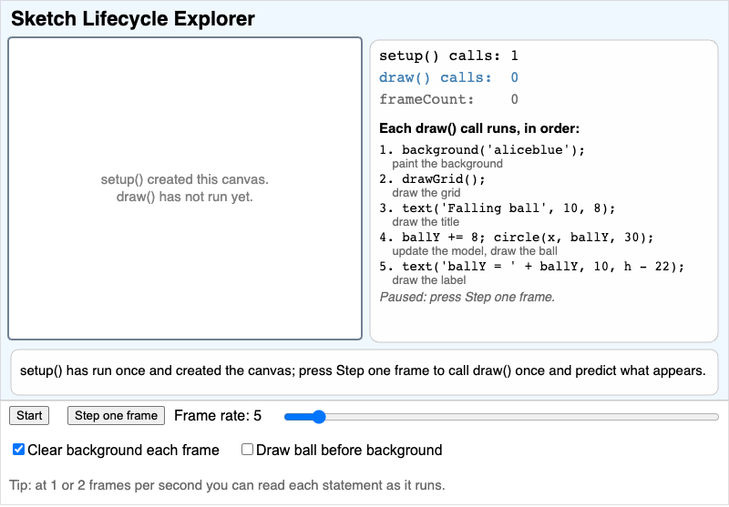

    Step a p5.js sketch one draw() call at a time, watch setup() and draw() counters and the executing statement, and see why statement order inside…

- **[Vector and Particle Lab](./p5-vector-particle-lab/index.md)**

    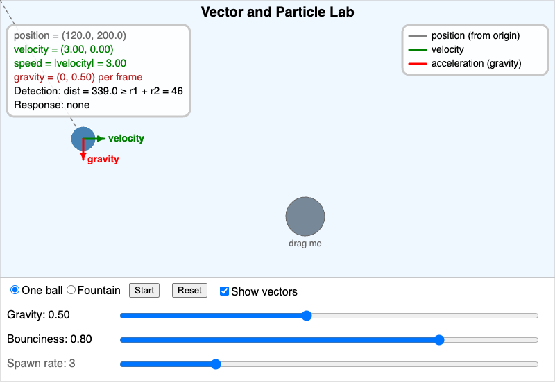

    Watch labeled position, velocity and gravity arrows drive a bouncing ball, drag a second ball into its path to separate collision detection from…

## Chapter 7: Charts, Plots and Tables

[Read Chapter 7](../chapters/07-charts-plots-and-tables/index.md)

- **[Chart Configuration Anatomy Explorer](./chart-configuration-anatomy-explorer/index.md)**

    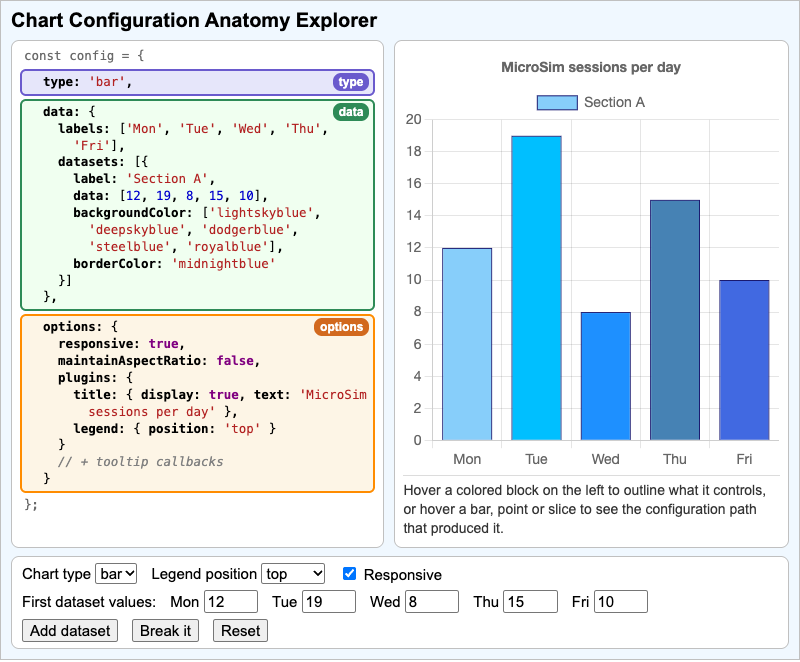

    Edit a live Chart.js configuration shown as color-coded type, data and options blocks, and see which block controls each visible feature of the chart.

- **[Chart Type Chooser](./chart-type-chooser/index.md)**

    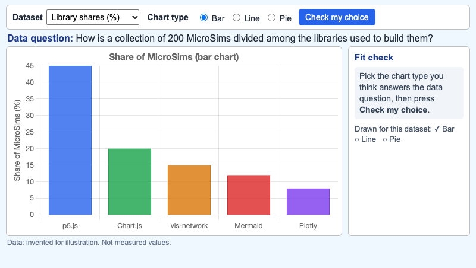

    Choose bar, line or pie for a stated data question, check the choice against a fit rule, and compare the same data drawn in the two alternative…

- **[Clickable Detail Matrix](./clickable-detail-matrix/index.md)**

    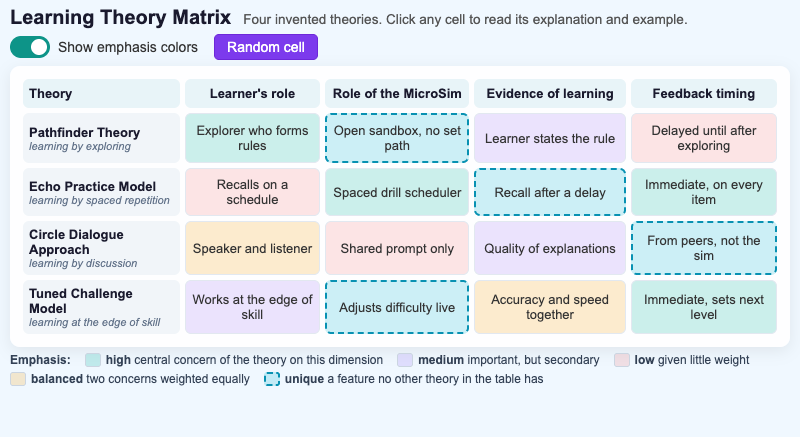

    Differentiate four invented learning theories across four dimensions by reading each cell's summary, predicting its emphasis, and opening a…

- **[Function Plot Slider Lab](./function-plot-slider-lab/index.md)**

    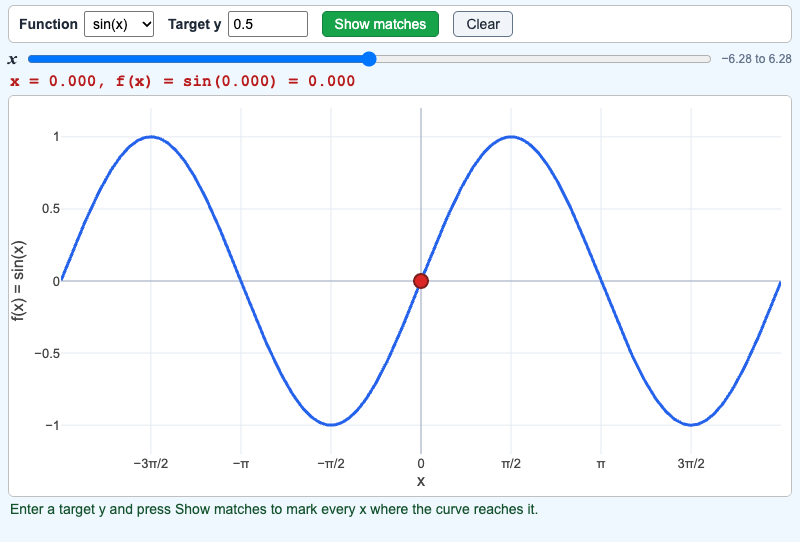

    Move a marker along sin(x), cos(x), x squared or a Gaussian curve with a slider, read x and f(x), and mark every x where the curve reaches a…

- **[Priority Matrix Bubble Explorer](./priority-matrix-bubble-explorer/index.md)**

    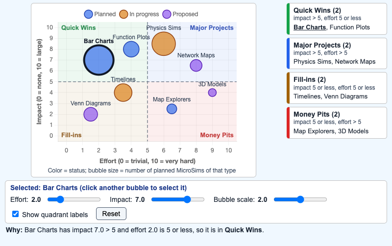

    Compare eight candidate MicroSim types by impact, effort and count on a Chart.js bubble chart, move items across the quadrant midpoints, and see…

- **[Star Rating Comparison Table](./star-rating-comparison-table/index.md)**

    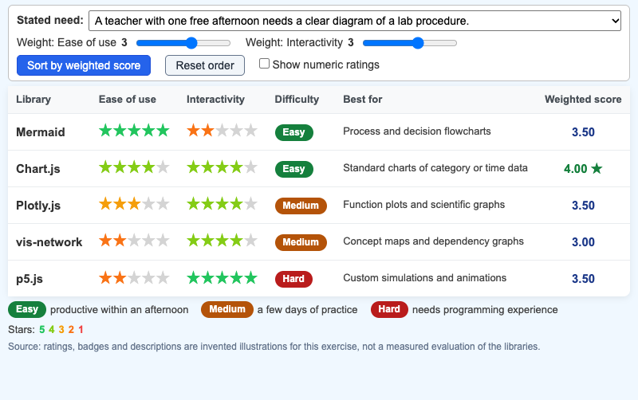

    Judge which of five MicroSim libraries best fits a stated need by weighting two star-rated criteria, sorting by weighted score, and reading badges…

## Chapter 8: Diagrams, Networks and Systems

[Read Chapter 8](../chapters/08-diagrams-networks-and-systems/index.md)

- **[Clickable Flowchart Anatomy](./clickable-flowchart-anatomy/index.md)**

    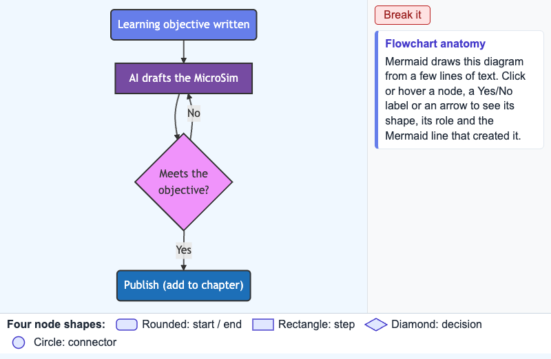

    Inspect a working Mermaid flowchart to tell apart its node shapes, edges, branch labels and style classes, and see the real parse error when a…

- **[Loop Polarity Tracer](./loop-polarity-tracer/index.md)**

    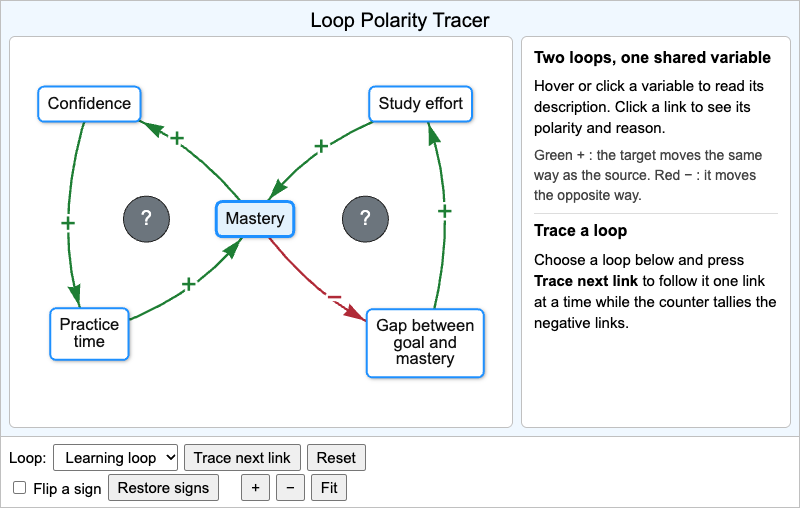

    Trace the polarity links of two learner feedback loops one link at a time, count the negative links, and decide whether each loop is reinforcing…

- **[Node and Edge Data Explorer](./node-edge-data-explorer/index.md)**

    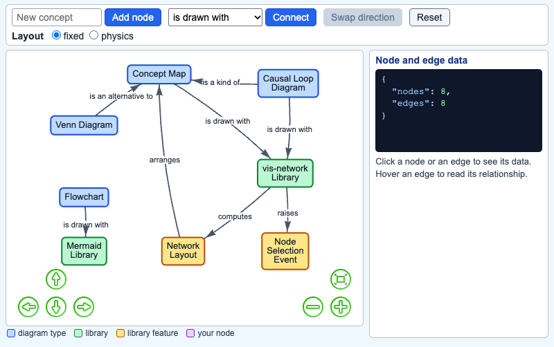

    Build a small concept map in vis-network by adding nodes, connecting them with labeled relationships and swapping edge directions, while a data…

- **[Readability Repair Bench](./diagram-readability-repair-bench/index.md)**

    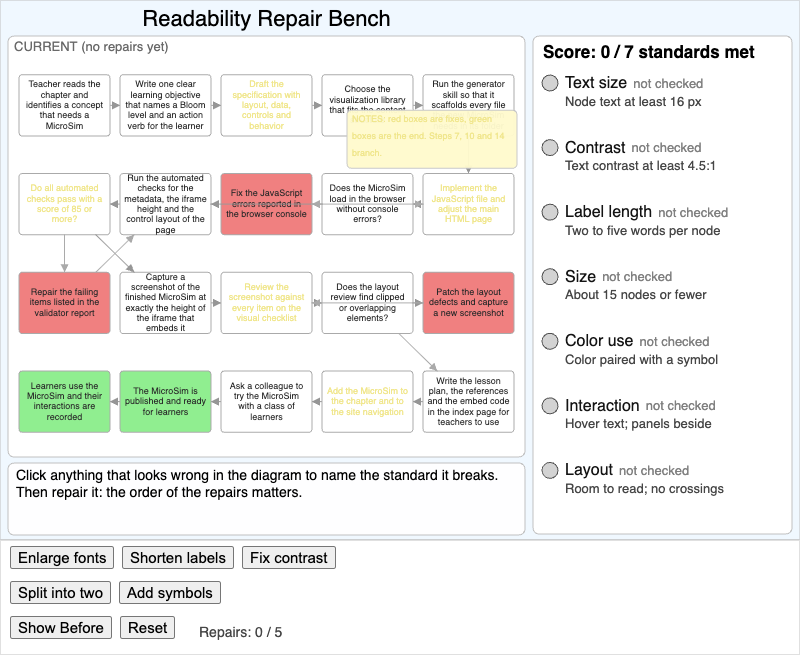

    Critique a cluttered 20-step flowchart against seven diagram readability standards, name each flaw, and repair the diagram with five fixes applied…

- **[Reinforcing and Balancing Behavior Lab](./feedback-behavior-lab/index.md)**

    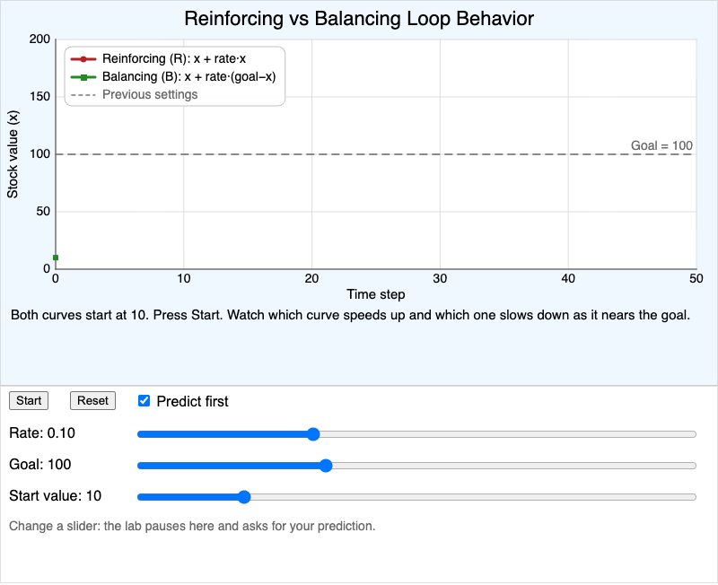

    Compare how a reinforcing loop and a balancing loop behave over time by changing the loop rate, the goal and the start value and predicting how…

- **[Set Overlap Explorer](./set-overlap-explorer/index.md)**

    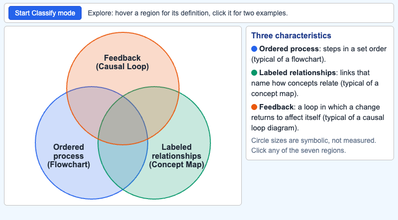

    Classify example diagrams into the seven regions of a three-circle Venn diagram of ordered process, labeled relationships and feedback, the…

## Chapter 9: Timelines and Maps

[Read Chapter 9](../chapters/09-timelines-and-maps/index.md)

- **[Choropleth Threshold Lab](./choropleth-threshold-lab/index.md)**

    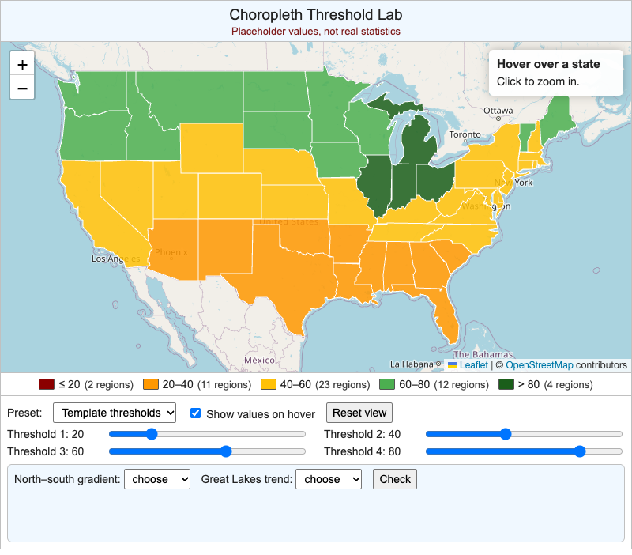

    Move four color thresholds on a US choropleth of placeholder values and judge whether each setting reveals or hides a south-north gradient and a…

- **[Marker, Popup and Tile Source Map](./marker-popup-tile-map/index.md)**

    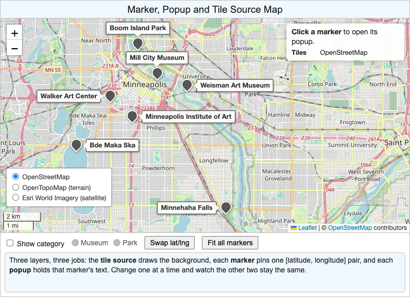

    A Leaflet map of seven Minneapolis museums and parks that separates the jobs of the marker, the popup and the tile source by letting learners…

- **[Timeline Item and Date Explorer](./timeline-item-date-explorer/index.md)**

    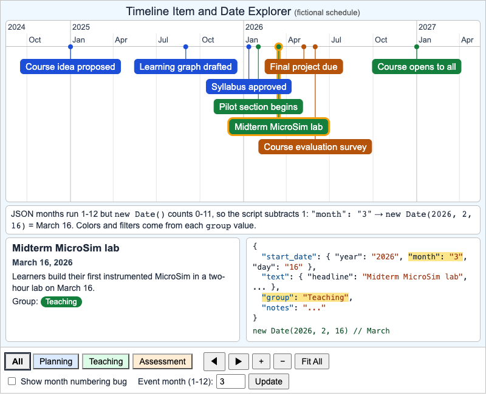

    Place fictional course-schedule events on a vis-timeline from the template's JSON event format, then see how the month off-by-one bug and group…

## Chapter 10: Image Overlays and Comparison Posters

[Read Chapter 10](../chapters/10-image-overlays-and-comparison-posters/index.md)

- **[Callout Overlay Anatomy Explorer](./callout-overlay-anatomy-explorer/index.md)**

    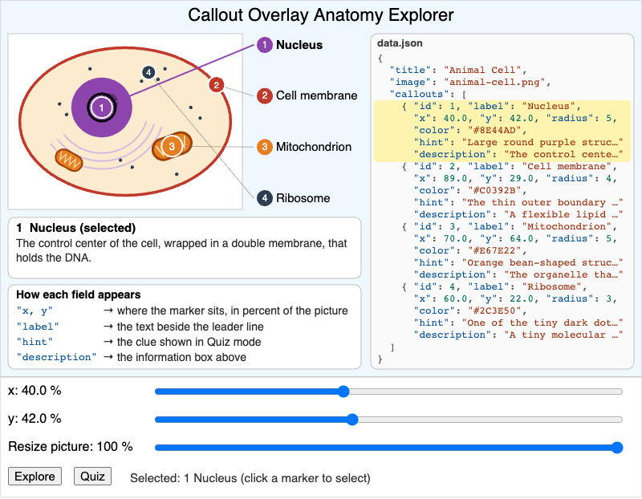

    See how each field of an overlay data file (x, y, label, hint, description) turns into a marker, a label, a quiz clue or an information box on a…

- **[Comparison Poster Explorer](./comparison-poster-explorer/index.md)**

    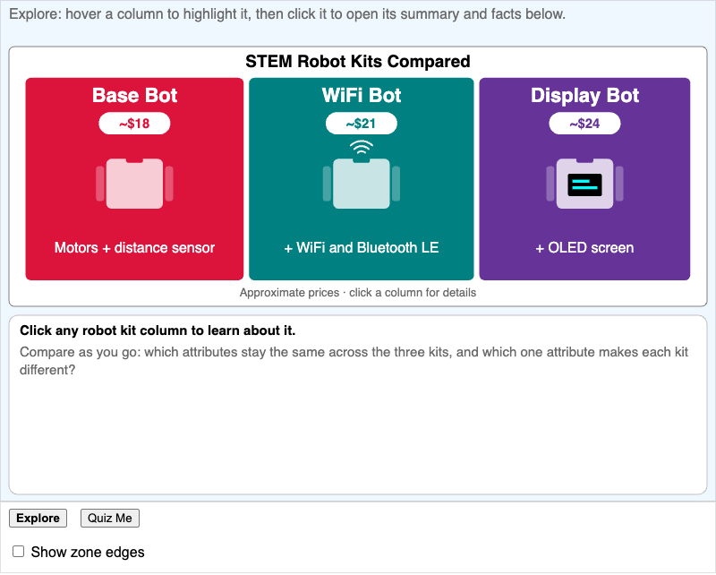

    Explore a three-column robot-kit comparison poster by hovering and clicking its percentage zones, then answer which-column quiz questions that…

- **[Percentage Zone Calibrator](./percentage-zone-calibrator/index.md)**

    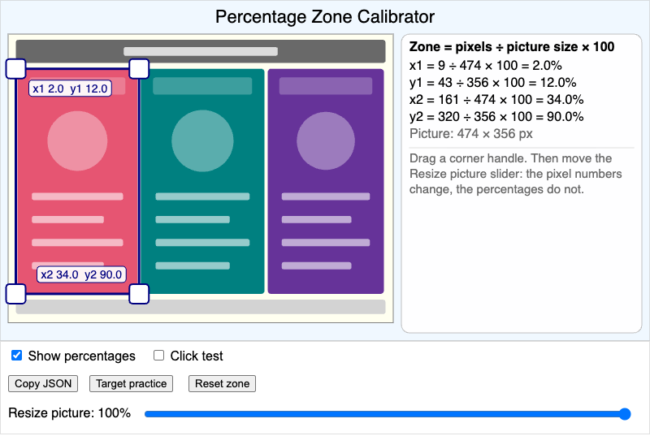

    Drag the corners of a zone over a placeholder poster and watch the pixel-to-percentage calculation for x1, y1, x2 and y2, then practice matching a…

- **[Poster Folder Explorer](./poster-folder-explorer/index.md)**

    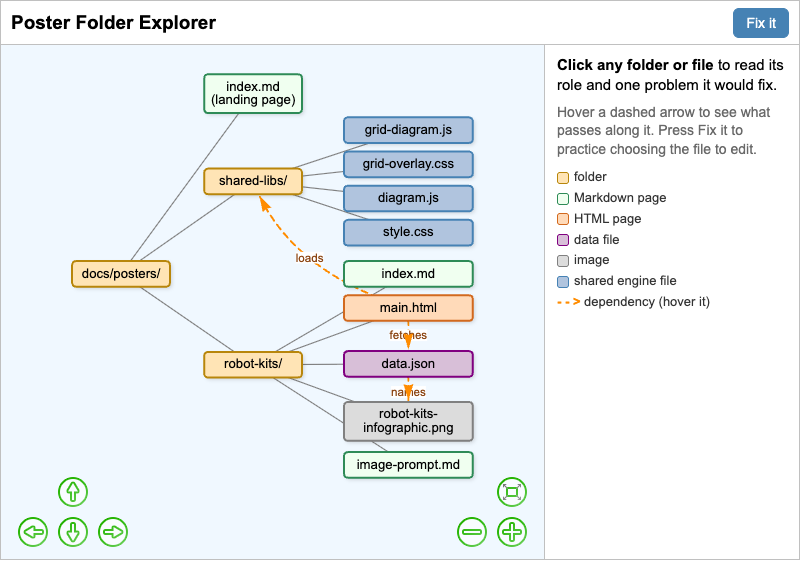

    Explore the folder layout of a poster collection, including the shared overlay library and one poster folder's five files, and practice choosing…

- **[Prompt Text Rule Checker](./prompt-text-rule-checker/index.md)**

    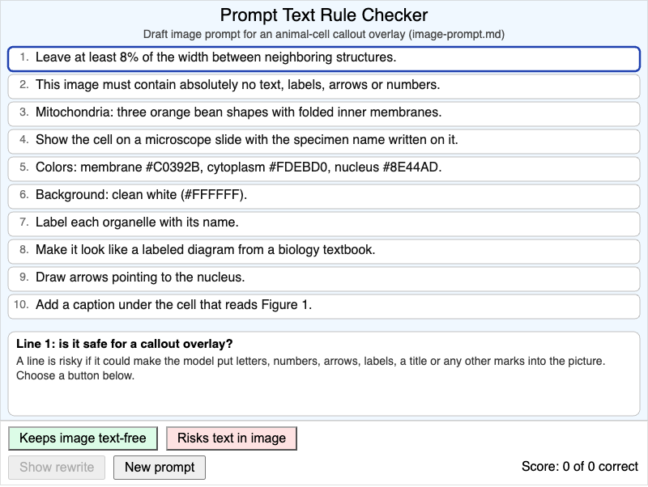

    Judge each line of a draft image prompt as safe for a callout overlay or likely to put text into the image, then read why and see a safe rewrite…

## Chapter 11: Verified Posters and Specialized MicroSim Types

[Read Chapter 11](../chapters/11-verified-posters-and-specialized-microsim-types/index.md)

- **[Claim Bucket Sorter](./claim-bucket-sorter/index.md)**

    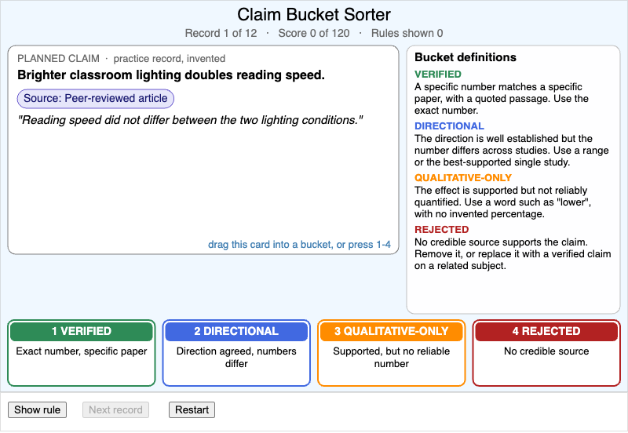

    Drag twelve invented evidence records into the four verification buckets, VERIFIED, DIRECTIONAL, QUALITATIVE-ONLY and REJECTED, and read the rule…

- **[Classifier Scenario Builder](./classifier-scenario-builder/index.md)**

    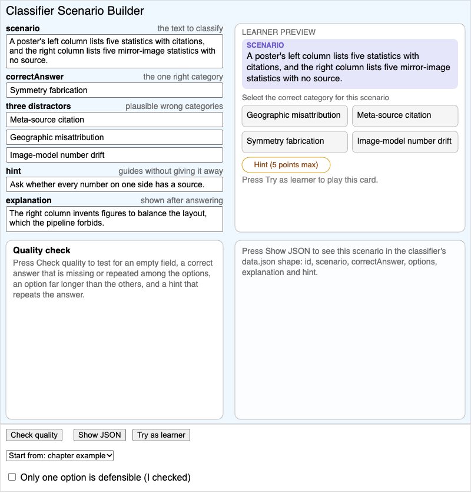

    Write a concept-classifier scenario with a correct answer, three distractors, a hint and an explanation, watch the learner's quiz card update as…

- **[Docker Lab Run Flow](./docker-lab-run-flow/index.md)**

    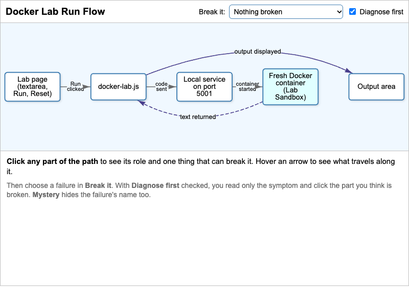

    Follow a Docker Python lab's path from the Run button through docker-lab.js, the local service on port 5001 and a fresh container to the output…

- **[Verified Poster Pipeline Explorer](./verified-poster-pipeline-explorer/index.md)**

    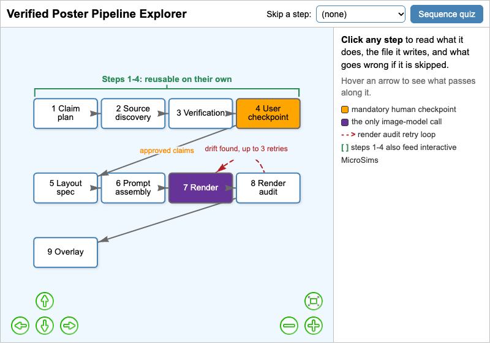

    Explore the nine steps of the verified poster route, from claim plan to overlay, see the file each step writes and what fails when a step is…

## Chapter 12: Width-Responsive Design and Iframe Heights

[Read Chapter 12](../chapters/12-width-responsive-design-and-iframe-heights/index.md)

- **[Height Resolution Order Tracer](./height-resolution-order-tracer/index.md)**

    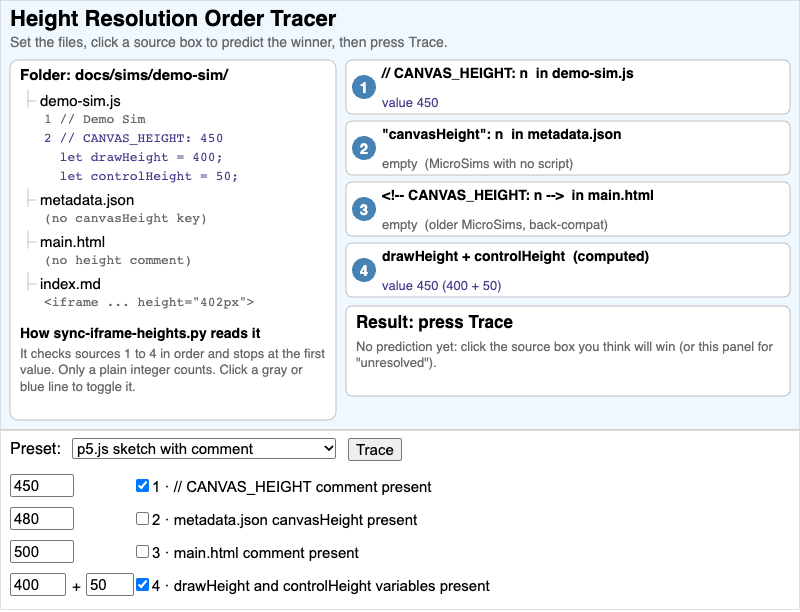

    Examine a MicroSim folder, predict which of the four height sources the height sync tool will use, and trace the resolution order to the resulting…

- **[Iframe Resize Message Stepper](./iframe-resize-message-stepper/index.md)**

    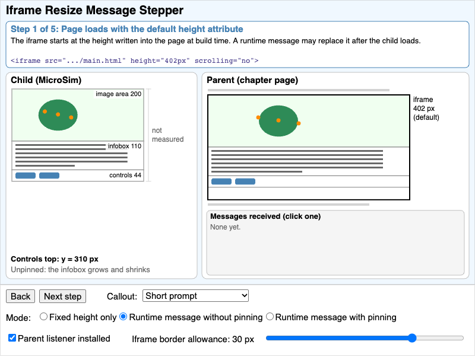

    Step through the iframe auto-height protocol and compare a fixed height, a runtime resize message and a pinned infobox by watching where the…

- **[Width-Responsive Breakpoint Lab](./width-responsive-breakpoint-lab/index.md)**

    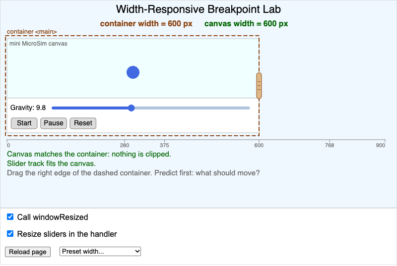

    Drag the edge of a simulated container around a miniature MicroSim and switch windowResized and slider resizing on and off to see how container…

## Chapter 13: Quality Assurance and Automated Layout Review

[Read Chapter 13](../chapters/13-quality-assurance-and-automated-layout-review/index.md)

- **[Audit Baseline Explorer](./audit-baseline-explorer/index.md)**

    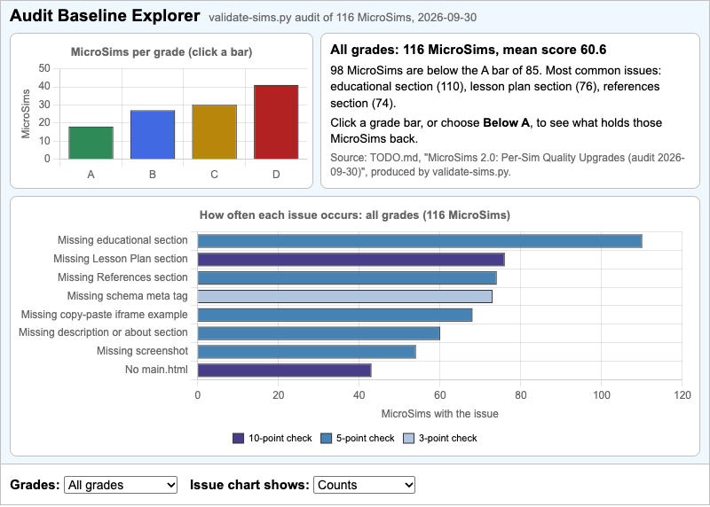

    Explore the 2026-09-30 audit of 116 MicroSims by grade and find which rubric issues most often hold MicroSims below the grade A bar.

- **[Iframe Height Test Simulator](./iframe-height-test-simulator/index.md)**

    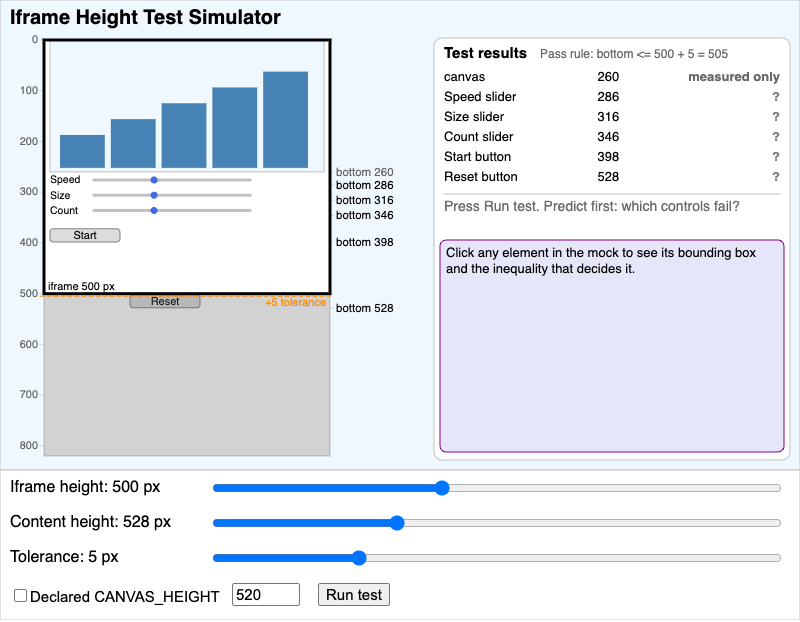

    Apply the control visibility and iframe height tests to a mock MicroSim and calculate the suggested iframe height from its content height.

- **[Layout Defect Catalog Explorer](./layout-defect-catalog-explorer/index.md)**

    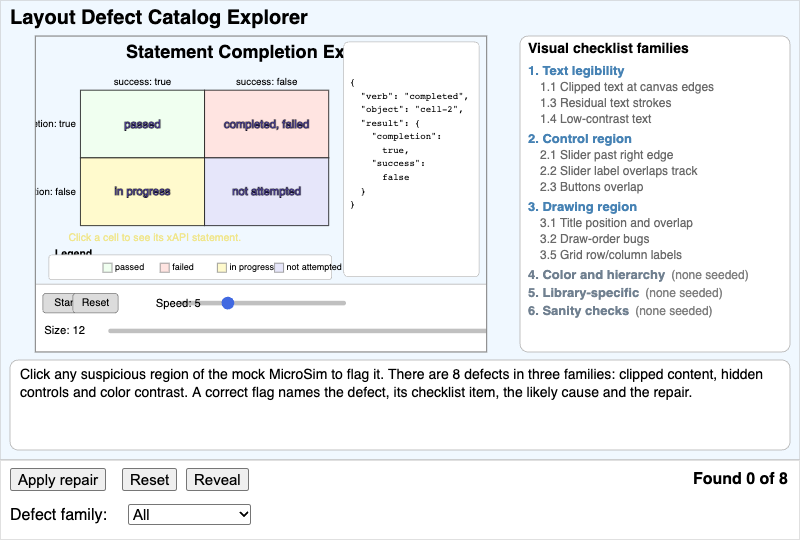

    Find eight seeded layout defects in a mock MicroSim and match each to its visual checklist item, likely cause and repair.

- **[Quality Chain Workflow](./quality-chain-workflow/index.md)**

    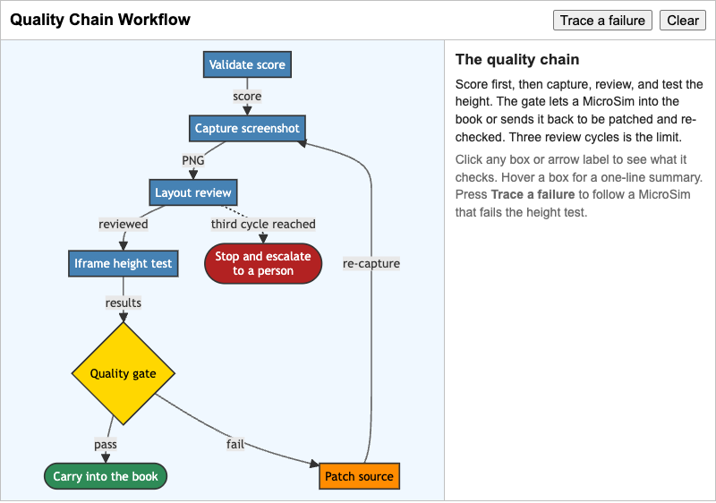

    A clickable flowchart of the quality chain that explains each step, the condition on every arrow, and the path a MicroSim takes after failing the…

- **[Quality Score Calculator](./quality-score-calculator/index.md)**

    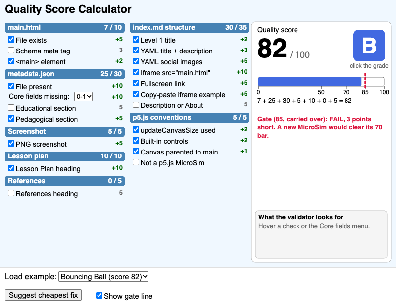

    Tick the rubric checks a MicroSim satisfies to calculate its 100-point quality score and grade, and find the cheapest change that reaches the 85…

- **[Review and Fix Cycle Simulator](./review-fix-cycle-simulator/index.md)**

    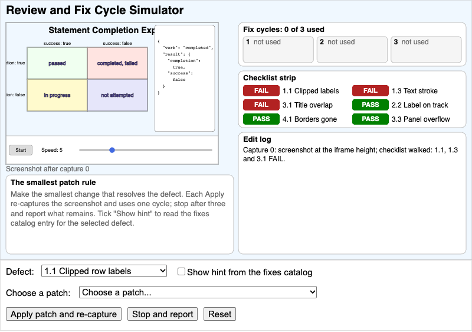

    Judge candidate patches against the smallest patch rule and decide when the three-cycle limit requires stopping and reporting.

## Chapter 14: Batch Generation from Specifications

[Read Chapter 14](../chapters/14-batch-generation-from-specifications/index.md)

- **[Batch Generation Pipeline Stepper](./batch-generation-pipeline-stepper/index.md)**

    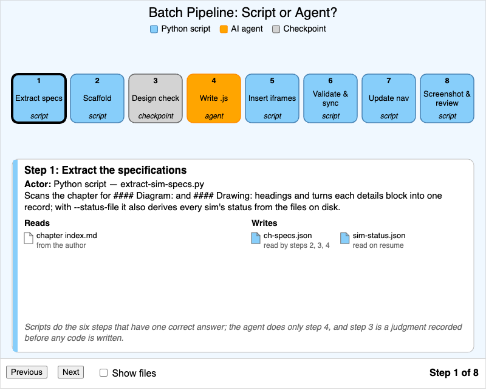

    Step through the eight steps of a MicroSim batch run to tell the Python-script steps from the one AI-agent step and trace the files each step…

- **[Nav Status Icon Legend](./nav-status-icon-legend/index.md)**

    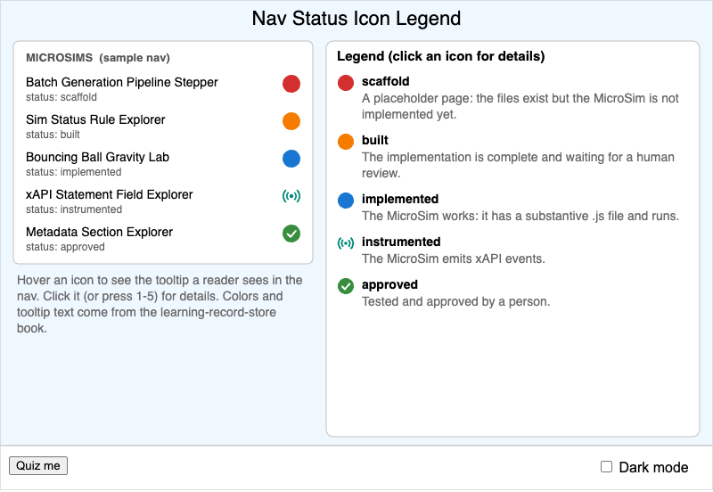

    Match each MicroSim nav status icon and color to its tooltip, its meaning and the batch lifecycle state that usually produces it, with a matching…

- **[Sim Status Rule Explorer](./sim-status-rule-explorer/index.md)**

    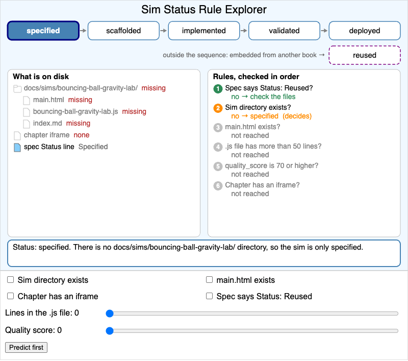

    Set the state of a MicroSim's files and predict the lifecycle status that extract-sim-specs.py assigns, then see the ordered rule that decided it.

## Chapter 15: Metadata, Search and Reuse

[Read Chapter 15](../chapters/15-metadata-search-and-reuse/index.md)

- **[Faceted Filter Lab](./faceted-filter-lab/index.md)**

    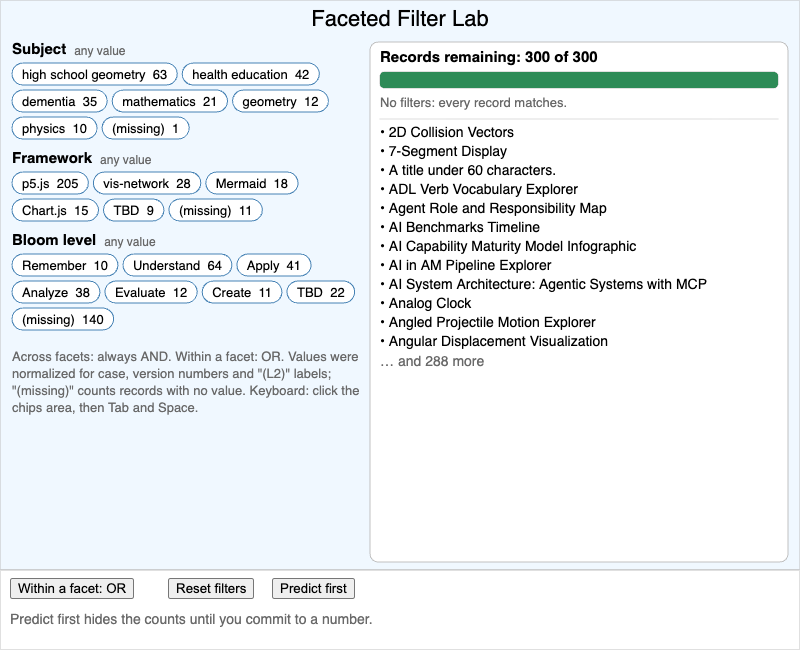

    Narrow a 300-record sample of the MicroSim catalog with Subject, Framework and Bloom level facets, and predict how switching OR to AND within a…

- **[Metadata Section Explorer](./metadata-section-explorer/index.md)**

    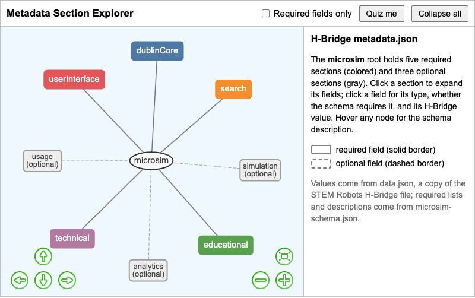

    Expand the sections of the H-Bridge metadata.json as a network, classify each field under dublinCore, search, educational, technical or…

- **[Reuse Threshold Explorer](./reuse-threshold-explorer/index.md)**

    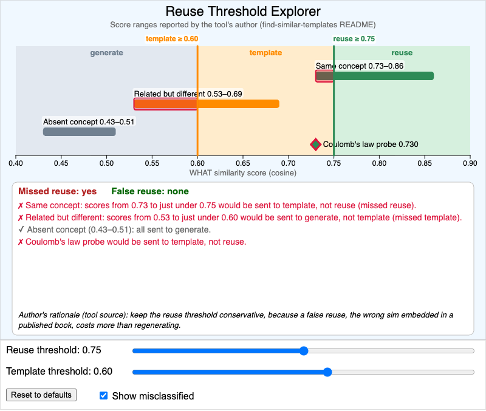

    Move the reuse and template thresholds of the find-similar-templates reuse check and judge where they should sit, using only the score ranges the…

## Chapter 16: xAPI Statements and Evidence

[Read Chapter 16](../chapters/16-xapi-statements-and-evidence/index.md)

- **[Activity IRI Builder](./activity-iri-builder/index.md)**

    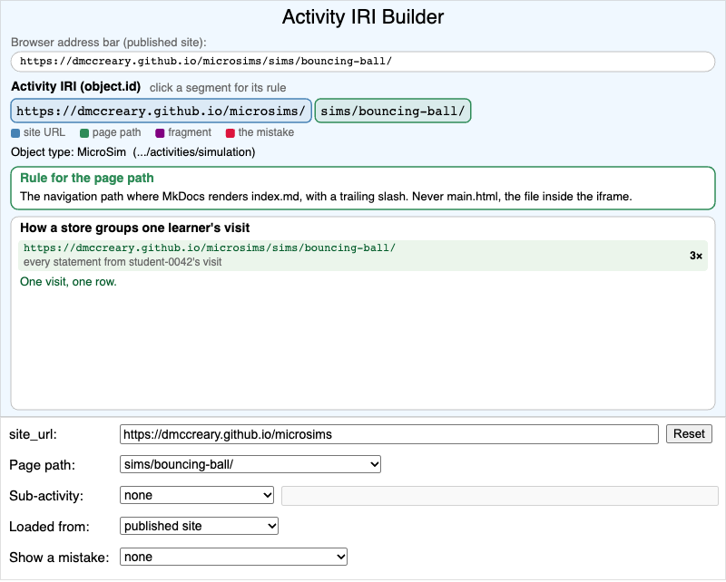

    Construct the activity IRI for a page, a control, a diagram node or a question from the canonical site_url, and diagnose five common mistakes by…

- **[Contract Violation Finder](./contract-violation-finder/index.md)**

    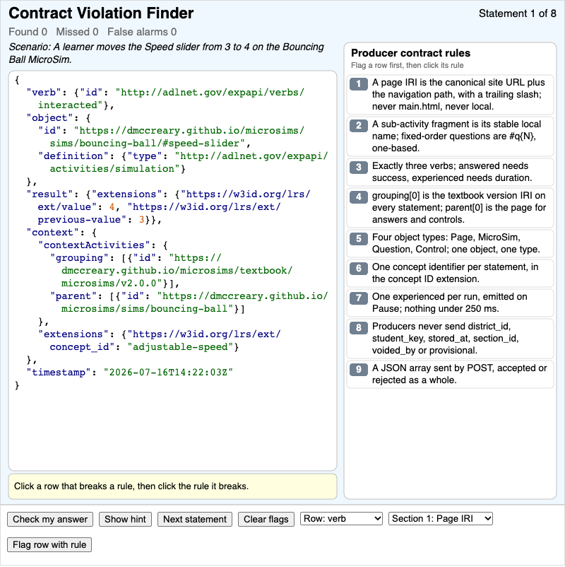

    Critique eight candidate xAPI statements against the nine rules of the MicroSim producer contract, flagging each violating field and justifying it…

- **[Evidence Class Sorter](./evidence-class-sorter/index.md)**

    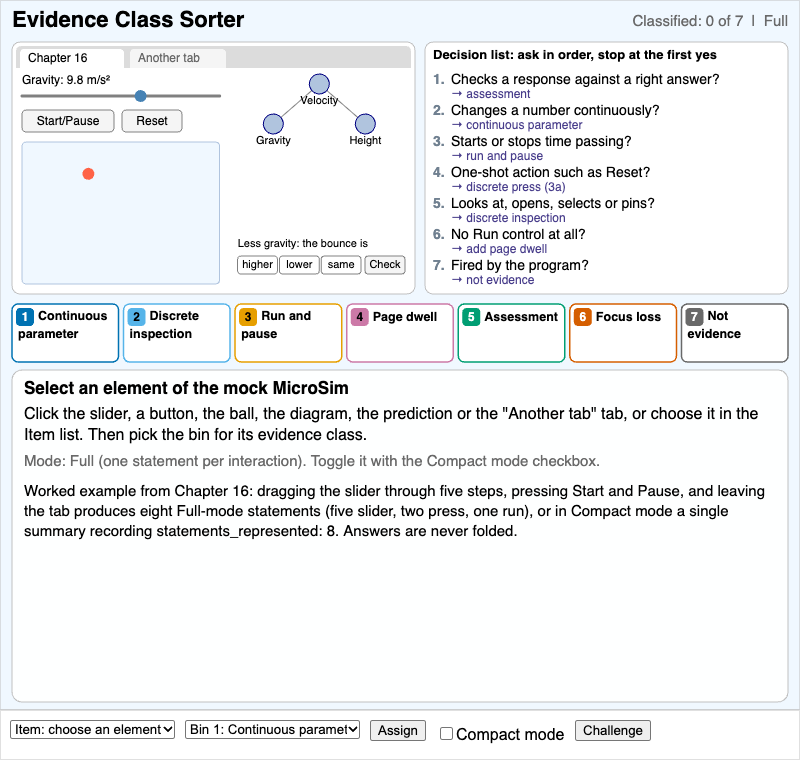

    Assign each interaction in a mock MicroSim to one of the seven evidence classes, name the deciding question, and compare what Full and Compact…

- **[Evidence Threshold Lab](./evidence-threshold-lab/index.md)**

    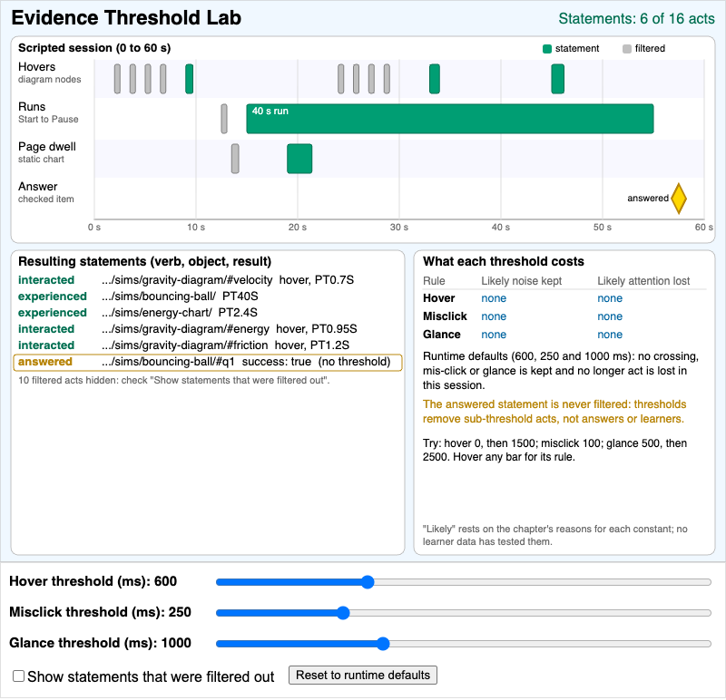

    Move the hover, misclick and glance thresholds and watch a scripted 60-second learner session gain or lose statements, then justify a choice of…

- **[Three Verb Classifier](./three-verb-classifier/index.md)**

    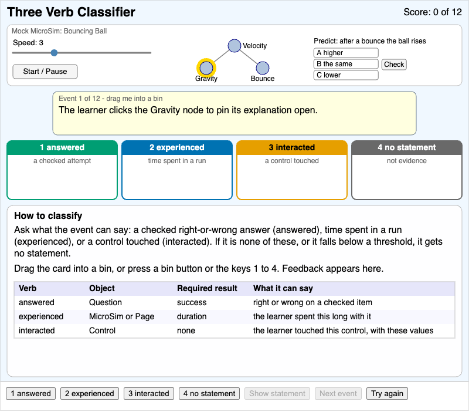

    Classify twelve learner events in a mock Bouncing Ball MicroSim as answered, experienced, interacted or no statement, then see the verb, object…

- **[xAPI Statement Field Explorer](./xapi-statement-field-explorer/index.md)**

    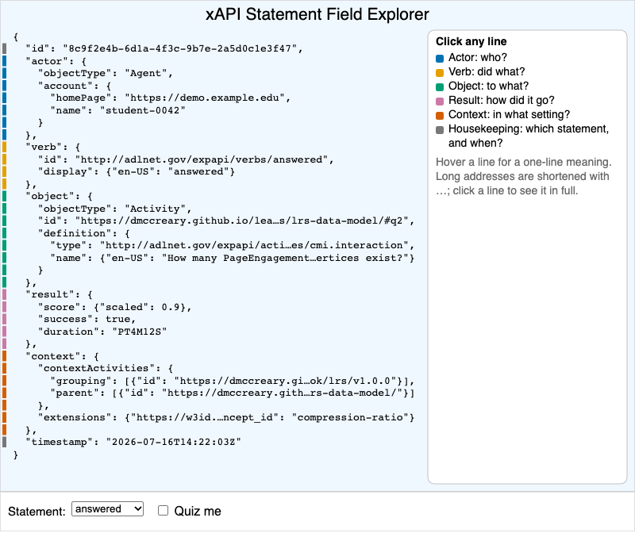

    Click the lines of three real-shaped xAPI statements to tell the actor, verb, object, result and context apart, name the question each part…

## Chapter 17: Instrumenting MicroSims with the xAPI Runtime

[Read Chapter 17](../chapters/17-instrumenting-microsims-with-the-xapi-runtime/index.md)

- **[Guarded Call Runtime Toggle](./guarded-call-runtime-toggle/index.md)**

    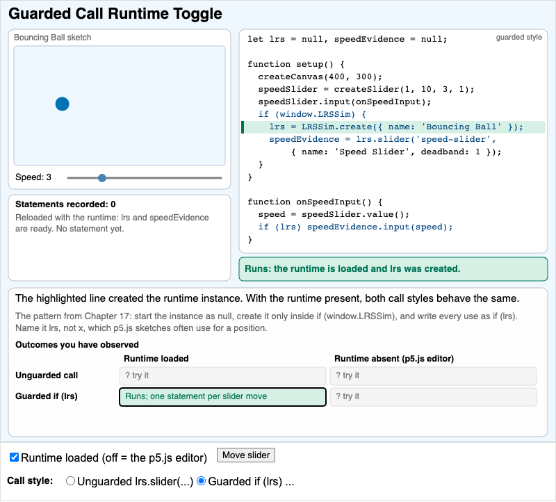

    Toggle the xAPI runtime on and off and switch between a guarded and an unguarded instrumentation call to see which one keeps a p5.js sketch…

- **[Policy Precedence Resolver](./policy-precedence-resolver/index.md)**

    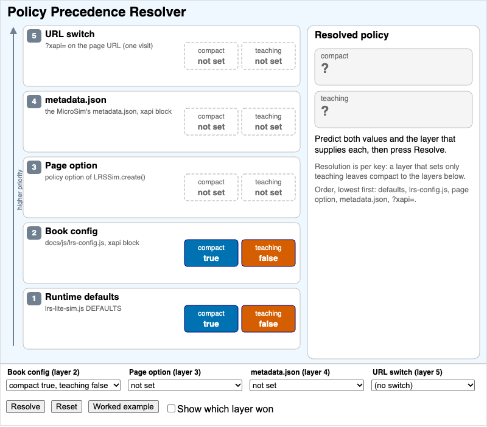

    Set the book config, page option, metadata.json and ?xapi= URL switch layers, predict the resolved compact and teaching values, then watch the…

## Chapter 18: Mastery Prediction and Knowledge Tracing

[Read Chapter 18](../chapters/18-mastery-prediction-and-knowledge-tracing/index.md)

- **[Attempt Order Swap Lab](./attempt-order-swap-lab/index.md)**

    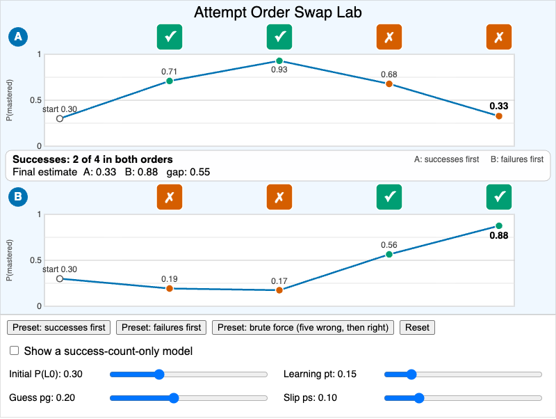

    Drag answer tiles into two different orders and compare the Bayesian knowledge tracing estimates they produce, against a success-count model that…

- **[BKT Parameter Lab](./bkt-parameter-lab/index.md)**

    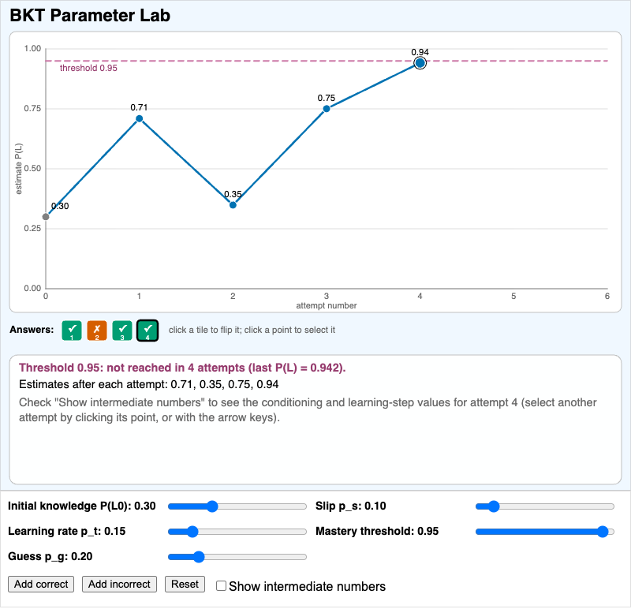

    Set the four Bayesian knowledge tracing parameters and a sequence of correct and incorrect answers, watch the mastery estimate update after each…

- **[From Interaction to Mastery Prediction](./evidence-stream-to-prediction-pipeline/index.md)**

    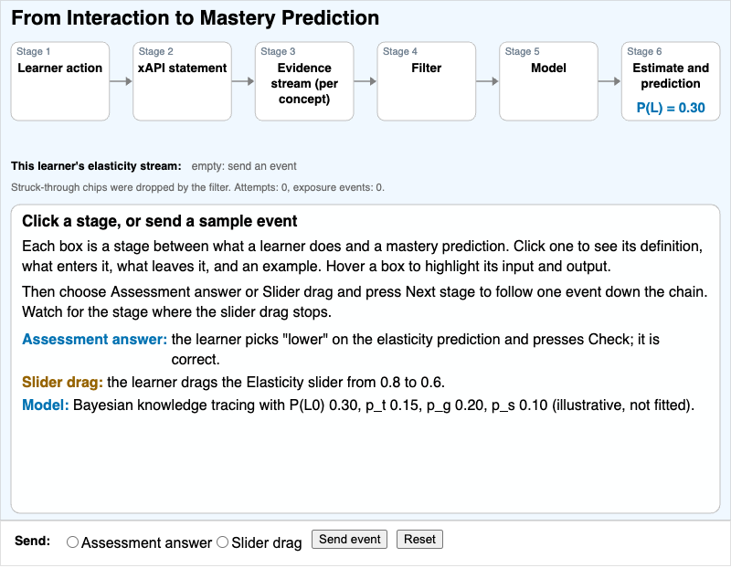

    Step an assessment answer and a slider drag through the six stages from a learner's action to a mastery prediction, and see which stage discards…

- **[Prerequisite Propagation Explorer](./prerequisite-propagation-explorer/index.md)**

    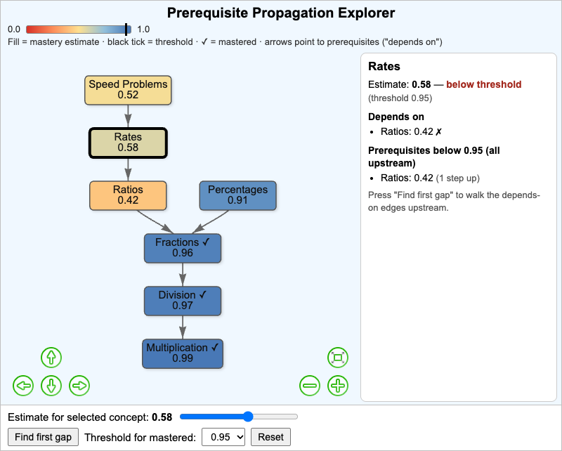

    Walk depends-on edges upstream through a seven-concept learning graph to tell a concept whose own evidence is weak from one whose weakness traces…

## Chapter 19: Evaluating the Predictive Fidelity of the xAPI Stream

[Read Chapter 19](../chapters/19-evaluating-the-predictive-fidelity-of-the-xapi-stream/index.md)

- **[Accuracy Versus Base Rate Lab](./fidelity-accuracy-base-rate-lab/index.md)**

    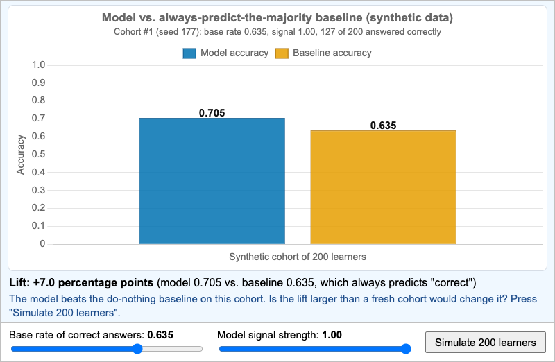

    Change how common success is and how informative a synthetic model is, and judge whether its accuracy beats the always-predict-the-majority…

- **[AUC Pair Explorer](./fidelity-auc-pair-explorer/index.md)**

    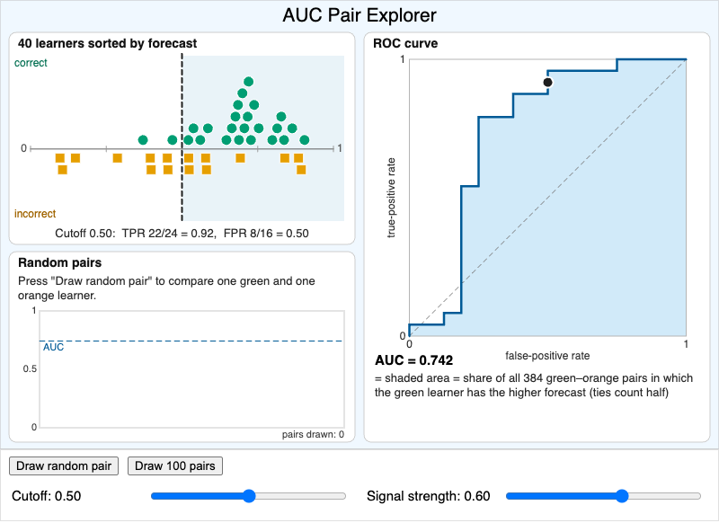

    Connect the ROC curve to a live count of random pairs and explain AUC as the chance that a random successful learner outranks a random…

- **[Calibration Curve Lab](./fidelity-calibration-curve-lab/index.md)**

    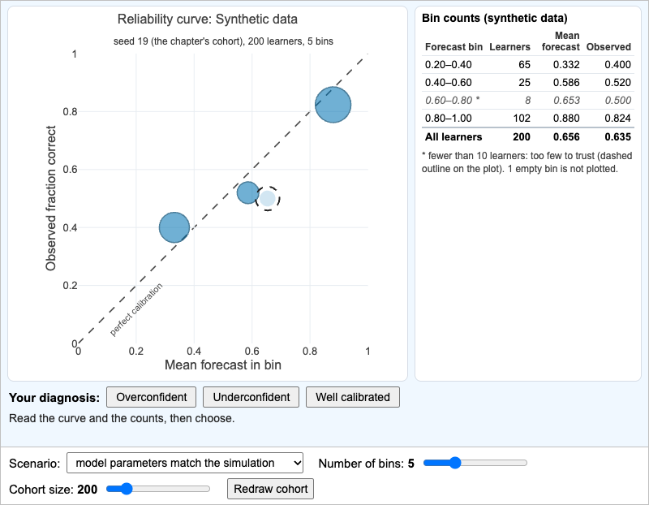

    Build a reliability curve from a seeded synthetic cohort, read its bin counts, and diagnose whether a knowledge-tracing forecast is overconfident,…

- **[Claim Sorter](./fidelity-claim-sorter/index.md)**

    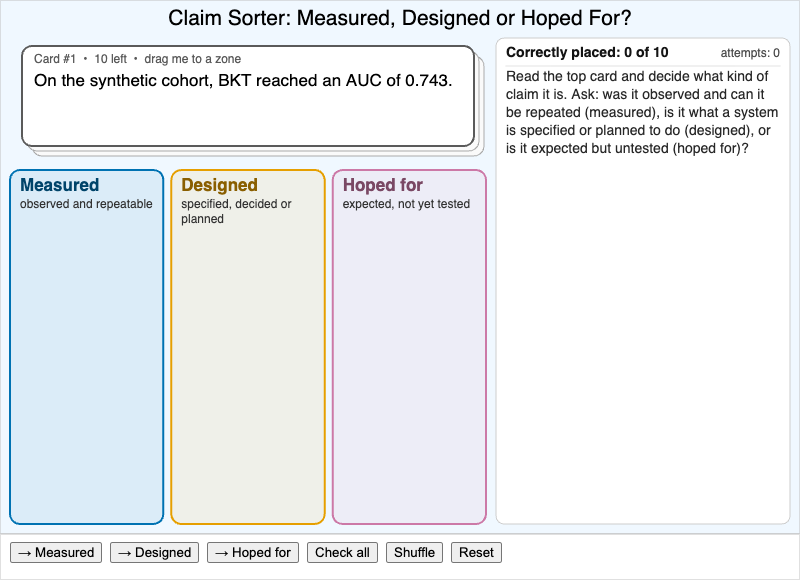

    Sort ten sentences about the xAPI stream and the Learning Record Store into measured, designed and hoped-for claims, and justify each by the…

- **[Held-Out Split Explorer](./fidelity-held-out-split-explorer/index.md)**

    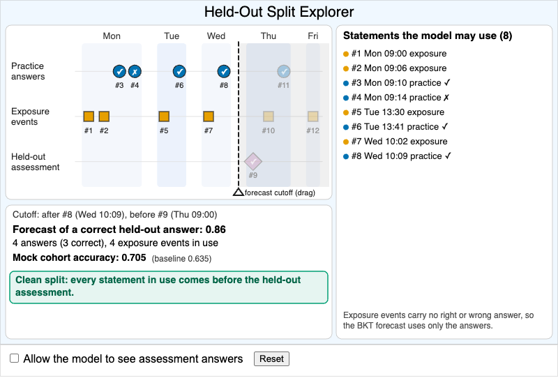

    Drag a forecast cutoff along one synthetic learner's xAPI timeline and judge which statements may feed a mastery forecast and which leak the…

## Chapter 20: "The Full LRS: Architecture and Ingestion"

[Read Chapter 20](../chapters/20-the-full-lrs-architecture-and-ingestion/index.md)

- **[Full LRS Architecture Explorer](./lrs-architecture-explorer/index.md)**

    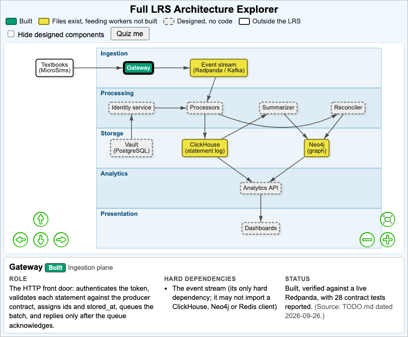

    Explore the full Learning Record Store's five planes and twelve nodes, see which components are built, partly built or only designed, and quiz…

- **[Gateway Request Simulator](./gateway-request-simulator/index.md)**

    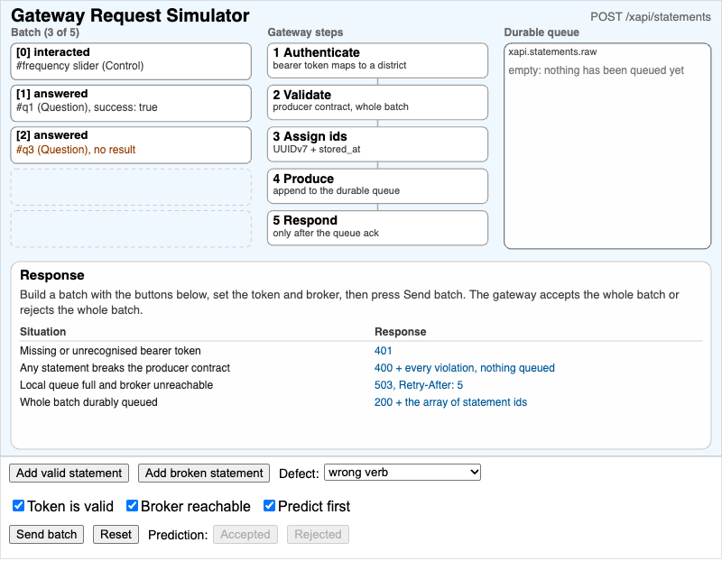

    Build a batch of xAPI statements, set the token and broker, predict whether the ingestion gateway accepts or rejects it, and watch the five…

- **[Log and Graph Compression Lab](./log-graph-compression-lab/index.md)**

    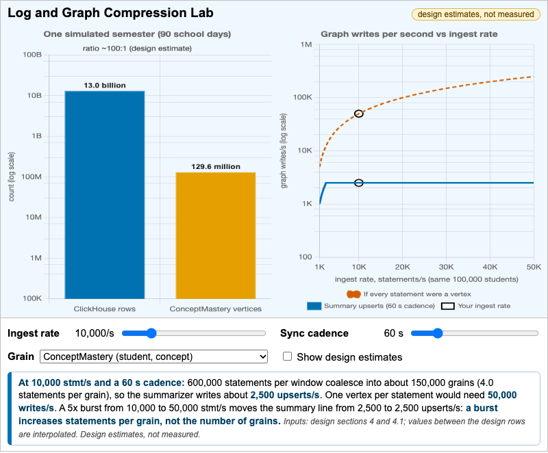

    Move the ingest rate and sync cadence to see how summary vertices keep graph writes near 2,500 per second while one vertex per statement would…

- **[Partition Key Simulator](./partition-key-simulator/index.md)**

    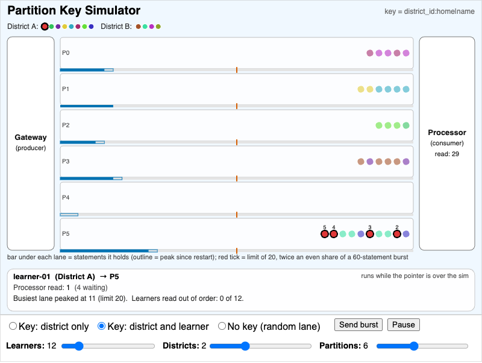

    Route a burst of xAPI statements into event-stream partitions by district, by district and learner, or with no key, and compare the load on each…

- **[Redelivery and Idempotency Lab](./redelivery-idempotency-lab/index.md)**

    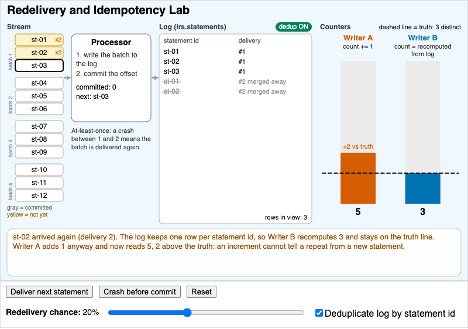

    Deliver statements through an at-least-once stream, crash the processor before it commits, and compare a summary writer that increments with one…

- **[Tenant Isolation and Pseudonym Explorer](./tenant-pseudonym-explorer/index.md)**

    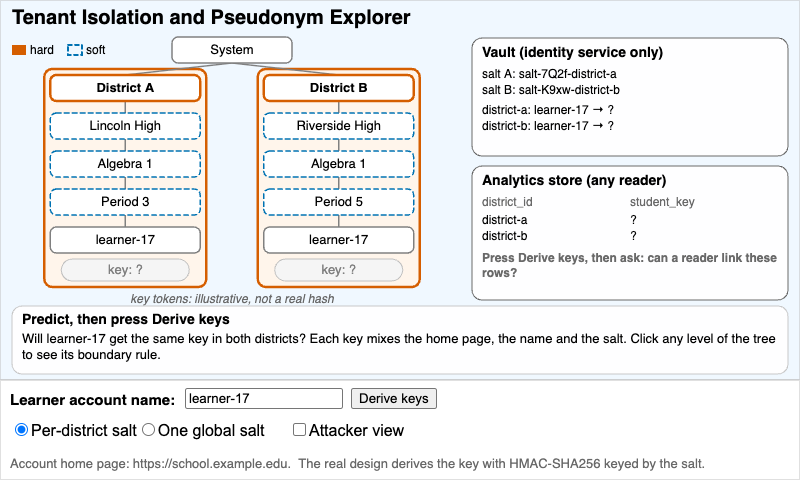

    Derive a learner's pseudonymous key in two school districts with per-district salts or one global salt, see whether an analytics reader can link…

## Chapter 21: "The Full LRS: Dashboards, Operations and Compliance"

[Read Chapter 21](../chapters/21-the-full-lrs-dashboards-operations-and-compliance/index.md)

- **[Capacity and Cost Explorer](./capacity-cost-explorer/index.md)**

    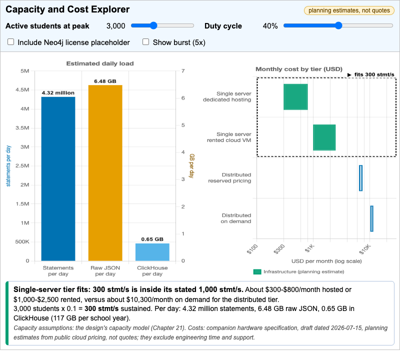

    Estimate daily statements and storage from the number of active students, then judge whether the full LRS's single-server tier or distributed tier…

- **[Class Mastery Heatmap Reader](./class-mastery-heatmap-reader/index.md)**

    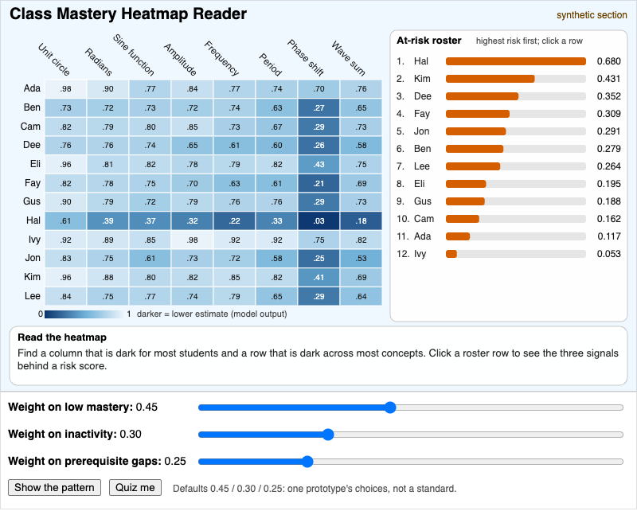

    Read a synthetic class mastery heatmap to tell a concept the whole class struggles with (a dark column) from a student who struggles broadly (a…

- **[Failure Boundary Explorer](./failure-boundary-explorer/index.md)**

    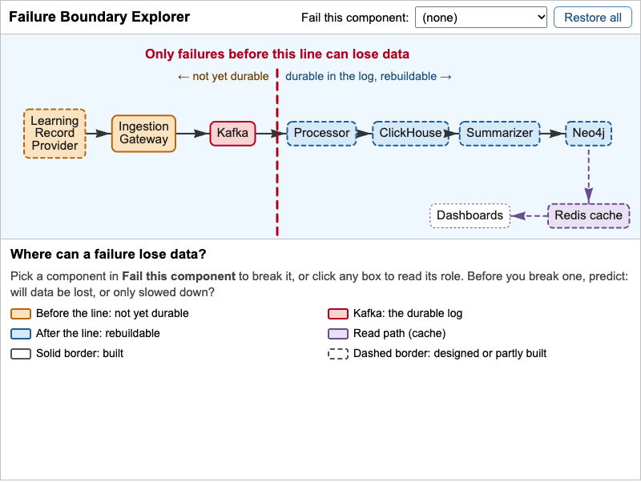

    Break one component of the full LRS at a time and see why only a failure before the durability boundary at Kafka can lose data, while every…

- **[Suppression Threshold Lab](./suppression-threshold-lab/index.md)**

    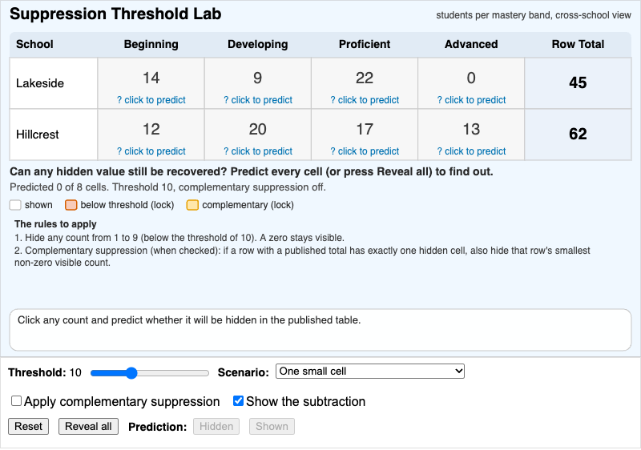

    Predict which counts in a small mastery-band table must be hidden under a suppression threshold, see how a single hidden cell leaks through the…

## Chapter 22: "LRS-Lite: Compact Summaries and Browser Storage"

[Read Chapter 22](../chapters/22-lrs-lite-compact-summaries-and-browser-storage/index.md)

- **[Compact Session Folding Lab](./compact-session-folding-lab/index.md)**

    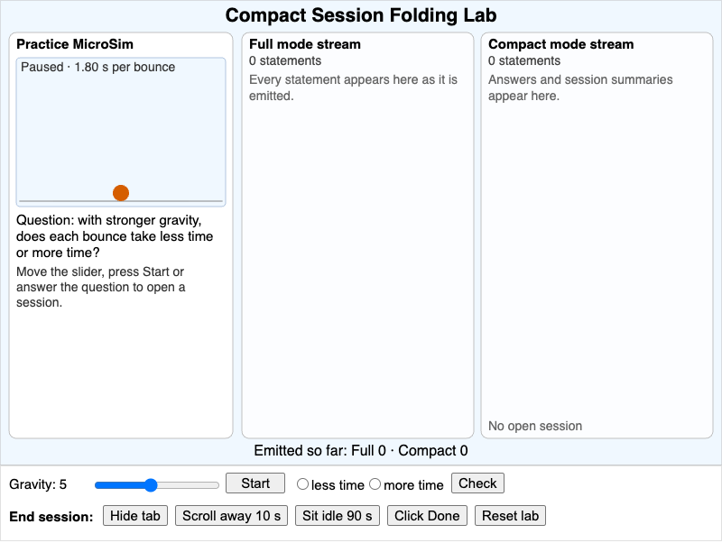

    Drive a small practice MicroSim and watch the same interactions arrive as separate statements in Full mode but fold into one session summary in…

- **[Semester Storage Estimator](./lite-semester-storage-estimator/index.md)**

    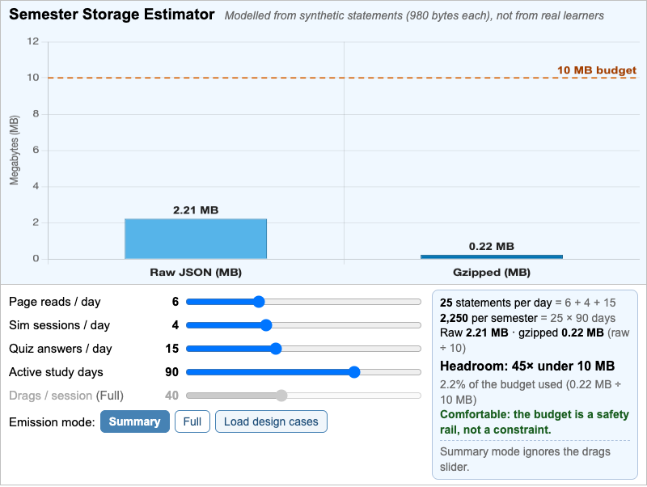

    Calculate a semester's xAPI statement count and LRS-Lite storage footprint from daily activity assumptions, then judge the headroom left under the…

- **[Storage Meter Pressure Lab](./storage-meter-pressure-lab/index.md)**

    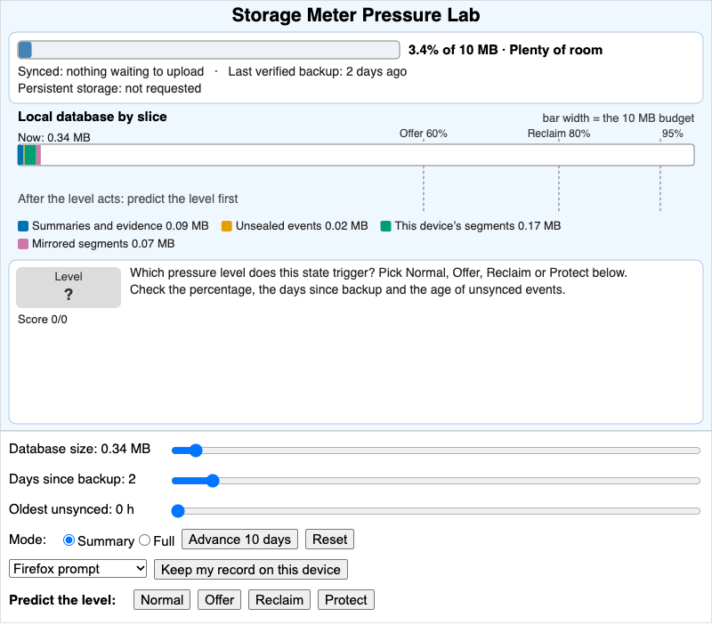

    Set the size, backup age and unsynced age of an LRS-Lite browser database, predict which pressure level (Normal, Offer, Reclaim or Protect) the…

## Chapter 23: "LRS-Lite: Sync, Dashboards and Choosing Full or Lite"

[Read Chapter 23](../chapters/23-lrs-lite-sync-dashboards-and-choosing-full-or-lite/index.md)

- **[Class Dashboard Load Estimator](./class-dashboard-load-estimator/index.md)**

    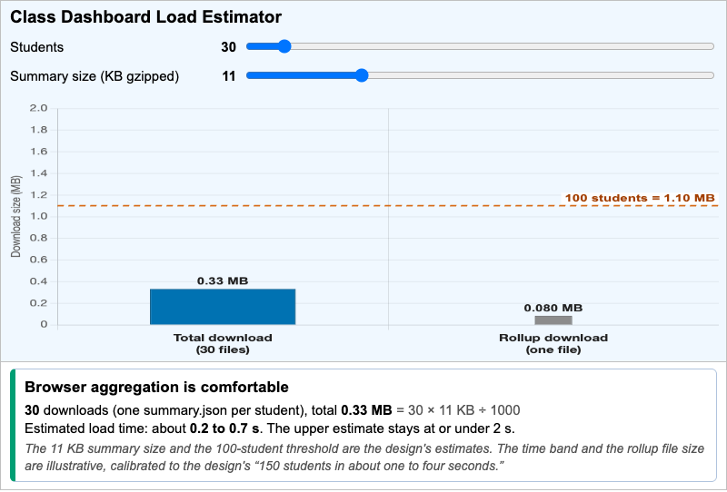

    Calculate how much a teacher's browser must download to build an LRS-Lite class dashboard, estimate the load-time band, and decide when the…

- **[Full or Lite Decision Explorer](./full-or-lite-decision-explorer/index.md)**

    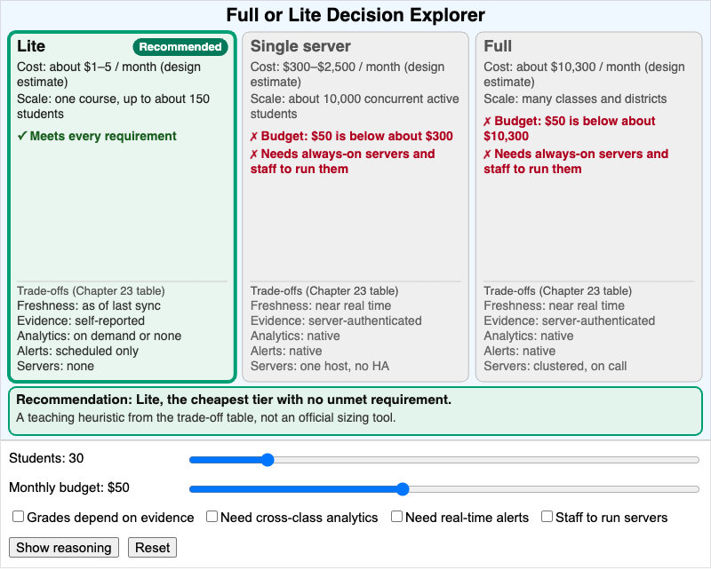

    Describe a school by roster size, budget and requirements, see which of the Lite, single-server and Full LRS tiers each requirement rules out, and…

- **[Two-Browser Convergence Lab](./two-browser-convergence-lab/index.md)**

    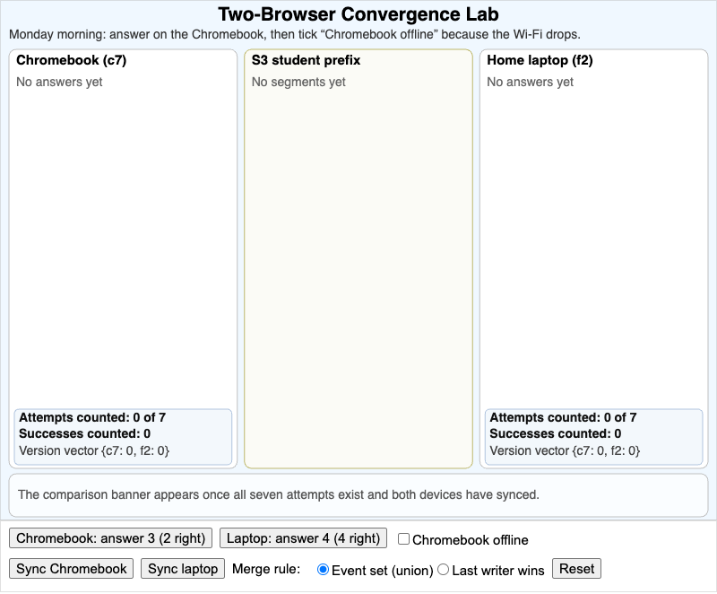

    Run the Chromebook and home-laptop scenario under a last-writer-wins merge and an append-only event-set merge, and identify which of the seven…

## Chapter 24: Pedagogy, Accessibility and Ethics

[Read Chapter 24](../chapters/24-pedagogy-accessibility-and-ethics/index.md)

- **[Accessibility Check Walkthrough](./accessibility-check-walkthrough/index.md)**

    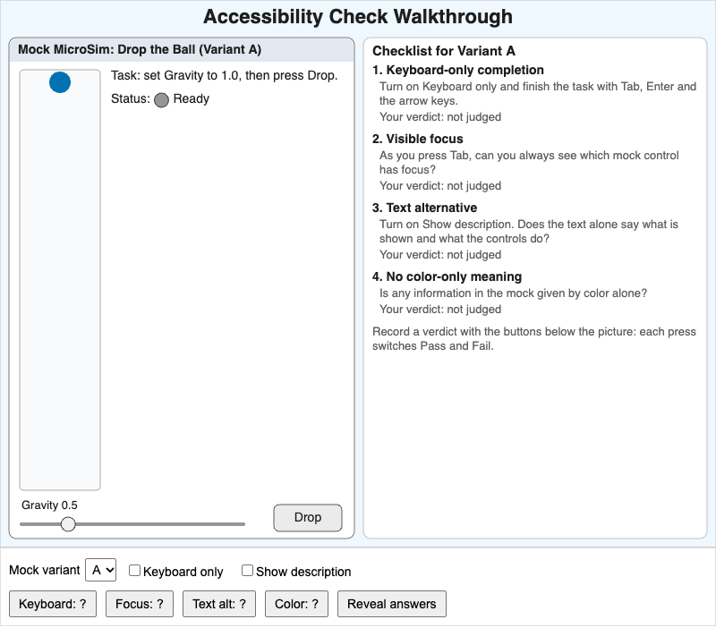

    Run four human accessibility checks (keyboard-only completion, visible focus, text alternative and no color-only meaning) on three variants of a…

- **[PII Surface Explorer](./pii-surface-explorer/index.md)**

    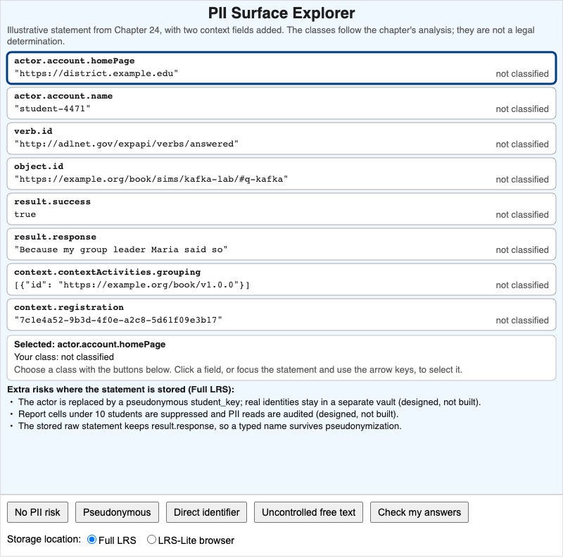

    Classify each field of an illustrative xAPI statement as no PII risk, pseudonymous, direct identifier or uncontrolled free text, check your…

- **[Prediction Fairness Explorer](./prediction-fairness-explorer/index.md)**

    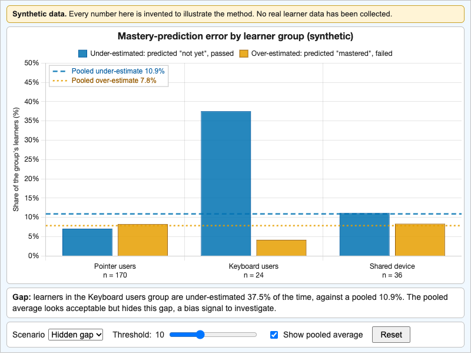

    Critique a mastery prediction by comparing its under- and over-estimation rates across three synthetic learner groups, see how a pooled average…

- **[PRIMM Semantic Wave Explorer](./primm-semantic-wave-explorer/index.md)**

    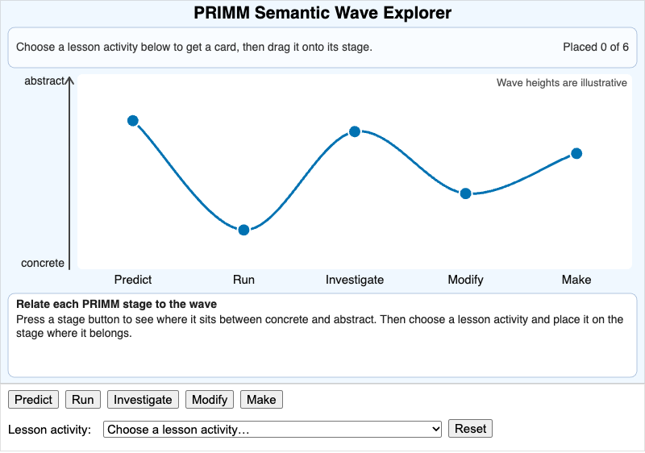

    Relate each PRIMM stage (Predict, Run, Investigate, Modify, Make) to a point on a semantic wave between concrete and abstract, then place…

## Chapter 25: "Capstone: Building an Instrumented MicroSim Portfolio"

[Read Chapter 25](../chapters/25-capstone-building-an-instrumented-microsim-portfolio/index.md)

- **[Portfolio Milestone Planner](./portfolio-milestone-planner/index.md)**

    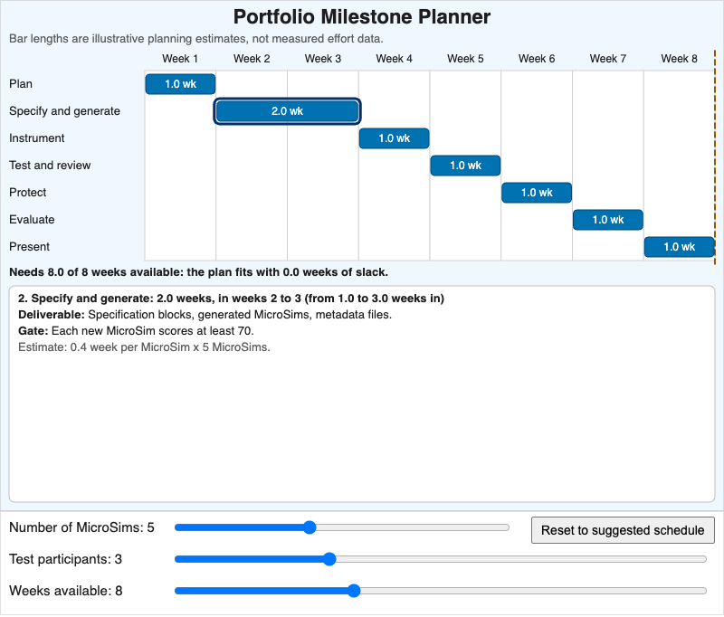

    Design a week-by-week schedule for a capstone MicroSim portfolio by changing the number of MicroSims, test participants and weeks available, and…

- **[Rubric Self-Check](./portfolio-rubric-self-check/index.md)**

    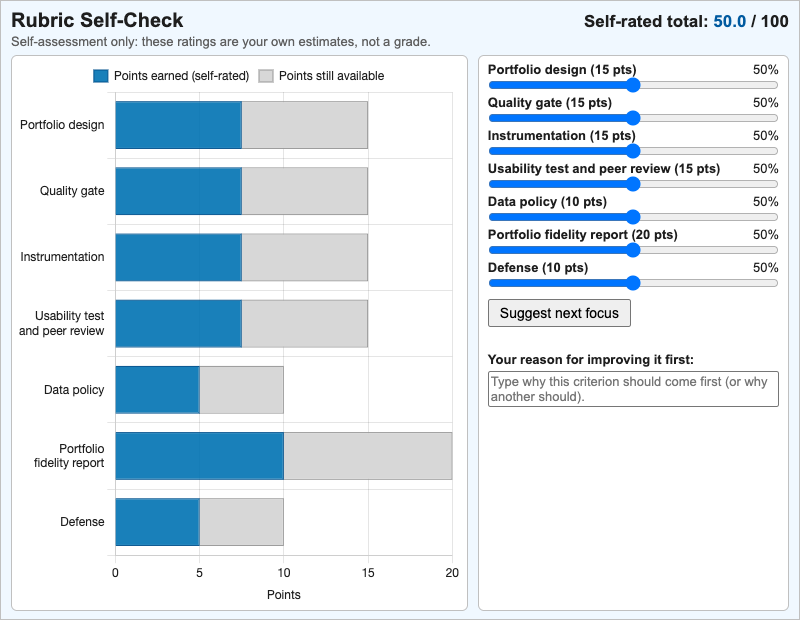

    Rate a draft capstone portfolio against the seven rubric criteria, see points earned and still available for each as a stacked bar chart, and…

## Chapter 26: The Future of MicroSims

[Read Chapter 26](../chapters/26-the-future-of-microsims/index.md)

- **[Guess Resistance Lab](./guess-resistance-lab/index.md)**

    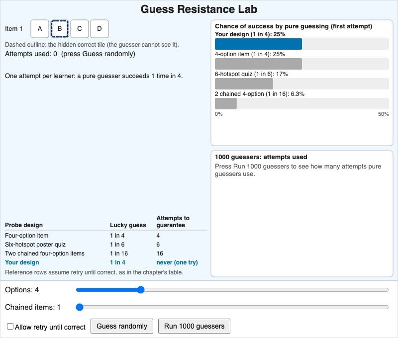

    Compare how easily a pure guesser succeeds on different probe designs by changing the number of options, the number of chained items and the retry…

- **[Prediction Trust Ladder](./prediction-trust-ladder/index.md)**

    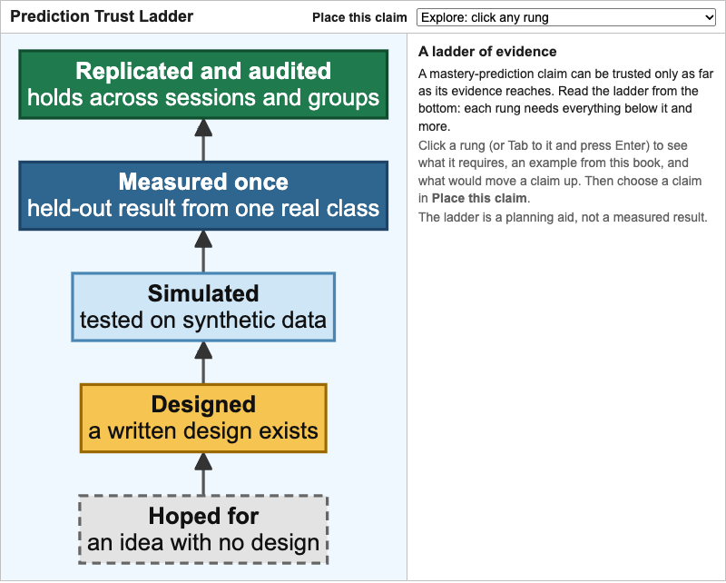

    Judge how far a mastery-prediction claim can be trusted by placing it on a five-rung ladder of evidence, from hoped for to replicated and audited,…

- **[Roadmap Status Board](./roadmap-status-board/index.md)**

    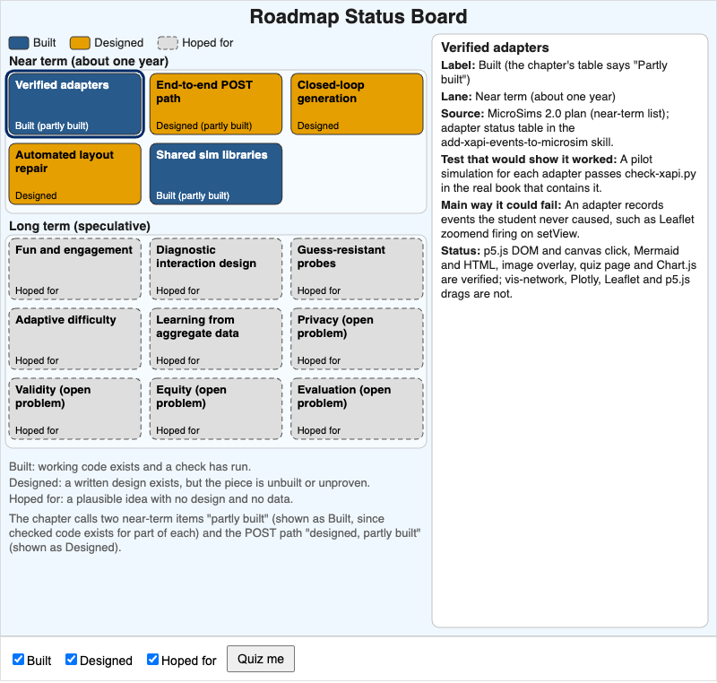

    Sort the MicroSims roadmap into built, designed and hoped-for items by opening fourteen near-term and long-term cards from Chapter 26 and reading…

