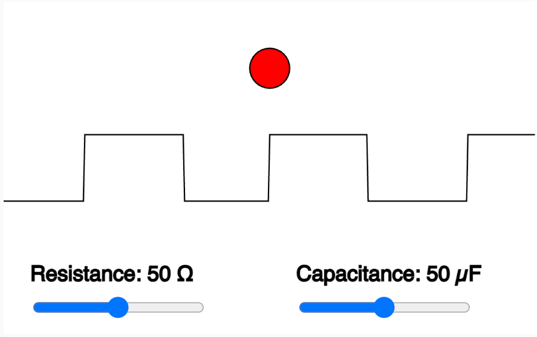
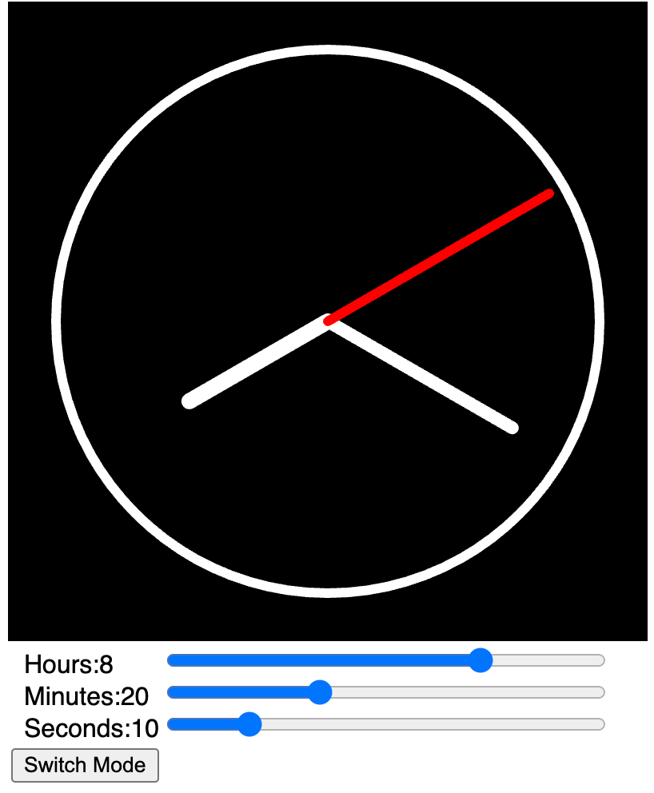
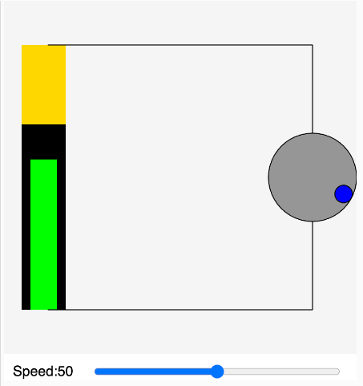
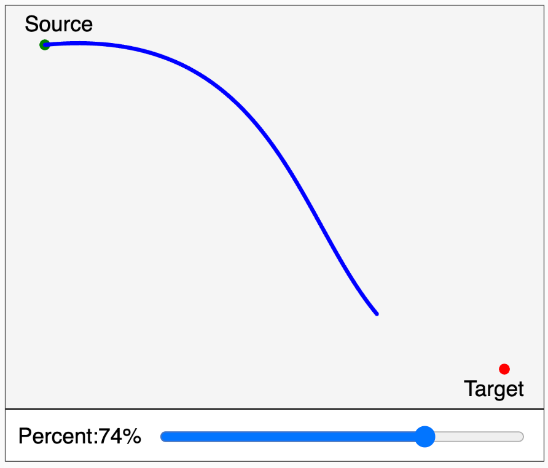
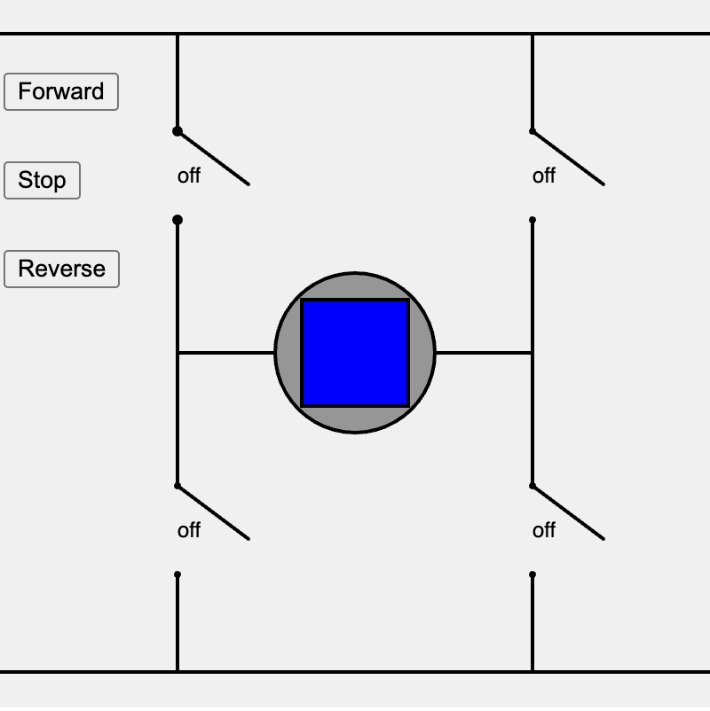
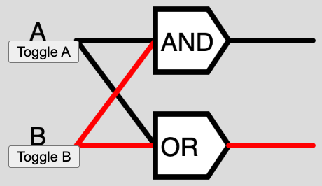
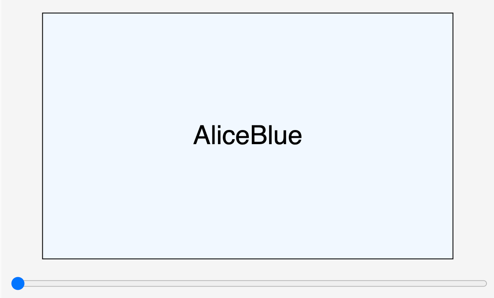
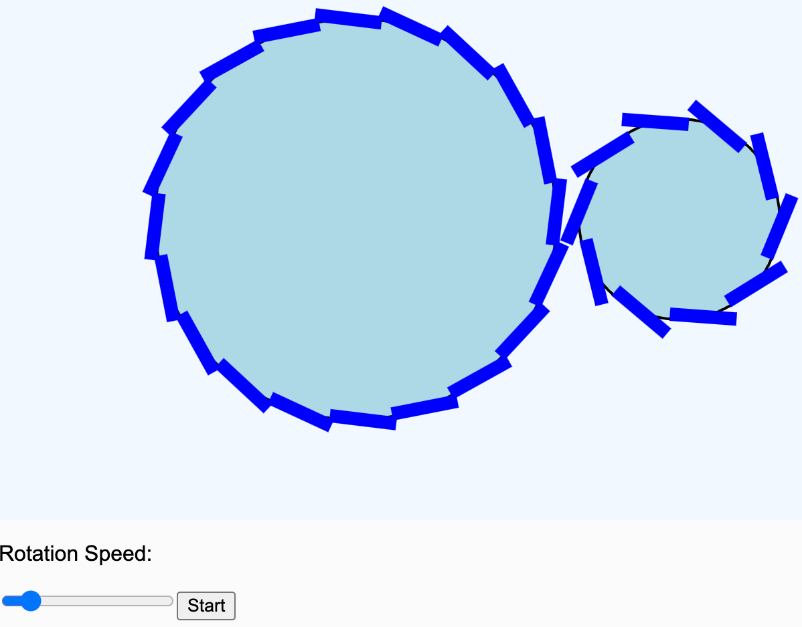

# Examples of MicroSims

This section of the MicroSims website contains examples of MicroSims that cover many different subjects in education including geometry, electronics, biology, physics, linear algebra, statistics, systems thinking, cellular automata, fractals and computer science.

We encourage you to submit your own MicroSims and we have a set of guidelines to help.

[Gallery](./gallery.md)

- **[555 Timer](./555-timer/index.md)**

    
    Interactive simulation of the classic 555 timer integrated circuit.

- **[A* Graph Search Algorithm](./a-star/index.md)**

    
    Visualization of the A* pathfinding algorithm on a grid.

- **[AC Circuit MicroSim](./ac-circuit/index.md)**

    
    Interactive alternating current circuit simulation.

- **[AI Benchmarks Timeline](./ai-benchmarks-timeline/index.md)**

    
    Timeline of AI benchmark achievements and milestones.

- **[Arithmetic Logic Unit (ALU)](./alu/index.md)**

    
    Interactive simulation of an arithmetic logic unit.

- **[Analog Circuits](./analog-circuit/index.md)**

    
    Explore analog circuit fundamentals.

- **[Analog Clock](./analog-clock/index.md)**

    
    Interactive analog clock face with moving hands.

- **[Animated Wire MicroSim](./animated-wire/index.md)**

    
    Animated visualization of electrical current flow in a wire.

- **[Background Grid Controls](./background-grid/index.md)**

    
    Customizable background grid for MicroSim layouts.

- **[Bouncing Ball in a Rotating Hexagon](./ball-in-rotating-hexagon/index.md)**

    
    Physics simulation of a ball bouncing inside a rotating hexagon.

- **[Bathtub MicroSim](./bathtub/index.md)**

    
    Stock and flow simulation demonstrating bathtub dynamics.

- **[Battery Drain](./battery-drain/index.md)**

    
    Visualization of battery discharge over time.

- **[Battery Life Calculator](./battery-life/index.md)**

    
    Calculate battery life based on capacity and current draw.

- **[Breadth First Graph Search](./bfs/index.md)**

    
    Visualization of breadth-first search algorithm.

- **[BFS vs DFS](./bfs-vs-dfs/index.md)**

    
    Side-by-side comparison of breadth-first and depth-first search.

- **[Binary Number](./binary-number/index.md)**

    
    Interactive binary number converter and visualizer.

- **[Book Build Workflow](./book-gen-workflow/index.md)**

    
    Workflow diagram for intelligent textbook generation.

- **[Bouncing Ball](./bouncing-ball/index.md)**

    
    Classic bouncing ball physics simulation.

- **[Breadboard](./breadboard/index.md)**

    
    Interactive breadboard for circuit prototyping.

- **[Brownian Motion](./brownian-motion/index.md)**

    
    Simulation of random particle movement.

- **[Kinetic Molecular Theory](./chemistry/index.md)**

    
    Visualization of molecular motion and kinetic theory.

- **[Circle](./circle/index.md)**

    
    Interactive circle geometry exploration.

- **[Battery Circuit](./circuits/index.md)**

    
    Simple battery and switch circuit simulation.

- **[Collision Avoidance Robot](./collision-avoidance-robot/index.md)**

    
    Robot navigation with obstacle avoidance.

- **[Color Names](./color-names/index.md)**

    
    Explore named CSS colors interactively.

- **[Color Wheel Harmonies](./color-wheel/index.md)**

    
    Interactive color wheel with harmony rules.

- **[Color Wheel with Named Colors](./color-wheel-with-named-colors/index.md)**

    
    Color wheel featuring CSS named colors.

- **[Conway's Game of Life](./conway-game-of-life/index.md)**

    
    Classic cellular automaton simulation.

- **[CSS Box Model Interactive](./css-box-model/index.md)**

    
    Interactive visualization of the CSS box model.

- **[Curve Control PointerEvent](./curve/index.md)**

    
    Interactive Bezier curve manipulation.

- **[Data Element Mapper MicroSim](./data-element-mapper/index.md)**

    
    Visual data element mapping tool.

- **[FFT Butterfly MicroSim](./fft-butterfly/index.md)**

    
    Visualization of FFT butterfly computation pattern.

- **[Microphone Frequency Visualization with FFT](./fft-mic/index.md)**

    
    Real-time audio frequency analysis using FFT.

- **[FFT Microphone V2](./fft-mic-v2/index.md)**

    
    Enhanced microphone frequency visualization.

- **[Fibonacci Clock](./fibonacci-clock/index.md)**

    
    Clock display using Fibonacci sequence encoding.

- **[Flashcards App](./flashcards/index.md)**

    
    Interactive flashcard study application.

- **[Flex Layout Playground](./flex-layout-playground/index.md)**

    
    Interactive CSS flexbox layout explorer.

- **[Flower Petal Designer](./flower-petal/index.md)**

    
    Create flower patterns with customizable petals.

- **[Force Directed Graph](./force-directed-graph/index.md)**

    
    Interactive force-directed graph visualization.

- **[Fourier](./fourier/index.md)**

    
    Fourier series and transform visualization.

- **[Fractal Tree MicroSim](./fractal-tree/index.md)**

    
    Recursive fractal tree generator.

- **[Galton Board](./galton-board/index.md)**

    
    Simulation of the Galton board demonstrating normal distribution.

- **[Global Impact of MicroSims](./global-impact/index.md)**

    
    Visualization of MicroSims educational reach.

- **[Gold Star](./gold-star/index.md)**

    
    Interactive gold star shape generator.

- **[Learning Graph Viewer](./graph-viewer/index.md)**

    
    Interactive concept dependency graph explorer.

- **[H-Bridge Circuit](./h-bridge/index.md)**

    
    Motor control H-bridge circuit simulation.

- **[Koch Curve Fractal](./koch/index.md)**

    
    Interactive Koch snowflake fractal generator.

- **[Lady Bug Walk](./lady-bug-walk/index.md)**

    
    Random walk simulation with a ladybug.

- **[Larson Scanner](./larson-scanner/index.md)**

    
    Knight Rider-style LED scanner animation.

- **[Concept Graph Prompt](./learning-graph/index.md)**

    
    Prompt engineering for learning graph generation.

- **[Learning Modality Effectiveness](./learning-modality-effectiveness/index.md)**

    
    Comparison of different learning modalities.

- **[Least Squares](./least-squares/index.md)**

    
    Interactive linear regression demonstration.

- **[Lissajous Figures](./lissajous-figures/index.md)**

    
    Generate Lissajous curves with adjustable parameters.

- **[Logic Gates](./logic-gates/index.md)**

    
    Interactive digital logic gate simulator.

- **[Maze Generator](./maze-gen/index.md)**

    
    Procedural maze generation algorithms.

- **[Maze Solver](./maze-solver/index.md)**

    
    Visualization of maze solving algorithms.

- **[AI-Assisted MicroSim Creation Workflow](./microsim-creation-workflow/index.md)**

    
    Workflow for creating MicroSims with AI assistance.

- **[MicroSim Growth Network Effect](./microsim-growth/index.md)**

    
    Visualization of MicroSim adoption growth.

- **[MicroSim Layout Architecture](./microsim-layout/index.md)**

    
    Standard MicroSim layout patterns and architecture.

- **[MicroSim Library Ecosystem](./microsim-library-ecosystem/index.md)**

    
    Overview of JavaScript libraries used in MicroSims.

- **[MicroSim Uniqueness Interactive Venn Diagram](./microsim-uniqueness/index.md)**

    
    Venn diagram showing what makes MicroSims unique.

- **[Mobile Compatible Buttons](./mobile-buttons/index.md)**

    
    Touch-friendly button patterns for mobile devices.

- **[Rotating Motor](./motor/index.md)**

    
    Animated DC motor simulation.

- **[Named Colors](./named-colors/index.md)**

    
    Complete CSS named color reference.

- **[NeoPixel Simulation](./neopixel/index.md)**

    
    Addressable LED strip simulation.

- **[Neural Network](./neural-network/index.md)**

    
    Interactive neural network visualization.

- **[OODA Loop](./ooda/index.md)**

    
    Observe-Orient-Decide-Act decision cycle diagram.

- **[p5.js Animation Loop Cycle](./p5-animation-loop/index.md)**

    
    Visualization of the p5.js draw loop.

- **[p5.js Coordinate System](./p5-coordinate-system/index.md)**

    
    Interactive p5.js coordinate system explorer.

- **[History of p5.js and Creative Coding](./p5-timeline/index.md)**

    
    Timeline of p5.js and creative coding evolution.

- **[Particle Fields](./particle-fields/index.md)**

    
    Interactive particle system with field effects.

- **[Pendulum](./pendulum/index.md)**

    
    Simple pendulum physics simulation.

- **[Regular Polygons](./polygon/index.md)**

    
    Generate regular polygons with adjustable sides.

- **[Prisoners Dilemma](./prisoners-dilemma/index.md)**

    
    Game theory simulation of the prisoner's dilemma.

- **[Projectile Motion](./projectile-motion/index.md)**

    
    Basic projectile motion physics.

- **[Projectile Motion with Gravity](./projectile-motion-gravity/index.md)**

    
    Projectile motion with adjustable gravity.

- **[Projecting AI Task Completion to 2030](./projecting-ai/index.md)**

    
    AI capability projection visualization.

- **[Pulse-Width Modulation](./pwm/index.md)**

    
    Interactive PWM signal visualization.

- **[Pythagorean Theorem MicroSim](./pythagorean-theorem/index.md)**

    
    Visual proof of the Pythagorean theorem.

- **[Rabbits and Foxes](./rabbits-and-foxes/index.md)**

    
    Predator-prey population dynamics simulation.

- **[Rainbow Color Picker](./rainbow-color-picker/index.md)**

    
    Colorful rainbow-based color selection tool.

- **[Recursion Tree](./recursion-tree/index.md)**

    
    Visualization of recursive function calls.

- **[Resize in iframe](./resize-in-iframe/index.md)**

    
    Demonstration of responsive resizing in iframes.

- **[Resize Demo](./resize-test/index.md)**

    
    Canvas resize behavior demonstration.

- **[Responsive Design](./responsive-design/index.md)**

    
    Responsive design patterns for MicroSims.

- **[Collision Avoidance Robot](./robots/index.md)**

    
    Multiple robot collision avoidance simulation.

- **[Rotating Gears](./rotating-gears/index.md)**

    
    Animated interlocking gear system.

- **[7-Segment Display](./seven-segment-display/index.md)**

    
    Interactive seven-segment LED display.

- **[Sierpinski](./sierpinski/index.md)**

    
    Sierpinski triangle fractal generator.

- **[Simple Tree](./simple-tree/index.md)**

    
    Basic recursive tree drawing.

- **[Sine and Cosine](./sine-and-cosine/index.md)**

    
    Interactive sine and cosine wave visualization.

- **[Sine Wave](./sine-wave/index.md)**

    
    Adjustable sine wave generator.

- **[Slope and Intercept](./slope-and-intercept/index.md)**

    
    Interactive linear equation y = mx + b explorer.

- **[Snake MicroSim](./snake/index.md)**

    
    Classic snake game implementation.

- **[Solar Battery](./solar-battery/index.md)**

    
    Solar panel and battery charging simulation.

- **[Solar Cell Battery Charger MicroSim](./solar-cell/index.md)**

    
    Detailed solar cell charging system.

- **[Bouncing 3D Sphere Demo](./sphere/index.md)**

    
    3D bouncing sphere with WebGL.

- **[Spinning 3D Shapes](./spinning-3d-shapes/index.md)**

    
    Rotating 3D geometric shapes.

- **[Star Rating MicroSim](./star-rating/index.md)**

    
    Interactive star rating component.

- **[String Harmonics](./string-harmonics/index.md)**

    
    Visualization of standing wave harmonics.

- **[Supply and Demand](./supply-and-demand/index.md)**

    
    Economics supply and demand curve interaction.

- **[Temperature and Pressure](./temp-and-pressure/index.md)**

    
    Gas law temperature and pressure relationship.

- **[MicroSim Template](./template/index.md)**

    
    Starter template for creating new MicroSims.

- **[Three Web Languages](./three-web-languages/index.md)**

    
    Overview of HTML, CSS, and JavaScript.

- **[Virus Spread Simulation](./virus/index.md)**

    
    Epidemic spread simulation model.

- **[Wave Sums and Fourier Synthesis](./wave-sums/index.md)**

    
    Combine sine waves to create complex waveforms.

- **[Yin & Yang MicroSim](./yin-yang/index.md)**

    
    Interactive yin-yang symbol generator.

