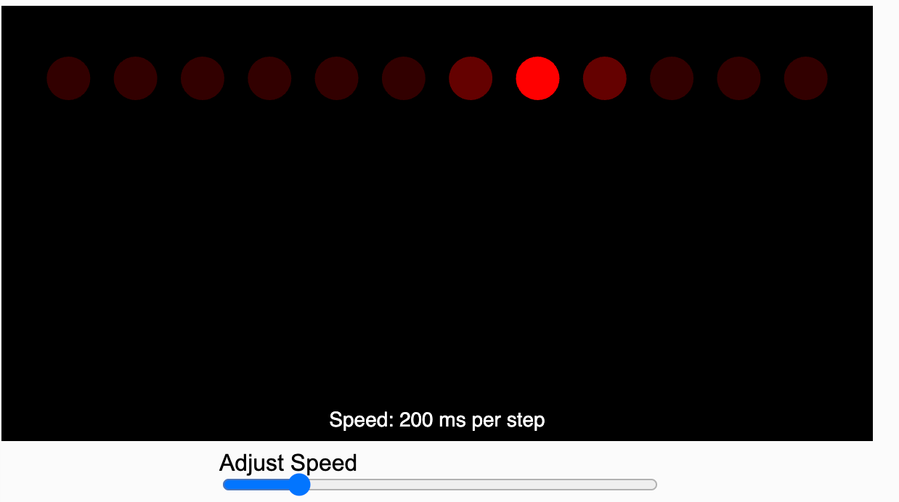

# Larson Scanner

{ width="400" }


[Run the Larson Scanner MicroSim](./larson-scanner.html){ .md-button .md-button--primary }

[Edit this MicroSim](https://editor.p5js.org/dmccreary/sketches/Q1MxIJZ3j)

## About this MicroSim

This MicroSim teaches us how the [Larson Scanner](https://hackaday.com/tag/larson-scanner/) animation works.

## Sample Prompt

```linenums="0"
Create a p5.js sketch for a simulation of a Larson Scanner.
The project has a row of 12 red evenly spaced horizontal
circles at the top of the 600x300 canvas that fade in
and out like a Cylon robot eyes. A slider below the
drawing area allows a user to control the speed of
the animation.
```

## ChatGPT o1-mini Sample Response

Sure! Below is a complete p5.js sketch that simulates a Larson Scanner with the specifications you provided. This sketch features 12 red circles that fade in and out sequentially, mimicking the iconic Cylon robot eyes. A slider is included below the canvas to allow users to control the speed of the animation.

### How It Works:

1.  **Setup:**

    -   A canvas of size 600x300 is created.
    -   12 circles are positioned evenly across the top of the canvas.
    -   A slider is added below the canvas to control the animation speed.

2.  **Animation Logic:**

    -   The animation moves a "scanner" across the circles from left to right and then back from right to left.
    -   The current active circle's brightness is controlled using alpha transparency to create a fading effect.
    -   The speed of the scanner is adjustable via the slider, affecting how quickly the scanner moves from one circle to the next.

3.  **Interactivity:**

    -   Users can adjust the slider to make the scanner move faster or slower.

### Complete p5.js Sketch:

```javascript
let numCircles = 12;        // Total number of circles
let circles = [];           // Array to hold circle positions
let current = 0;            // Current active circle index
let direction = 1;          // Direction of the scanner: 1 = forward, -1 = backward
let speedSlider;            // Slider to control speed
let speed;                  // Speed value from slider
let lastUpdate = 0;         // Time of the last update
let interval = 200;         // Interval between updates in milliseconds

function setup() {
  createCanvas(600, 300);
  // Calculate spacing between circles
  let spacing = width / (numCircles + 1);
  for (let i = 0; i < numCircles; i++) {
    let x = spacing * (i + 1);
    let y = 50; // Positioned near the top
    circles.push(createVector(x, y));
  }

  // Create a slider for speed control
  // Slider range: 50 ms (fast) to 1000 ms (slow)
  speedSlider = createSlider(50, 1000, interval, 50);
  speedSlider.position(150, height + 20);
  speedSlider.style('width', '300px');

  // Label for the slider
  let label = createP('Adjust Speed');
  label.position(150, height - 10);
  label.style('font-family', 'Arial');
  label.style('font-size', '16px');
}

function draw() {
  background(0); // Black background

  // Get current speed from slider
  speed = speedSlider.value();

  // Update interval based on speed
  interval = speed;

  // Update the current active circle based on the interval
  if (millis() - lastUpdate > interval) {
    current += direction;

    // Change direction if we reach the end or beginning
    if (current >= numCircles - 1) {
      direction = -1;
    } else if (current <= 0) {
      direction = 1;
    }

    lastUpdate = millis();
  }

  // Draw all circles
  for (let i = 0; i < numCircles; i++) {
    if (i === current) {
      // Active circle: bright red
      fill(255, 0, 0, 255);
      ellipse(circles[i].x, circles[i].y, 30, 30);
    } else if (i === current - direction || i === current + direction) {
      // Adjacent circles: semi-transparent red
      fill(255, 0, 0, 100);
      ellipse(circles[i].x, circles[i].y, 30, 30);
    } else {
      // Inactive circles: dim red
      fill(255, 0, 0, 50);
      ellipse(circles[i].x, circles[i].y, 30, 30);
    }
  }

  // Optional: Display current speed
  fill(255);
  noStroke();
  textSize(14);
  textAlign(CENTER);
  text(`Speed: ${speed} ms per step`, width / 2, height - 10);
}
```

### How to Run the Sketch:

1.  **Using the p5.js Web Editor:**

-   Go to the p5.js Web Editor.
-   Create a new sketch.
-   Replace the existing code with the code provided above.
-   Click the "Play" button to run the sketch.
2.  **Locally on Your Computer:**

-   Ensure you have the p5.js library included in your project.
-   Save the above code in a file named `sketch.js`.
-   Create an `index.html` file and include the p5.js library and your `sketch.js`.
-   Open `index.html` in your web browser to see the simulation.

### Customization:

-   **Number of Circles:** You can change the `numCircles` variable to increase or decrease the number of circles in the scanner.
-   **Circle Size:** Adjust the diameter values in the `ellipse` function calls to make the circles larger or smaller.
-   **Colors:** Modify the `fill` colors to change the appearance of the scanner.
-   **Initial Speed:** Change the default value in the `createSlider` function to set a different initial speed.

Feel free to experiment with the parameters to create a Larson Scanner that fits your preferences!

## References

[Link to Full ChatGPT Transcript](https://chatgpt.com/share/670a71af-1244-8001-aeb9-e996820bd5fd)