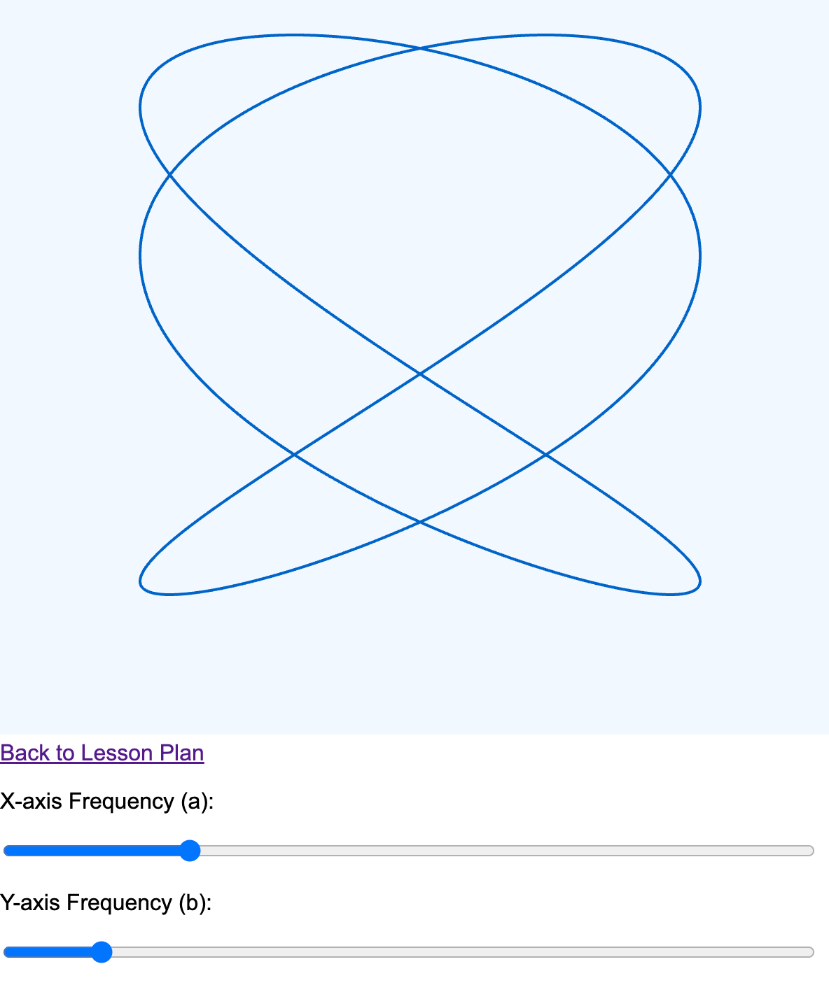

# Lissajous Figures



[Run the Lissajous MicroSim](./lissajous-figures.html){ .md-button .md-button--primary }

[Edit the MicroSim with the p5.js Editor](https://editor.p5js.org/dmccreary/sketches/8FETmXFqX)

## Prompt

```linenums="0"
Create a p5.js animation of Lissajous figures.
Make one slider control the x-axis and one
slider control the y-axis.
Draw the figure on an aliceblue background.
```

## ChatGPT o1-mini Response

Sure! Below is a p5.js sketch that animates Lissajous figures with two sliders controlling the frequencies of the x-axis and y-axis respectively.

### Lissajous Figures Overview

Lissajous figures are complex harmonic motion patterns formed by combining two perpendicular oscillations. They are defined by the parametric equations:

$$
\begin{cases}
   x(t) = A \sin(a t + \delta) \\\\
   y(t) = B \sin(b t)
\end{cases}
$$

where:

-   **A, B**: Amplitudes in the x and y directions.
-   **a, b**: Frequencies in the x and y directions.
-   **δ**: Phase shift between the two oscillations.

In this sketch:

-   **Slider 1** controls the frequency `a` of the x-axis.
-   **Slider 2** controls the frequency `b` of the y-axis.

### Setting Up the Environment

To run this sketch:

1.  Visit the p5.js online editor.
2.  Create a new sketch.
3.  Replace the existing code with the code provided below.
4.  Click the play button to see the animation.

### p5.js Code

```javascript
let sliderXFreq, sliderYFreq;
let xFreq = 3;
let yFreq = 2;
let phase = 0;
let phaseSpeed = 0.02;

function setup() {
  createCanvas(600, 600);
  background('aliceblue');

  // Create sliders
  createP('X-axis Frequency (a):');
  sliderXFreq = createSlider(1, 10, xFreq, 1);
  sliderXFreq.style('width', '580px');

  createP('Y-axis Frequency (b):');
  sliderYFreq = createSlider(1, 10, yFreq, 1);
  sliderYFreq.style('width', '580px');

  // Set drawing parameters
  strokeWeight(2);
  noFill();
}

function draw() {
  background(255);

  // Update frequencies from sliders
  xFreq = sliderXFreq.value();
  yFreq = sliderYFreq.value();

  // Parameters for Lissajous
  let A = width / 3;
  let B = height / 3;
  let delta = phase;

  translate(width / 2, height / 2);

  stroke(0, 100, 200);

  beginShape();
  for (let t = 0; t < TWO_PI * 2; t += 0.01) {
    let x = A * sin(xFreq * t + delta);
    let y = B * sin(yFreq * t);
    vertex(x, y);
  }
  endShape();

  // Increment phase for animation
  phase += phaseSpeed;
}
```

### Explanation of the Code

1.  **Variables Declaration:**

-   `sliderXFreq` and `sliderYFreq`: Slider elements controlling the frequencies.
-   `xFreq` and `yFreq`: Current frequencies for x and y axes.
-   `phase`: Phase shift to animate the figure.
-   `phaseSpeed`: Speed at which the phase shifts over time.

2.  **`setup()` Function:**

-   Initializes the canvas.
-   Creates two sliders for controlling the x and y frequencies, each ranging from 1 to 10 with an initial value.
-   Sets the stroke weight and disables fill for drawing the Lissajous figure.

3.  **`draw()` Function:**

-   Clears the background each frame to redraw the figure.
-   Retrieves the current values from the sliders to update `xFreq` and `yFreq`.
-   Defines amplitudes `A` and `B` based on canvas size.
-   Translates the origin to the center of the canvas.
-   Begins a new shape and iterates through values of `t` to plot the Lissajous figure using the parametric equations.
-   Increments the `phase` to animate the figure over time.

### **Customization**

-   **Amplitude Adjustment:** You can add sliders to control the amplitudes `A` and `B` if desired.
-   **Phase Control:** Introduce another slider to adjust the phase shift `delta` manually.
-   **Colors and Styles:** Modify `stroke()` and `strokeWeight()` to change the appearance of the figure.
-   **Resolution:** Adjust the increment in the `for` loop (`t += 0.01`) for smoother or faster rendering.

### **Live Demo**

For a live demo, you can copy the above code into the p5.js online editor and see the animation in action. Adjust the sliders to explore different Lissajous patterns!
