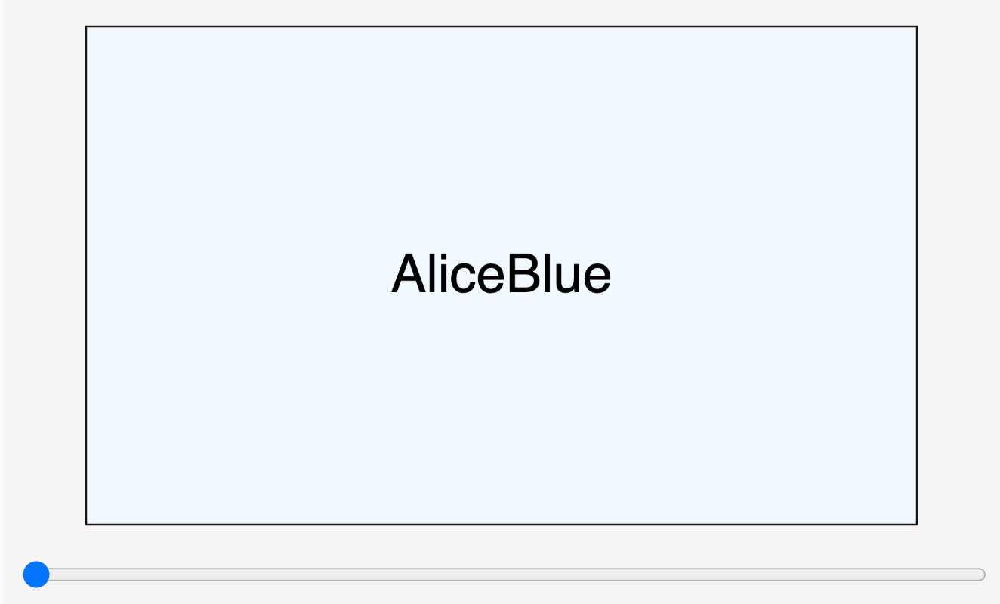

# Named Colors

<figure markdown>
   { width="400" }
   <figcaption>Named colors.</figcaption>
</figure>

[Link to Demo](./named-colors.html){ .md-button .md-button--primary }

## About this MicroSim

This MicroSim teaches us how
to use a list of 140 named
colors to change the fill color
of a rectangle.

## Sample Prompt

```linenums="0"
Create a single file p5.js sketch.
Draw a green circle on a 600x400 canvas with a radius of 200.
```