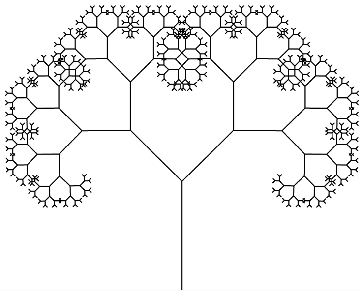

# Recursion Tree



Recursion trees are ideal ways to demonstrate recursive programming.
In a recursive program, a function calls itself repeatedly.
The result is often a beautiful complex image generated from
a very small program.

[Recursion Tree Demo](./recursion-tree.html){ .md-button .md-button--primary }

## Prompt

```linenums="0"
Generate a single file p5.js sketch on a 400x400 canvas.
Generate a drawing of a tree that uses recursion.
Add a slider that changes the angle between the branches of the tree.
```

## Response

Creating a p5.js sketch that draws a recursive tree with a slider to adjust the angle between branches involves a few key steps. Here's a basic outline of the code:

Setup the Canvas: Initialize a 400x400 canvas using createCanvas(400, 400) in the setup() function.
Create a Slider: Create a slider for the branch angle using createSlider() and position it on the canvas.
Draw the Tree: Use a recursive function to draw the tree in the draw() function. The angle between branches will be controlled by the slider's value.
Recursive Function: The recursive function will draw a line for the branch and then call itself twice to draw the two smaller branches at the specified angle.


```js
let angleSlider;

function setup() {
  const canvas = createCanvas(400, 400);
  canvas.parent('canvas-container');
  angleSlider = createSlider(0, TWO_PI, PI / 4, 0.01);
  angleSlider.position(10, height + 10);
}

function draw() {
  background(255);
  stroke(0);
  translate(width / 2, height);
  drawBranch(100);
}

function drawBranch(len) {
  line(0, 0, 0, -len);
  translate(0, -len);

  if (len > 4) {
    push();
    rotate(angleSlider.value());
    drawBranch(len * 0.67);
    pop();

    push();
    rotate(-angleSlider.value());
    drawBranch(len * 0.67);
    pop();
  }
}
```

In this code:

angleSlider is a global variable to hold the slider.
In setup(), the canvas is created, and the slider is initialized.
draw() continuously updates the canvas, translating the origin to the bottom center and then drawing the tree.
drawBranch(len) is the recursive function. It draws a line, then moves to the end of that line. If the branch is long enough, it draws two smaller branches at angles determined by the slider.
This code provides a basic recursive tree. You can enhance it with more features like changing the color, stroke weight, or the number of branches.