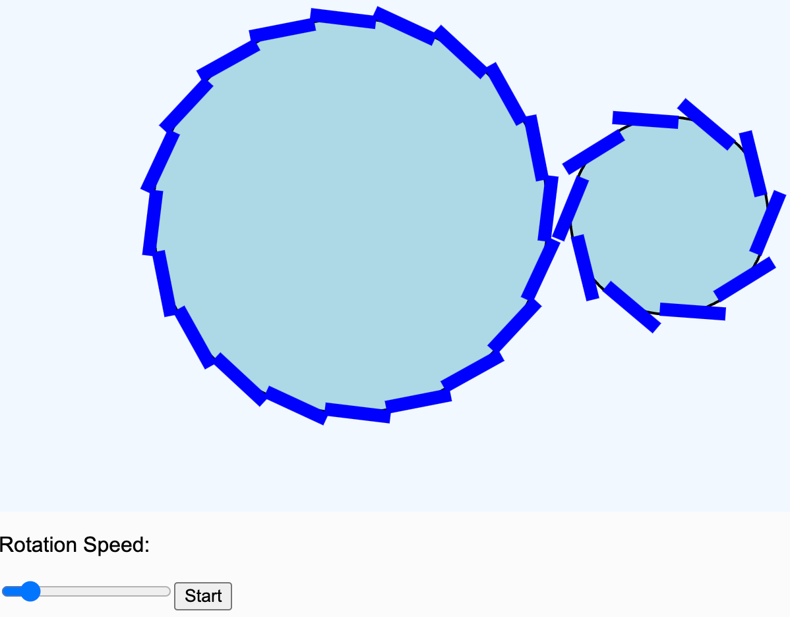

# Rotating Gears



[Run the Rotating Gears MicroSim](./rotating-gears.html){ .md-button .md-button--primary }
[Edit the MicroSim](https://editor.p5js.org/dmccreary/sketches/lMu-ClFat)

## Prompt

```linenums="0"
Create a p5.js sketch of two rotating gears that are
meshed.  Make one smaller have half the number of
teeth that the larger gear has.
Add a Start/Stop button and a slider to control the speed.
```

## ChatGPT o1-mini Response

Certainly! Below is a comprehensive p5.js sketch that simulates two meshed rotating gears. One gear is smaller with half the number of teeth as the larger gear. Additionally, the sketch includes a **Start/Stop** button to control the animation and a slider to adjust the rotation speed.


### Meshed Rotating Gears Animation

This sketch visualizes two meshed gears rotating in opposite directions. The key features include:

-   **Two Gears:**
    -   **Large Gear:** Has twice the number of teeth compared to the smaller gear.
    -   **Small Gear:** Has half the number of teeth of the large gear.
-   **Controls:**
    -   **Start/Stop Button:** Toggles the rotation of the gears.
    -   **Speed Slider:** Adjusts the rotation speed of the gears.

### **Understanding Gear Mechanics**

When two gears mesh:

- **Opposite Rotation:** Gears rotate in opposite directions.

- **Speed Ratio:** The rotation speed of each gear is inversely proportional to its number of teeth.

$$
\frac{\omega_1}{\omega_2} = -\frac{N_2}{N_1}
$$

where:

- $\omega_1$ ​: Angular speed of Gear 1
- $\omega_2$ ​: Angular speed of Gear 2
- $N_1$ ​: Number of teeth on Gear 1
- $N_2$ ​: Number of teeth on Gear 2
- **Negative Sign:** Indicates opposite rotation directions

In this sketch:

-   **Large Gear (Gear 1):** $N_1$ = 20 teeth
-   **Small Gear (Gear 2):** $N_2$ = 10 teeth

Thus, the angular speed relationship becomes:

$$
\frac{\omega_1}{\omega_2} = -\frac{10}{20} = -0.5 
\Rightarrow \omega_2 = -2 \omega_1​
$$

This means the small gear rotates twice as fast as the large gear in the opposite direction.

### Setting Up the Environment

To run this sketch:

1.  Visit the p5.js online editor.
2.  Create a new sketch.
3.  Replace the existing code with the code provided below.
4.  Click the play button to see the animation in action.

### p5.js Code

Note this original code did not work.  I told it that
the image was just circles and it got it right the
second time.

```javascript
// Gear Animation with Start/Stop Button and Speed Slider

let largeGear, smallGear;
let isRunning = true;
let speedSlider;
let startStopButton;

function setup() {
  createCanvas(800, 600);
  angleMode(RADIANS);

  // Initialize Gears
  // Large Gear: 20 teeth
  largeGear = new Gear(width / 3, height / 2, 150, 20);

  // Small Gear: 10 teeth
  smallGear = new Gear((2 * width) / 3, height / 2, 75, 10);

  // Create Speed Slider
  createP('Rotation Speed:');
  speedSlider = createSlider(0, 5, 2, 0.1); // Base speed from 0 to 5

  // Create Start/Stop Button
  startStopButton = createButton('Stop');
  startStopButton.mousePressed(toggleAnimation);

  // Set text alignment for controls
  textAlign(CENTER, CENTER);
}

function draw() {
  background(240);

  // Update rotation if running
  if (isRunning) {
    let baseSpeed = speedSlider.value();
    largeGear.update(baseSpeed);
    smallGear.update(-2 * baseSpeed); // Small gear rotates twice as fast in opposite direction
  }

  // Display Gears
  largeGear.display();
  smallGear.display();
}

// Function to toggle animation
function toggleAnimation() {
  isRunning = !isRunning;
  if (isRunning) {
    startStopButton.html('Stop');
  } else {
    startStopButton.html('Start');
  }
}

// Gear Class Definition
class Gear {
  constructor(x, y, radius, numTeeth) {
    this.x = x;
    this.y = y;
    this.radius = radius;
    this.numTeeth = numTeeth;
    this.angle = 0;
  }

  update(speed) {
    this.angle += speed * (TWO_PI / 60); // Convert speed to radians per frame
  }

  display() {
    push();
    translate(this.x, this.y);
    rotate(this.angle);

    // Draw Gear Body
    stroke(0);
    strokeWeight(2);
    fill(200);
    ellipse(0, 0, this.radius * 2, this.radius * 2);

    // Draw Teeth
    let toothWidth = (TWO_PI) / this.numTeeth / 2;
    let toothHeight = this.radius * 0.2;

    for (let i = 0; i < this.numTeeth; i++) {
      let theta = i * TWO_PI / this.numTeeth;
      push();
      rotate(theta);
      rectMode(CENTER);
      fill(150);
      noStroke();
      rect(this.radius, 0, toothHeight, toothWidth);
      pop();
    }

    pop();
  }
}
```

### Explanation of the Code

1.  **Global Variables:**

-   **Gears:**
    -   `largeGear`: Represents the larger gear with more teeth.
    -   `smallGear`: Represents the smaller gear with fewer teeth.
-   **Controls:**
    -   `isRunning`: Boolean flag to control animation state.
    -   `speedSlider`: Slider to adjust rotation speed.
    -   `startStopButton`: Button to start or stop the animation.
2.  **`setup()` Function:**

-   **Canvas:** Creates an 800x600 pixel canvas.
-   **Angle Mode:** Sets angle measurements to radians for smoother calculations.
-   **Gear Initialization:**
    -   **Large Gear:** Positioned at one-third of the canvas width, with a radius of 150 pixels and 20 teeth.
    -   **Small Gear:** Positioned at two-thirds of the canvas width, with a radius of 75 pixels and 10 teeth.
-   **Controls Creation:**
    -   **Speed Slider:** Ranges from 0 to 5 with a default value of 2 and increments of 0.1.
    -   **Start/Stop Button:** Initializes with the label "Stop" and is linked to the `toggleAnimation` function.
-   **Text Alignment:** Centers the text for the controls.
3.  **`draw()` Function:**
-   **Background:** Sets a light gray background each frame.
-   **Rotation Update:**
    -   If `isRunning` is `true`, the gears' angles are updated based on the slider value.
    -   **Large Gear:** Rotates at a speed proportional to the slider value.
    -   **Small Gear:** Rotates at twice the speed of the large gear in the opposite direction.
-   **Displaying Gears:** Calls the `display()` method for both gears to render them on the canvas.
4.  **`toggleAnimation()` Function:**

-   Toggles the `isRunning` flag.
-   Updates the button label to "Start" or "Stop" based on the current state.
5.  **`Gear` Class:**

-   **Constructor Parameters:**
-   `x, y`: Position of the gear's center.
-   `radius`: Radius of the gear.
-   `numTeeth`: Number of teeth on the gear.
-   **Properties:**
-   `angle`: Current rotation angle of the gear.
-   **Methods:**
-   `update(speed)`: Increments the gear's angle based on the provided speed.
-   `display()`: Renders the gear on the canvas, including its body and teeth.
    -   **Gear Body:** Drawn as a filled ellipse.
    -   **Teeth:** Represented as rectangles protruding from the gear's circumference. The size and placement are calculated based on the number of teeth.

### **Customization**

Feel free to modify the sketch to explore different gear configurations or enhance the visualization:

-   **Number of Teeth:**
    -   Change the `numTeeth` parameter when initializing `Gear` objects to see how it affects meshing.
-   **Gear Sizes:**
    -   Adjust the `radius` parameter to change the size of the gears.
-   **Tooth Design:**
    -   Modify the `toothWidth` and `toothHeight` in the `display()` method for different tooth appearances.
-   **Colors and Styles:**
    -   Change `fill()` and `stroke()` values to customize gear colors and outlines.
-   **Additional Controls:**
    -   Add sliders to control the number of teeth dynamically.
    -   Introduce a phase shift to synchronize gear rotations differently.

### **Live Demo**

For a live demonstration, copy the above code into the p5.js online editor and run the sketch. Use the **Start/Stop** button to control the animation and adjust the **Rotation Speed** slider to change how fast the gears rotate.

Feel free to reach out if you have any questions or need further assistance with the sketch. Happy coding and gear modeling!


## References

[Full ChatGPT Transcript](https://chatgpt.com/share/6709d832-b328-8001-b37f-11c107e2647f)