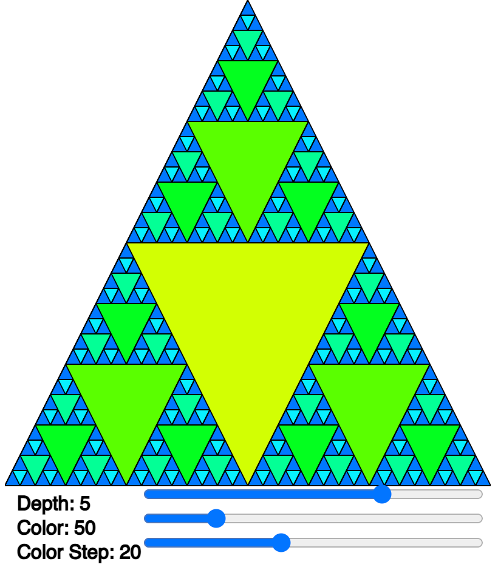

# Sierpinski

<figure markdown>
   { width="400" }
   <figcaption>Sierpinski Triangle</figcaption>
</figure>

## Demo 1

This demo draws colored triangles within triangles up to a depth of 7.
The users have three range contols for depth, color and color step size.

* [Run the Colored Sierpinski Demo](./sierpinski-2.html)

* [Run the Random Sierpinski Demo](./sierpinski.html)
