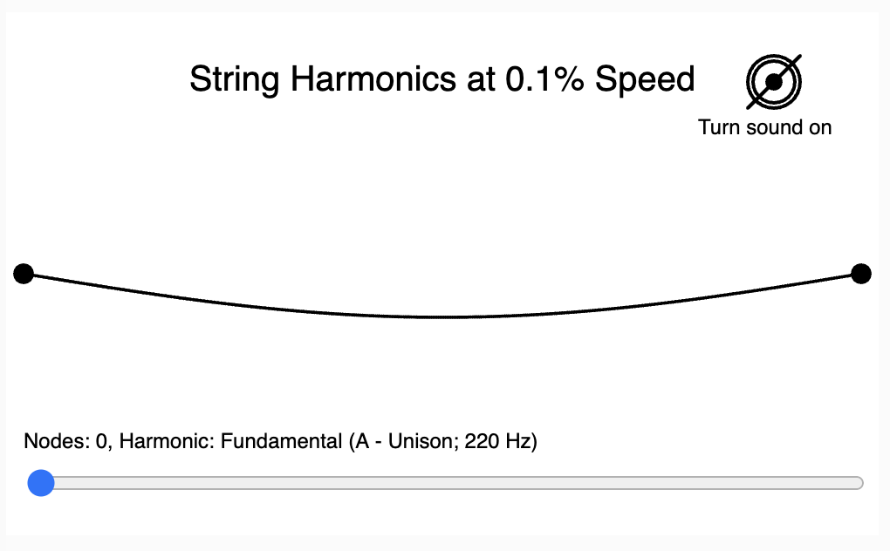

# String Harmonics

Contributed by [Shawn McBurnie](https://www.linkedin.com/in/shawnmcburnie/).



* [String Harmonics Demo No Sound](./string-harmonics.html)
* [String Harmonics Demo With Sound](./string-harmonics-osc.html) (not working)

## Sample Prompt

```linenums="0"
Create a single file p5.js sketch on a canvas of width=800 and height=200.
Generate a demonstration of string harmonics.
Allow the string to vary from a frequency of 1 to 16.
Add a slider that changes the frequency with a step of .1
```

## Lesson Plan: Exploring String Harmonics with Interactive Simulation

### Objective
- Understand the concept of string harmonics and how frequency affects sound pitch.

### Grade Level
- 9th Grade

### Subject
- Physics (Sound and Waves)

### Materials Needed
- Computers with internet access
- Access to the string harmonics simulation [String Harmonics Simulation](https://dmccreary.github.io/microsims/sims/string-harmonics/)
- Notebooks and pens for taking notes

### Duration
- 1 Class Period (45-60 minutes)

### Introduction (10 minutes)
- **Brief Lecture:** Introduce the concept of harmonics in strings, explaining how vibrations at different frequencies produce different sounds.
- **Demonstration:** Show a real-world example, like a guitar string, and discuss how varying the tension changes the sound.

### Interactive Session (20 minutes)
- **Hands-On Activity:** Students explore the string harmonics simulation. They are encouraged to adjust the frequency slider and observe changes in wave patterns and listen to the pitch changes.
- **Guided Questions:** As they explore, ask questions like, "What happens to the wave as you increase the frequency?" or "How does the change in frequency affect the sound you hear?"

### Group Discussion (10 minutes)
- **Sharing Observations:** Students discuss their findings in small groups, focusing on the relationship between frequency, wave pattern, and pitch.
- **Connecting Theory and Practice:** Discuss how this simulation relates to real-life instruments and sound production.

### Application Activity (10 minutes)
- **Creative Exploration:** Ask students to imagine and sketch a new musical instrument that uses the principles of string harmonics.
- **Discussion:** Share ideas within the class, discussing the feasibility and creativity of the designs.

### Conclusion (5 minutes)
- **Recap:** Summarize key concepts learned about harmonics, frequency, and sound production.
- **Homework Assignment:** Students write a brief report on how understanding string harmonics is essential in designing musical instruments.

### Assessment
- Participation in the interactive session and group discussion.
- Quality and creativity of the musical instrument design.
- Understanding demonstrated in the homework report.

## A Story about this MicroSim

I met Shawn at a ChatGPT meetup and I gave him a short demo of MicroSims.  The meetup was over lunch.  By supper time he had already finished his first MicroSim, despite never having used Processing before.  AND he figured
out how to get sound working.  WOW!