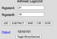
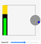
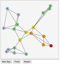
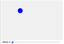
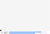
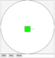
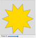
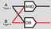

| Sim | Sim | Sim | Sim |
| --- | --- | --- | --- |
| [Simulation of an Arithmetic Logic Unit (ALU)](../sims/alu)  | [Battery Drain](../sims/battery-drain)  | [Breadth First Graph Search](../sims/bfs)  | [Binary Number](../sims/binary-number)  |
| [Bouncing Ball](../sims/bouncing-ball)  | [Canon and Projectile Motion](../sims/canon)  | [Collision Avoidance Robot](../sims/collision-avoidance-robot)  | [Gold Star](../sims/gold-star)  |
| [Logic Gates](../sims/logic-gates)  | [Named Colors](../sims/named-colors)  | [Pulse-Width Modulation](../sims/pwm)  | [String Harmonics](../sims/string-harmonics)  |
